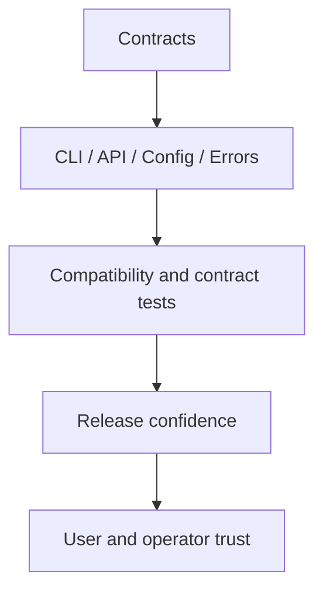
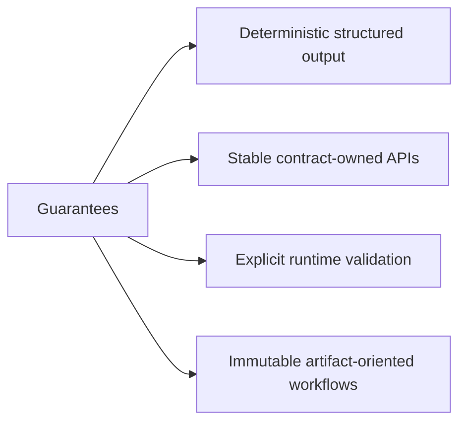
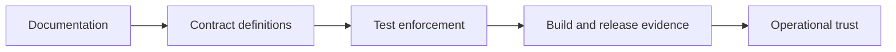

# Guarantees and Stability

Atlas is opinionated about stability: it does not promise everything, but what it does promise should be explicit, test-backed, and documented.

The practical reading rule is simple: if a behavior is not documented as a contract-owned surface,
treat it as current behavior only and confirm it before you build automation or operational process
around it.

## The Stability Stack

This stack shows the intended direction of proof. Atlas wants trust to come from documented
surfaces, enforced tests, and checked release evidence instead of from repository folklore.

Atlas aims to make stability understandable by layer:

- public commands and options are more stable than internal helper code
- API schemas and structured output are more stable than ad hoc debug payloads
- runtime config contracts are more stable than undocumented environment-dependent behavior

## Guarantee Table

| Claimed guarantee | Main enforcement point | Evidence source |
| --- | --- | --- |
| deterministic structured output where documented | response and output contracts in code and generated references | generated OpenAPI and runtime reference artifacts |
| stable contract-owned APIs | HTTP router, response contracts, and contract docs | generated OpenAPI plus compatibility review |
| explicit runtime validation | runtime config parsing and contract schemas | generated runtime config docs and validation behavior |
| immutable artifact-oriented workflows | dataset, ingest, and store boundaries | workflow docs and artifact/state references |

## What We Can Honestly Claim

Atlas should earn confidence from three places:

- documented contracts
- tests and validation that exercise those contracts
- release or review evidence that shows the current implementation still matches them

Intent by itself is not a guarantee.

## What Atlas Tries to Guarantee

This list of guarantees is deliberately narrow. Atlas is trying to make a few promises clearly and
credibly rather than implying stability everywhere.

Atlas tries to provide:

- deterministic machine-readable output where documented
- explicit validation rather than silent coercion
- stable contract-owned API and config surfaces
- immutable artifact workflows for release state

## What Atlas Does Not Guarantee

- all internal Rust module paths remain unchanged
- all debug-only behavior remains stable
- all internal fixtures or benchmark helpers are public API
- every implementation detail remains source-compatible across refactors

## Current Hard Limits

- Atlas validates supported inputs and runtime boundaries, but it does not make upstream data sources inherently correct.
- Atlas prefers artifact-centric workflows, so shortcuts that skip publication into a serving store are outside the intended serving model.
- Maintainer automation around `bijux-dev-atlas` is important and tested, but it is not the same stability layer as the user-facing runtime API and CLI.

## Why Stability Is Evidence-Based

This evidence chain explains how readers should evaluate stability claims. A statement becomes
stronger when it is documented, enforced, and visible in release or validation output.

Atlas does not treat “we intended this to be stable” as enough. Stability is meaningful only when:

- the surface is documented
- ownership is clear
- tests enforce it
- releases validate it

## How to Interpret Stability in Practice

When you need a stronger claim, ask:

1. Is the surface documented?
2. Is it described in reference or contracts rather than only in examples?
3. Do tests or checks enforce it?
4. Would a future release be expected to preserve it intentionally?

If you are a user:

- trust documented commands, config contracts, and query behavior

If you are an operator:

- trust documented runtime and operational contracts, not incidental local behavior

If you are a maintainer:

- do not turn undocumented implementation details into accidental promises

## Stability Reading Shortcut

- tutorial and example pages explain workflow and current practice
- reference pages explain exact factual surfaces
- contract pages describe the strongest intentional promises

## Next Pages

- [Runtime Surfaces](runtime-surfaces.md)
- [Release Model](release-model.md)
- [Documentation Map](documentation-map.md)

## Main Takeaway

Atlas should only sound stable where it can show its work. A guarantee becomes
real when a reader can point to the owning contract or code path, the test or
validation layer behind it, and the artifact that proves the promise still
holds today.
