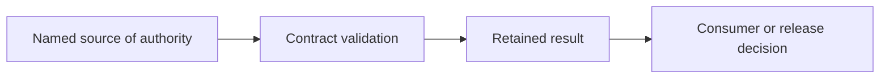
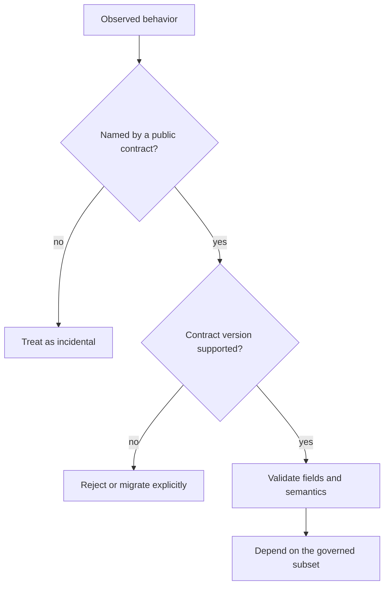
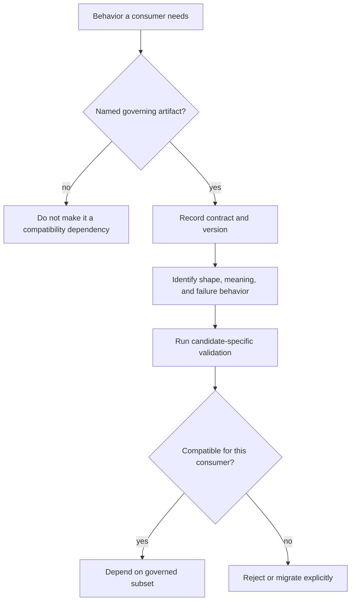

# Guarantees and Stability

Atlas has several kinds of public surface, and they do not all carry the same
compatibility promise. A command that works in one checkout is current
behavior. A versioned schema, public command registry, or generated API
contract is a stronger commitment because a specific artifact defines what
consumers may rely on.

## Stability Classes

| Class | Examples | Safe dependency | Change signal |
| --- | --- | --- | --- |
| governed contract | versioned schemas, public command registry, OpenAPI, documented artifact layouts | fields, types, identifiers, and behavior named by the contract | schema or contract review, compatibility policy, and release notes. |
| documented public behavior | workflows, command semantics, configuration precedence, error behavior | the documented outcome, within the named release line | documentation and implementation change together. |
| generated observation | command help, generated references, compatibility reports, conformance results | the state of the exact build or release that produced it | regenerate and compare against the governing source. |
| implementation detail | internal Rust paths, debug logging, test helpers, local fixtures | nothing outside the owning crate or repository workflow | may change without downstream compatibility treatment. |

The narrowest applicable contract wins. A command-specific schema is more
authoritative than a general statement about JSON, and an artifact manifest is
more authoritative than a tutorial showing an example directory.

## Where Guarantees Come From

```mermaid
flowchart LR
    Authority[Named source of authority] --> Validation[Contract validation]
    Validation --> Evidence[Retained result]
    Evidence --> Decision[Consumer or release decision]
```

A strong Atlas guarantee has all three supporting parts:

- a named authority, such as a schema, registry, manifest, or versioned API;
- a check that compares implementation or data with that authority; and
- evidence tied to the exact build, dataset, or release under evaluation.

Documentation explains how to find and interpret those parts. Documentation
alone does not prove that a particular release passed its checks.

## Product Guarantees

Atlas is designed around these durable boundaries:

| Boundary | Promise | Authority to inspect |
| --- | --- | --- |
| dataset identity | queries and artifacts refer to an explicit release, species, and assembly identity | dataset and artifact schemas plus the published manifest. |
| published release | serving state comes from a complete published release, not an intermediate build directory | catalog entry, store layout, and release manifest. |
| public command surface | user commands are separated from maintainer-only commands | generated CLI reference and public command registry. |
| HTTP interface | routes and payload shapes are described by the versioned API contract | generated OpenAPI document. |
| runtime configuration | accepted keys, types, defaults, and precedence are explicit where governed | runtime configuration schema and generated reference. |
| machine output | automation may depend on fields governed by the exact output schema | command- or report-specific JSON Schema. |

These guarantees do not establish the biological correctness of an upstream
source. They establish how Atlas admits, identifies, packages, publishes, and
serves the source it was given.

## Compatibility Does Not Mean Immutability

A stable surface can evolve. Compatible additions may appear, deprecations may
be announced, and a new major contract may deliberately replace an old one.
Consumers should validate the contract version they support. They should reject
unknown incompatible shapes instead of guessing.

```mermaid
flowchart TD
    Input[Observed behavior] --> Named{Named by a public contract?}
    Named -- no --> Incidental[Treat as incidental]
    Named -- yes --> Version{Contract version supported?}
    Version -- no --> Reject[Reject or migrate explicitly]
    Version -- yes --> Validate[Validate fields and semantics]
    Validate --> Consume[Depend on the governed subset]
```

Repository compatibility policy defines the deprecation window for governed
surfaces. It does not promote internal modules, fixtures, log lines, or
maintainer implementation details into public API.

## Compatibility Has More Than One Dimension

A release can preserve syntax while breaking meaning or operations. Review the
dimensions that apply to the consumer:

| Dimension | Example incompatible change | Evidence to compare |
| --- | --- | --- |
| identity | interpreting the same dataset selector as a different release | dataset and catalog contracts |
| shape | removing a response field or changing its type | JSON Schema or OpenAPI diff |
| semantics | retaining a field while changing its unit or ordering | contract text and behavioral fixtures |
| artifacts | changing required paths, hashes, or manifest interpretation | artifact schema and compatibility report |
| configuration | changing precedence, default, or accepted value | generated configuration reference and validation |
| operations | weakening readiness, overload, recovery, or telemetry expectations | profile and candidate-bound operational evidence |

The correct compatibility question is therefore not merely “does it parse?”
It is “does the supported consumer observe the same governed meaning and
failure behavior?”

## Assess a Proposed Dependency

```mermaid
flowchart TD
    Need[Behavior a consumer needs] --> Authority{Named governing artifact?}
    Authority -- no --> Incidental[Do not make it a compatibility dependency]
    Authority -- yes --> Version[Record contract and version]
    Version --> Semantics[Identify shape, meaning, and failure behavior]
    Semantics --> Evidence[Run candidate-specific validation]
    Evidence --> Decision{Compatible for this consumer?}
    Decision -- yes --> Adopt[Depend on governed subset]
    Decision -- no --> Migrate[Reject or migrate explicitly]
```

Record the authority alongside the dependency. That makes later compatibility
review a comparison of named contracts instead of a reconstruction of what a
consumer happened to observe.

## Claims That Require Release Evidence

The existence of a contract is not proof that a release satisfies it. Before a
promotion, audit, or operational claim, pair the contract with evidence from
the exact candidate:

| Claim | Required evidence |
| --- | --- |
| an artifact is reproducible | matching input identity, toolchain identity, build configuration, and artifact hashes from independent builds. |
| a release is complete | manifest and catalog validation for every required artifact. |
| an API is conformant | conformance results against the candidate's generated OpenAPI contract. |
| a configuration is accepted | validation output from the candidate binary and the governed configuration schema. |
| a deployment is safe to promote | named security, conformance, health, and load evidence for that release and profile. |

Examples, screenshots, successful process exit, and unversioned local output do
not substitute for this evidence.

Continue with [Runtime Surfaces](runtime-surfaces.md) for interface ownership,
[Release Model](release-model.md) for immutable identity, and
[Structured Output Contracts](../contracts/structured-output-contracts.md) for
machine-consumption rules.
