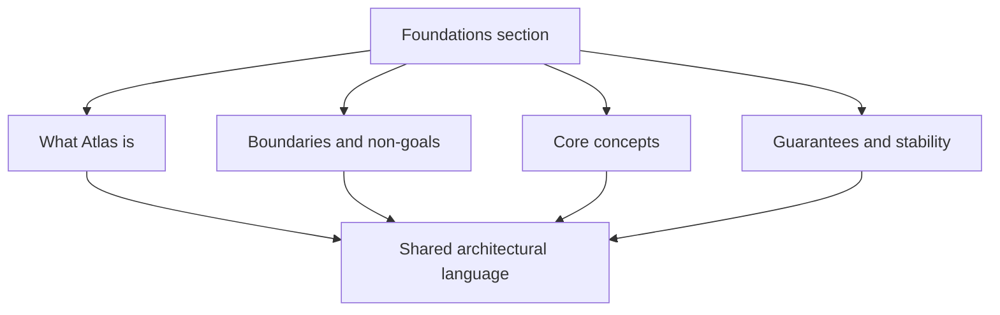

# Foundations

`bijux-atlas/foundations` is the section home for this handbook slice.

Foundations is where the repository vocabulary becomes stable enough for the
rest of the handbook to reuse without re-explaining itself. These pages should
define terms and boundaries once, then hand readers off to runtime, contracts,
interfaces, or workflows when the question becomes more concrete.

Use this section when you are trying to answer:

- what Atlas is actually for
- which product boundaries are intentional
- which concepts and terms matter before you read exact interfaces
- how datasets, queries, releases, and stability fit together

## Recommended Order

Read these pages in this order when you are new to Atlas:

1. [What Atlas Is](what-atlas-is.md)
2. [Core Concepts](core-concepts.md)
3. [Boundaries and Non-Goals](boundaries-and-non-goals.md)
4. [Guarantees and Stability](guarantees-and-stability.md)

After that, use the remaining pages as targeted lookup material for specific
product-model questions.

## What This Section Covers

- product identity and repository fit
- the conceptual model for datasets, releases, and query behavior
- the difference between documented promises and current implementation detail
- the handoff from product foundations into workflows, interfaces, runtime, and contracts

## What This Section Is Allowed To Do

This section may define terms, architectural boundaries, and stability posture.
It should not become a duplicate command reference, an API index, or an ops
runbook. When a concept turns into exact runtime behavior or exact user-facing
surface, the reader should move to the matching section instead of staying here.

## Pages

- [Boundaries and Non-Goals](boundaries-and-non-goals.md)
- [Core Concepts](core-concepts.md)
- [Dataset Model](dataset-model.md)
- [Documentation Map](documentation-map.md)
- [Guarantees and Stability](guarantees-and-stability.md)
- [Package Ownership](package-ownership.md)
- [Query Model](query-model.md)
- [Release Model](release-model.md)
- [Runtime Surfaces](runtime-surfaces.md)
- [What Atlas Is](what-atlas-is.md)

## Exit Criteria

Leave this section once you can answer three questions clearly:

- what counts as Atlas product behavior versus operations or maintainer behavior
- what the runtime is serving and why artifacts matter
- which surfaces are strong compatibility promises and which are only explanatory
