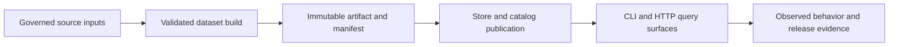

# Foundations

Atlas is an artifact-first genomics delivery system. A dataset becomes part of
the product only after governed inputs cross validation, artifact, publication,
and serving boundaries. That model keeps raw source data, build output,
published identity, and live query behavior distinguishable.

```mermaid
flowchart LR
    Source[Governed source inputs] --> Build[Validated dataset build]
    Build --> Artifact[Immutable artifact and manifest]
    Artifact --> Publish[Store and catalog publication]
    Publish --> Serve[CLI and HTTP query surfaces]
    Serve --> Evidence[Observed behavior and release evidence]
```

Each arrow is a contract boundary. A successful build is not publication. A
published artifact is not proof that a deployment is healthy. A healthy
process is not evidence that every supported query or recovery path worked.

## Core Identities

| Identity | Meaning | Must not be confused with |
| --- | --- | --- |
| source input | admitted GFF3, FASTA, configuration, and provenance | a normalized build product |
| dataset build | validated output produced from named inputs | a catalog-visible release |
| artifact | immutable files plus manifest, hashes, and metadata | mutable process state |
| release | versioned artifact identity eligible for publication | an arbitrary local directory |
| catalog entry | discoverable published identity | evidence that all objects are reachable |
| serving store | artifact bytes available to runtime adapters | authority for changing artifact content |
| query result | structured response against a resolved release | proof of upstream biological correctness |

## Product Boundaries

Atlas owns deterministic transformation and delivery behavior around admitted
data. It does not certify the scientific truth of upstream annotations, turn
partially built directories into releases, or make deployment health part of a
dataset's immutable identity.

Compatibility is also boundary-specific. Dataset manifests, structured output,
HTTP/OpenAPI shapes, configuration, artifact layout, and crate ownership can
evolve under different policies. The relevant contract—not a general claim of
"stability"—determines what a consumer may rely on.

## Reading Route

1. [What Atlas Is](what-atlas-is.md) establishes product identity.
2. [Core Concepts](core-concepts.md) defines the shared vocabulary.
3. [Dataset Model](dataset-model.md), [Query Model](query-model.md), and
   [Release Model](release-model.md) describe the three main identities.
4. [Boundaries and Non-Goals](boundaries-and-non-goals.md) records deliberate
   exclusions.
5. [Guarantees and Stability](guarantees-and-stability.md) maps promises to
   compatibility surfaces.

Crate consumers can continue to [Package Ownership](package-ownership.md) and
the [Crate Boundary Contract](crate-boundary-contract.md). Command and service
consumers can continue to [Runtime Surfaces](runtime-surfaces.md). The
[Documentation Map](documentation-map.md) connects those concepts to exact
workflow, interface, runtime, contract, and operations references.

## Authority and Evidence

A model page explains meaning. An interface or contract page identifies an
exact consumer surface. Generated references expose resolved command or API
shape. A release-specific assertion additionally needs evidence tied to the
artifact and execution being discussed. Examples and checked-in fixtures teach
shape; they are not observations of a live release.
