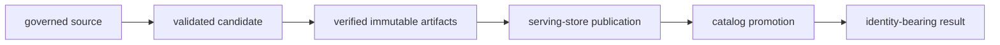

# Foundations

Atlas is an artifact-first genomics delivery system. It transforms admitted
sources into immutable dataset artifacts, publishes them through an explicit
store and catalog, and serves queries without making process state the
authority for release data.

```mermaid
flowchart LR
    Source["governed source"] --> Candidate["validated candidate"]
    Candidate --> Artifact["verified immutable artifacts"]
    Artifact --> Store["serving-store publication"]
    Store --> Catalog["catalog promotion"]
    Catalog --> Result["identity-bearing result"]
```

## Identities to Keep Separate

| Identity | Meaning |
| --- | --- |
| source | accepted GFF3, FASTA, configuration, provenance, and policy |
| candidate | build output that has not yet gained publication authority |
| dataset | logical `release/species/assembly` identity |
| artifact | manifest and hashes binding a dataset to exact bytes |
| catalog generation | discoverable selection of published datasets |
| request execution | software, configuration, principal, route, and observation |
| deployment qualification | target-bound evidence for serving and operating exact identities |

Confusing these identities produces false conclusions. A candidate directory is
not a release, a catalog entry is not proof that every server refreshed it, and
a healthy process is not proof of capacity or recovery.

## Read by Question

| Question | Guide |
| --- | --- |
| What is Atlas designed to do? | [What Atlas Is](what-atlas-is.md) |
| Which terms carry stable meaning? | [Core Concepts](core-concepts.md) |
| How is dataset identity defined? | [Dataset Model](dataset-model.md) |
| What makes a query comparable? | [Query Model](query-model.md) |
| How do software and dataset releases differ? | [Release Model](release-model.md) |
| What is deliberately outside Atlas? | [Boundaries and Non-Goals](boundaries-and-non-goals.md) |
| Which compatibility promise applies? | [Guarantees and Stability](guarantees-and-stability.md) |
| Which crate owns a behavior? | [Package Ownership](package-ownership.md) |

Use the [Atlas Decision Map](documentation-map.md) when the question already
crosses product, operations, or repository-maintenance ownership.

## Evidence Boundary

Concept pages define meaning. Interfaces and contracts define consumer
surfaces. Generated references expose one resolved build. A claim about a
particular dataset, deployment, or release additionally requires evidence tied
to its exact identities and observation window.
