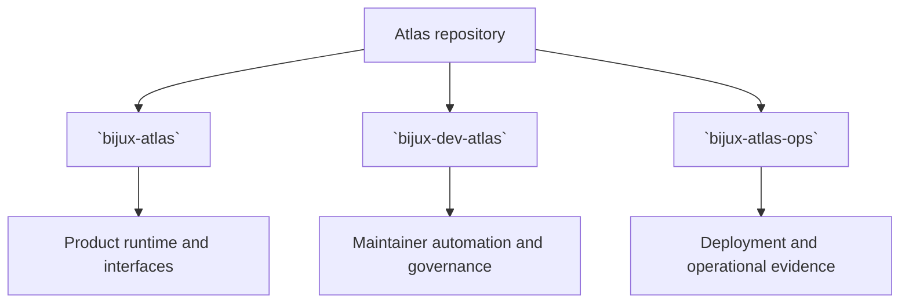

# Package Ownership

Atlas documentation works better when ownership is explicit at package level.

`bijux-atlas` owns the product runtime: ingest, dataset state, query behavior,
runtime configuration, and user-facing contracts. `bijux-dev-atlas` owns the
repository control plane and maintainer automation. `bijux-atlas-ops` names the
operational surface shaped by `ops/`, `ops/k8s/`, `ops/stack/`, `ops/load/`,
and related evidence.

## Ownership Model

This diagram keeps the three documentation trees legible. They are related, but
they do not serve the same audience and they should not make the same kind of
promise.

## Ownership Rule

- repository questions belong here when they explain the product package
- repository-governance questions move to the maintainer docs
- operations questions move to the operations docs

## Why This Split Matters

Without the split, Atlas product behavior gets buried under Kubernetes,
workflows, and governance material that serves a different audience.

## Code Anchors

- [`crates/bijux-atlas/`](/Users/bijan/bijux/bijux-atlas/crates/bijux-atlas)
- [`crates/bijux-dev-atlas/`](/Users/bijan/bijux/bijux-atlas/crates/bijux-dev-atlas)
- [`ops/`](/Users/bijan/bijux/bijux-atlas/ops)
- [`makes/`](/Users/bijan/bijux/bijux-atlas/makes)

## Placement Guide

- product runtime, dataset behavior, query semantics, and user-facing interfaces belong under `crates/bijux-atlas/`
- repository governance, maintainer automation, and release-control work belong under `crates/bijux-dev-atlas/`
- cluster, deployment, observability, and operational evidence belong under `ops/`
- `makes/` may provide convenience entrypoints, but it should not silently redefine product or maintainer truth

## Main Takeaway

Package ownership is what keeps Atlas readable as a repository. The product
crate, the repository control plane, and the operational surface are related,
but they should stay distinct in both code placement and documentation voice.
