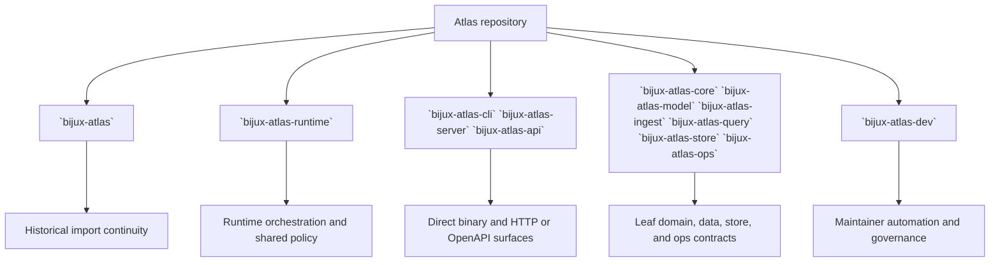

# Package Ownership

Atlas documentation works better when ownership is explicit at package level.

Atlas is no longer one runtime crate plus a support crate. The `0.2.2` release
line is carried by a split workspace where published crates and the repository
control plane each own a durable part of the story.

## Ownership Model

```mermaid
flowchart TD
    Repo[Atlas repository] --> Compatibility[`bijux-atlas`]
    Repo --> Runtime[`bijux-atlas-runtime`]
    Repo --> BinaryOwners[`bijux-atlas-cli` `bijux-atlas-server` `bijux-atlas-api`]
    Repo --> LeafOwners[`bijux-atlas-core` `bijux-atlas-model` `bijux-atlas-ingest` `bijux-atlas-query` `bijux-atlas-store` `bijux-atlas-ops`]
    Repo --> ControlPlane[`bijux-atlas-dev`]

    Compatibility --> Alias[Historical import continuity]
    Runtime --> Orchestration[Runtime orchestration and shared policy]
    BinaryOwners --> Interfaces[Direct binary and HTTP or OpenAPI surfaces]
    LeafOwners --> Contracts[Leaf domain, data, store, and ops contracts]
    ControlPlane --> Governance[Maintainer automation and governance]
```

This diagram keeps the product, operations, and maintainer trees legible
without pretending the product itself is still monolithic.

## Ownership Rule

- compatibility and orchestration questions belong here when they explain the.
  product-facing Atlas package set
- repository-governance questions move to the maintainer docs.
- deployment, load, and release-ops questions move to the operations docs.

## Why This Split Matters

Without the split, Atlas product behavior gets buried under Kubernetes,
workflows, and governance material that serves a different audience. Without
the crate map, readers also cannot tell whether a surface is owned by runtime
or by a leaf package.

## Code Anchors

- [`crates/bijux-atlas/`](/Users/bijan/bijux/bijux-atlas/crates/bijux-atlas).
- [`crates/bijux-atlas-runtime/`](/Users/bijan/bijux/bijux-atlas/crates/bijux-atlas-runtime).
- [`crates/bijux-atlas-cli/`](/Users/bijan/bijux/bijux-atlas/crates/bijux-atlas-cli).
- [`crates/bijux-atlas-server/`](/Users/bijan/bijux/bijux-atlas/crates/bijux-atlas-server).
- [`crates/bijux-atlas-api/`](/Users/bijan/bijux/bijux-atlas/crates/bijux-atlas-api).
- [`crates/bijux-atlas-ops/`](/Users/bijan/bijux/bijux-atlas/crates/bijux-atlas-ops).
- [`crates/bijux-atlas-dev/`](/Users/bijan/bijux/bijux-atlas/crates/bijux-atlas-dev).
- [`ops/`](/Users/bijan/bijux/bijux-atlas/ops).
- [`makes/`](/Users/bijan/bijux/bijux-atlas/makes).

## Placement Guide

- compatibility imports belong under `crates/bijux-atlas/`.
- runtime orchestration and shared policy belong under `crates/bijux-atlas-runtime/`.
- direct binaries and transport-facing surfaces belong under `crates/bijux-atlas-cli/`, `crates/bijux-atlas-server/`, and `crates/bijux-atlas-api/`.
- leaf ingest, query, model, core, store, and operations contracts belong under their owning split crates.
- repository governance, maintainer automation, and release-control work belong under `crates/bijux-atlas-dev/`.
- cluster, deployment, observability, and operational evidence belong under `ops/`.
- `makes/` may provide convenience entrypoints, but it should not silently redefine product or maintainer truth.

## Main Takeaway

Package ownership is what keeps Atlas readable as a repository. The published
crate set, the repository control plane, and the operational surface are
related, but they should stay distinct in both code placement and
documentation voice.
