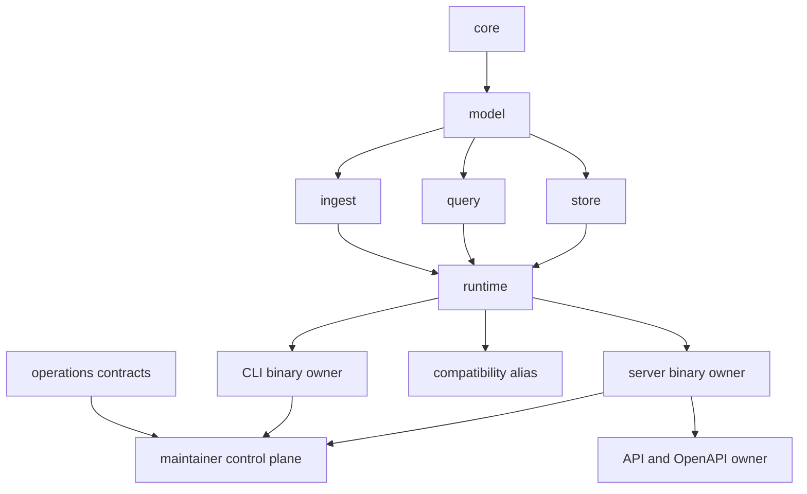

# Package Ownership

Atlas is a split Rust workspace. Each publishable crate owns one stable part of
the product or operations contract; the repository-only maintainer crate owns
validation and delivery automation. The installed `bijux-atlas` command and the
`bijux-atlas` compatibility library are deliberately different surfaces.

## Ownership Model

```mermaid
flowchart TB
    Core[core] --> Model[model]
    Model --> Ingest[ingest]
    Model --> Query[query]
    Model --> Store[store]
    Ingest --> Runtime[runtime]
    Query --> Runtime
    Store --> Runtime
    Runtime --> CLI[CLI binary owner]
    Runtime --> Server[server binary owner]
    Server --> API[API and OpenAPI owner]
    Runtime --> Alias[compatibility alias]
    Ops[operations contracts] --> Dev[maintainer control plane]
    CLI --> Dev
    Server --> Dev
```

Dependencies should point toward the owner of a concept. Binary and adapter
crates compose domain crates; they do not redefine dataset, query, store, or
operations contracts. Maintainer automation may validate all of these owners,
but product crates do not depend on the repository control plane.

## Workspace Ownership

| Crate | Durable responsibility | Explicitly outside its boundary |
| --- | --- | --- |
| [`bijux-atlas-core`](../../../crates/bijux-atlas-core/) | deterministic primitives, hashes, canonical JSON, cursor encoding, and generated error codes | dataset semantics and runtime policy |
| [`bijux-atlas-model`](../../../crates/bijux-atlas-model/) | dataset, catalog, manifest, feature, and release value types | query execution and storage adapters |
| [`bijux-atlas-ingest`](../../../crates/bijux-atlas-ingest/) | input admission, normalization, artifact construction, and candidate verification | catalog promotion and serving |
| [`bijux-atlas-query`](../../../crates/bijux-atlas-query/) | request parsing, planning, cursoring, ordering, and query execution | HTTP routing and publication |
| [`bijux-atlas-store`](../../../crates/bijux-atlas-store/) | immutable publication and serving-store contracts | dataset construction and API transport |
| [`bijux-atlas-api`](../../../crates/bijux-atlas-api/) | API DTOs, parameters, OpenAPI generation, and `bijux-atlas-openapi` | server process lifecycle |
| [`bijux-atlas-runtime`](../../../crates/bijux-atlas-runtime/) | canonical composition of ingest, query, store, API, and runtime policy | installed binary ownership |
| [`bijux-atlas-cli`](../../../crates/bijux-atlas-cli/) | installed `bijux-atlas` command and CLI adaptation | long-running HTTP service |
| [`bijux-atlas-server`](../../../crates/bijux-atlas-server/) | installed server process, HTTP routing, middleware, and telemetry bootstrap | OpenAPI schema ownership |
| [`bijux-atlas`](../../../crates/bijux-atlas/) | historical `bijux_atlas` Rust import compatibility | ownership of the installed command |
| [`bijux-atlas-ops`](../../../crates/bijux-atlas-ops/) | reusable typed operations, Kubernetes, load, observability, and release models | cluster mutation or end-user product commands |
| [`bijux-atlas-dev`](../../../crates/bijux-atlas-dev/) | repository-only command routing, validation, generation, reports, and delivery orchestration | published SDK and runtime behavior |

## Repository-Owned Surfaces

Some contracts are larger than one crate:

- [`ops/`](../../../ops/) owns Helm, profiles, policies, scenarios, dashboards,
  runbooks, schemas, and operational evidence inputs;
- [`configs/`](../../../configs/) owns governed source configuration, schemas,
  examples, and generated references;
- [`makes/`](../../../makes/) owns convenience entrypoints, not an independent
  implementation of product or maintainer behavior;
- [`docs/`](../../) explains the supported product, operator, and maintainer
  contracts without becoming their source of truth.

A change belongs with the owner of the behavior. Cross-cutting adapters should
translate between owners and preserve their contracts rather than absorbing
them into a new catch-all layer.
