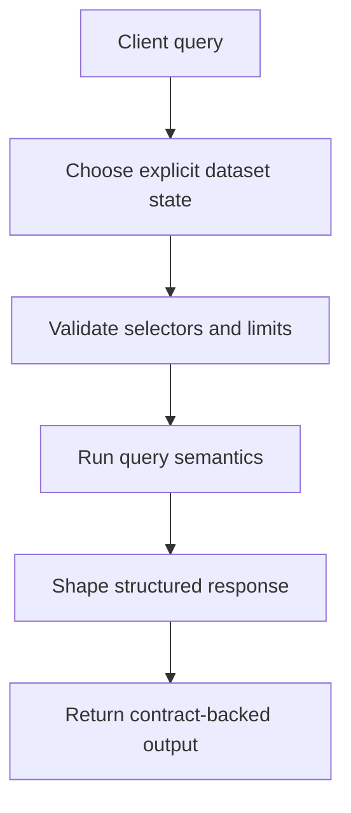

# Query Model

Atlas queries are validated requests over published dataset state.

That matters because query behavior is not just an endpoint shape. It is a
combination of dataset selection, request validation, cost control, and
structured response rules.

## Query Model

This diagram is the core reading frame for the page. Atlas query behavior starts
with dataset identity, passes through validation and policy, and only then turns
into the response shape a client sees.

## Query Boundary

- clients ask for explicit dataset state
- policy and limits validate the request
- runtime executes against immutable published content
- responses follow documented output contracts

## Repository Authority Map

- query semantics and domain rules live under [`src/domain/query/`](/Users/bijan/bijux/bijux-atlas/crates/bijux-atlas/src/domain/query)
- query execution logic is organized under [`src/domain/query/engine/`](/Users/bijan/bijux/bijux-atlas/crates/bijux-atlas/src/domain/query/engine)
- HTTP transport and endpoint routing live under [`src/adapters/inbound/http/`](/Users/bijan/bijux/bijux-atlas/crates/bijux-atlas/src/adapters/inbound/http)
- route ownership is declared in [`src/adapters/inbound/http/router.rs`](/Users/bijan/bijux/bijux-atlas/crates/bijux-atlas/src/adapters/inbound/http/router.rs:1)
- response-shape promises are enforced in [`src/adapters/inbound/http/response_contract.rs`](/Users/bijan/bijux/bijux-atlas/crates/bijux-atlas/src/adapters/inbound/http/response_contract.rs:1)
- generated public API shape is published in [`configs/generated/openapi/v1/openapi.json`](/Users/bijan/bijux/bijux-atlas/configs/generated/openapi/v1/openapi.json:1)

## What Belongs To Query Semantics

- dataset selection such as release, species, and assembly
- validation of selector combinations, limits, and expensive request patterns
- execution over published immutable content
- stable response meaning for rows, paging, and structured errors

## What Does Not Belong Here

- HTTP transport details that only describe routing or middleware plumbing
- operator-only serving concerns such as deployment and cluster behavior
- ingest-time normalization or artifact-build internals

Those matter elsewhere in the docs, but the query model page should stay focused
on request meaning rather than swallowing every adjacent runtime concern.

## Reading Rule

If a question is about request semantics, response shape, or API expectations,
it belongs to the repository handbook rather than the operations handbook.

## Main Takeaway

The query model is the contract-shaped path from explicit dataset identity to a
validated, policy-checked, structured answer. The repo expresses that path
across domain query code, HTTP adapters, and generated API artifacts, and this
page should help readers see those pieces as one coherent surface.
