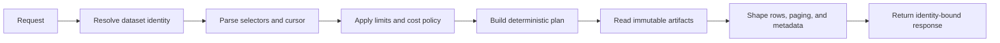

# Query Model

Atlas queries are validated requests over published dataset state.

That matters because query behavior is not just an endpoint shape. It is a
combination of dataset selection, request validation, cost control, and
structured response rules.

```mermaid
flowchart LR
    Request[Request] --> Resolve[Resolve dataset identity]
    Resolve --> Parse[Parse selectors and cursor]
    Parse --> Admit[Apply limits and cost policy]
    Admit --> Plan[Build deterministic plan]
    Plan --> Execute[Read immutable artifacts]
    Execute --> Shape[Shape rows, paging, and metadata]
    Shape --> Response[Return identity-bound response]
```

Dataset resolution occurs before execution so the answer cannot silently drift
between releases. Validation and admission occur before expensive reads so an
invalid or disallowed request does not become partial work. Response shaping
occurs after execution so CLI and HTTP adapters can preserve the same domain
meaning while using different transports.

## Query Contract

| Stage | Contract | Failure outcome |
| --- | --- | --- |
| resolve | select one catalog-visible release, species, and assembly | stable not-found or ambiguity error |
| parse | accept only supported selectors, cursor shape, and value types | structured validation error |
| admit | enforce limits and reject prohibited cost combinations | policy error before execution |
| plan | produce deterministic ordering and access strategy | planning error with no partial response |
| execute | read only the resolved immutable artifact set | store or integrity error bound to dataset identity |
| shape | apply response schema, paging metadata, and structured errors | contract failure rather than best-effort output |

The query boundary does not authorize publication, change catalogs, or mutate
artifacts. It consumes published state. This makes retries and comparisons
meaningful: the same admitted request against the same dataset identity is
evaluated over the same release content.

## Ordering, Paging, and Cursors

Stable paging requires more than a page-size parameter. Atlas must preserve a
deterministic order, bind continuation state to the relevant query and dataset
identity, and reject cursors that cannot be decoded or do not belong to the
requested context. Clients should treat cursors as opaque values and should not
construct or edit their payloads.

A cursor is continuation state, not a new dataset selector. If the caller
changes the dataset identity or query semantics, it must begin a new traversal.

## Repository Authority Map

- query parsing, planning, cursoring, and execution:
  [`crates/bijux-atlas-query/src/`](../../../crates/bijux-atlas-query/src/)
- HTTP routing and transport adaptation:
  [`crates/bijux-atlas-server/src/adapters/inbound/http/`](../../../crates/bijux-atlas-server/src/adapters/inbound/http/)
- route composition:
  [`router.rs`](../../../crates/bijux-atlas-server/src/adapters/inbound/http/router.rs)
- HTTP response contract checks:
  [`response_contract.rs`](../../../crates/bijux-atlas-server/src/adapters/inbound/http/response_contract.rs)
- generated public API contract:
  [`openapi.json`](../../../configs/generated/openapi/v1/openapi.json)

The [query workflow](../workflows/query-workflows.md) shows the supported
commands. [Query architecture](../runtime/query-architecture.md) traces the
runtime execution path, while [API compatibility](../contracts/api-compatibility.md)
defines which HTTP changes require compatibility treatment.
