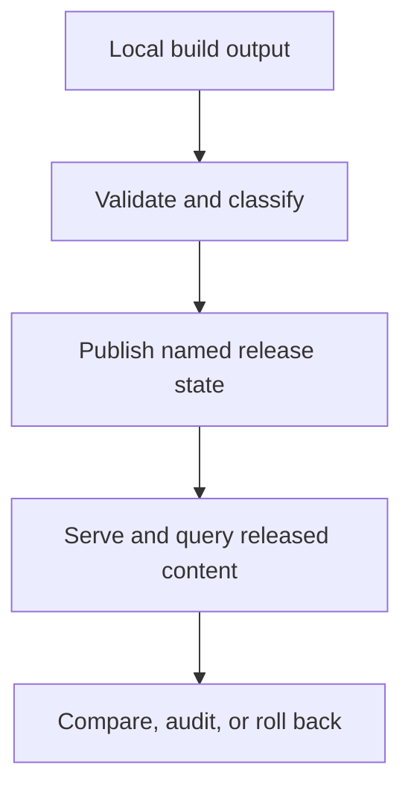

# Release Model

Releases are the time-shaped contract boundary for Atlas dataset content.

Atlas does not treat the latest local build as the durable truth. It treats a
release as the named state that can be validated, published, queried, compared,
and rolled back deliberately.

## Release Lifecycle

This release diagram matters because Atlas separates "I built something" from
"this is the durable released state another system can rely on."

## Release Questions

- what content belongs to this versioned state
- which artifact set represents it
- how clients request it
- how operators compare or restore it

## Repository Authority Map

- release policy inputs live under [`configs/sources/release/`](/Users/bijan/bijux/bijux-atlas/configs/sources/release)
- version and reproducibility policy are declared in [`version-policy.json`](/Users/bijan/bijux/bijux-atlas/configs/sources/release/version-policy.json:1) and [`reproducibility-policy.json`](/Users/bijan/bijux/bijux-atlas/configs/sources/release/reproducibility-policy.json:1)
- release-facing schema contracts live under [`configs/schemas/contracts/release/`](/Users/bijan/bijux/bijux-atlas/configs/schemas/contracts/release)
- generated runtime state and startup references live under [`configs/generated/runtime/`](/Users/bijan/bijux/bijux-atlas/configs/generated/runtime)
- product binaries that expose released behavior live under [`src/bin/`](/Users/bijan/bijux/bijux-atlas/crates/bijux-atlas/src/bin)

## Stable Release Boundaries

- a release is a named published state, not an arbitrary local workspace snapshot
- release identity must connect policy, artifacts, and public-facing runtime behavior
- comparison and rollback only make sense when the released state is durable and inspectable
- release reasoning should stay separate from transient debug output or temporary build products

## Practical Effect

Release-shaped thinking keeps runtime behavior and publication discipline tied
to the same identity model.

## Main Takeaway

The release model turns Atlas from a collection of local builds into a system of
named, validated, and comparable states. The repository expresses that through
release policy files, schemas, generated runtime artifacts, and the binaries
that expose released behavior to users.
