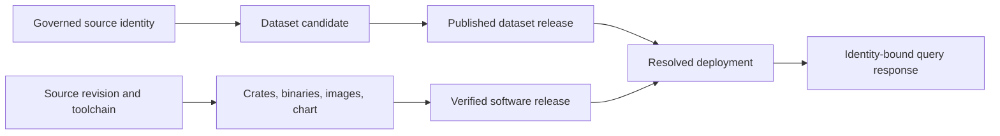
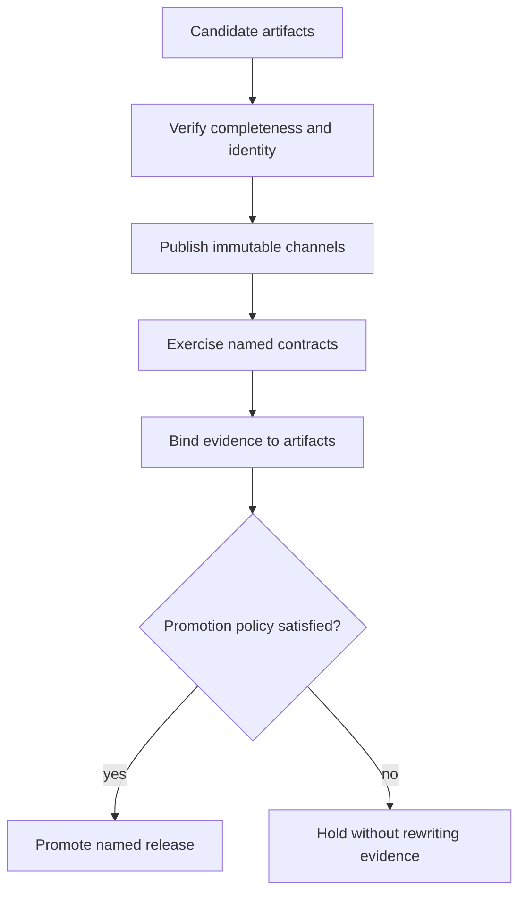
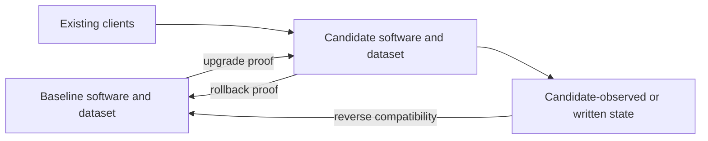

# Release Model

Atlas has two related release identities: a **dataset release** identifies
published genomic content, while a **software release** identifies the crates,
binaries, images, chart, schemas, and policies used to build and serve it. A
trustworthy result records both; neither identity can safely stand in for the
other.

## Release Lifecycle

```mermaid
flowchart LR
    Source[Governed source identity] --> DatasetBuild[Dataset candidate]
    DatasetBuild --> DatasetRelease[Published dataset release]
    Code[Source revision and toolchain] --> SoftwareBuild[Crates, binaries, images, chart]
    SoftwareBuild --> SoftwareRelease[Verified software release]
    DatasetRelease --> Deployment[Resolved deployment]
    SoftwareRelease --> Deployment
    Deployment --> Response[Identity-bound query response]
```

The dataset identity answers “which genomic state?” The software identity
answers “which implementation and operational contract?” Deployment evidence
binds them to a profile and environment. Query evidence additionally records
the dataset identity resolved for the request.

## Release Identity Matrix

| Identity | Includes | Must not be inferred from |
| --- | --- | --- |
| dataset release | release, species, assembly, input provenance, manifest, artifact hashes, catalog identity | build directory name or runtime cache |
| software release | version, source revision, toolchain, crates, binaries, images, chart, schemas, SBOM, checksums, provenance | workspace version string alone |
| deployment | software release, dataset release, chart and values digest, profile, dependency versions, environment identity | a successful Helm render |
| request observation | resolved dataset identity, software identity, route, request correlation, response status | a healthy process or unbound log sample |

## Publication and Promotion

A local build is a candidate, not a release. Dataset publication requires a
verified immutable payload and catalog promotion. Software publication requires
coherent channel artifacts, checksums, provenance, and verification. Promotion
then evaluates candidate-bound operational evidence; it does not create the
underlying identities retroactively.

```mermaid
flowchart TD
    Candidate[Candidate artifacts] --> Verify[Verify completeness and identity]
    Verify --> Publish[Publish immutable channels]
    Publish --> Exercise[Exercise named contracts]
    Exercise --> Packet[Bind evidence to artifacts]
    Packet --> Decision{Promotion policy satisfied?}
    Decision -->|yes| Promote[Promote named release]
    Decision -->|no| Hold[Hold without rewriting evidence]
```

Rollback selects a previously verified software and dataset combination and
records a new operational decision. It does not edit an existing release or
discard the failed observation.

## Compatibility Is Directional

A software release consuming a dataset, configuration, or API contract is a
directed relationship. Proving that a newer runtime reads an older dataset does
not prove that the older runtime can read state written or promoted by the
newer one.

| Direction | Compatibility question |
| --- | --- |
| software upgrade | can the candidate read existing artifacts, configuration, catalog state, and client requests? |
| software rollback | can the previous release read every state the candidate may have changed? |
| dataset promotion | can the active software and clients consume the new schema, indexes, and semantics? |
| dataset rollback | can selection return to the previous payload without incompatible cache, catalog, or derived state? |
| client transition | do old and new clients receive supported fields, errors, ordering, and cursor behavior? |

```mermaid
flowchart LR
    Baseline[Baseline software and dataset] -->|upgrade proof| Candidate[Candidate software and dataset]
    Candidate -->|rollback proof| Baseline
    OldClient[Existing clients] --> Candidate
    Candidate --> NewState[Candidate-observed or written state]
    NewState -->|reverse compatibility| Baseline
```

Record each supported arrow independently. A release combination is safe to
promote only when its forward path and required reversal path are both proven
for the actual artifacts, profiles, and shared state. Semantic version labels
help classify change; they cannot manufacture directional evidence.

## Repository Authority Map

- release policy: [`configs/sources/release/`](../../../configs/sources/release/)
- version policy:
  [`version-policy.json`](../../../configs/sources/release/version-policy.json)
- reproducibility policy:
  [`reproducibility-policy.json`](../../../configs/sources/release/reproducibility-policy.json)
- release schemas: [`configs/schemas/contracts/release/`](../../../configs/schemas/contracts/release/)
- runtime references: [`configs/generated/runtime/`](../../../configs/generated/runtime/)
- distribution and recovery handbook: [Atlas Release Operations](../../bijux-atlas-ops/release/index.md)

The [dataset model](dataset-model.md) defines dataset state transitions.
[Release Evidence](../../bijux-atlas-ops/release/release-evidence.md) defines
what binds a promotion decision to published software and operational proof.
