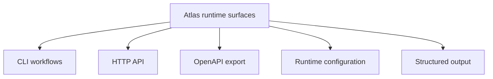

# Runtime Surfaces

`bijux-atlas` exposes several runtime surfaces that need to be understood
together.

## Surface Model

This page groups these surfaces together because users rarely touch only one of
them. A local dataset or query workflow often crosses CLI, config, server, and
structured output boundaries in one session.

## Main Surfaces

- CLI workflows for ingest, validation, and local inspection
- HTTP endpoints for serving dataset content
- OpenAPI export for published API shape
- runtime configuration and environment inputs
- structured machine-readable output for automation

## Repository Authority Map

- CLI surface lives under [`src/adapters/inbound/cli/`](/Users/bijan/bijux/bijux-atlas/crates/bijux-atlas/src/adapters/inbound/cli) and [`src/bin/bijux-atlas.rs`](/Users/bijan/bijux/bijux-atlas/crates/bijux-atlas/src/bin/bijux-atlas.rs:1)
- server process surface lives under [`src/adapters/inbound/http/`](/Users/bijan/bijux/bijux-atlas/crates/bijux-atlas/src/adapters/inbound/http) and [`src/bin/bijux-atlas-server.rs`](/Users/bijan/bijux/bijux-atlas/crates/bijux-atlas/src/bin/bijux-atlas-server.rs:1)
- generated OpenAPI surface is produced by [`src/bin/bijux-atlas-openapi.rs`](/Users/bijan/bijux/bijux-atlas/crates/bijux-atlas/src/bin/bijux-atlas-openapi.rs:1) and published under [`configs/generated/openapi/v1/`](/Users/bijan/bijux/bijux-atlas/configs/generated/openapi/v1)
- runtime config reference lives under [`configs/generated/runtime/`](/Users/bijan/bijux/bijux-atlas/configs/generated/runtime)
- response and error-shape contracts live under [`src/adapters/inbound/http/response_contract.rs`](/Users/bijan/bijux/bijux-atlas/crates/bijux-atlas/src/adapters/inbound/http/response_contract.rs:1)

## Why Group Them

Atlas users usually touch more than one surface. A local ingest workflow often
ends in server startup or API use, so the docs should describe them as one
product system instead of scattered isolated pages.

## Main Takeaway

Runtime surfaces are the user-visible edges of Atlas: command invocation,
server behavior, public API description, config intake, and machine-readable
responses. The repo spreads them across different roots, but the product only
feels coherent when readers can see them as one connected surface family.
