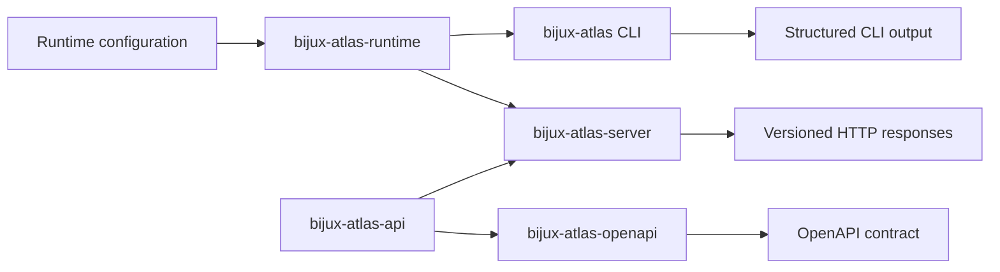

# Runtime Surfaces

Atlas exposes three installed commands, a canonical orchestration library, and
versioned machine contracts. They share domain behavior but have separate
owners and compatibility boundaries.

## Surface Model

```mermaid
flowchart LR
    Runtime[bijux-atlas-runtime] --> CLI[bijux-atlas CLI]
    Runtime --> Server[bijux-atlas-server]
    API[bijux-atlas-api] --> Server
    API --> OpenAPI[bijux-atlas-openapi]
    Config[Runtime configuration] --> Runtime
    CLI --> Output[Structured CLI output]
    Server --> HTTP[Versioned HTTP responses]
    OpenAPI --> Contract[OpenAPI contract]
```

The runtime library composes domain crates. The CLI owns interactive and
automation-facing command adaptation. The server owns process lifecycle, HTTP
routing, middleware, and telemetry bootstrap. The API crate owns wire DTOs and
OpenAPI generation. Sharing a runtime does not make their flags, process state,
or transport presentation interchangeable.

## Surface Contracts

| Surface | Direct owner | Stable consumer dependency | Evidence for one release |
| --- | --- | --- | --- |
| `bijux-atlas` | `bijux-atlas-cli` | documented commands, flags, exit codes, and governed structured output | generated help and focused CLI contract results from the released binary |
| `bijux-atlas-server` | `bijux-atlas-server` | startup configuration, process behavior, routes, middleware, health, and telemetry contracts | startup, route, health, and conformance results bound to the image or binary |
| `bijux-atlas-openapi` | `bijux-atlas-api` | deterministic export of the versioned OpenAPI document | generated document plus compatibility and freshness checks |
| `bijux-atlas-runtime` | `bijux-atlas-runtime` | documented Rust orchestration API | crate build, API docs, and contract checks for the published crate |
| runtime configuration | runtime with binary adapters | governed keys, types, precedence, and rejection behavior | candidate configuration validation and startup observation |
| machine output | owning command or endpoint | fields and semantics named by its schema | schema validation against candidate output |

## Cross-Surface Invariants

- CLI and HTTP adapters must preserve the resolved dataset identity and domain
  error meaning.
- OpenAPI must describe the routes and wire shapes owned by the released API
  and server combination.
- Configuration precedence must not depend on whether startup is reached
  through a wrapper or the direct binary.
- A compatibility library re-export does not transfer ownership of the
  installed command or server process.
- Human presentation may differ from structured output; automation must consume
  the governed machine contract.

Route availability alone does not prove response conformance, and successful
startup does not prove dataset readiness. Each surface requires evidence at the
boundary it owns.

## Repository Authority Map

- CLI binary: [`bijux-atlas.rs`](https://github.com/bijux/bijux-atlas/blob/main/crates/bijux-atlas-cli/src/bin/bijux-atlas.rs)
- server HTTP adapters:
  [`crates/bijux-atlas-server/src/adapters/inbound/http/`](https://github.com/bijux/bijux-atlas/tree/main/crates/bijux-atlas-server/src/adapters/inbound/http/)
- server binary:
  [`bijux-atlas-server.rs`](https://github.com/bijux/bijux-atlas/blob/main/crates/bijux-atlas-server/src/bin/bijux-atlas-server.rs)
- OpenAPI exporter:
  [`bijux-atlas-openapi.rs`](https://github.com/bijux/bijux-atlas/blob/main/crates/bijux-atlas-api/src/bin/bijux-atlas-openapi.rs)
- generated OpenAPI: [`configs/generated/openapi/v1/`](https://github.com/bijux/bijux-atlas/tree/main/configs/generated/openapi/v1/)
- generated runtime references: [`configs/generated/runtime/`](https://github.com/bijux/bijux-atlas/tree/main/configs/generated/runtime/)

Continue with [Interfaces](../interfaces/index.md) for exact commands and wire
surfaces, or [Request Lifecycle](../runtime/request-lifecycle.md) for the path
through a running server.
