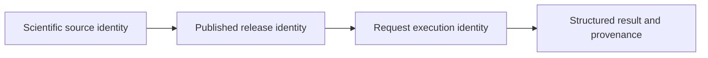
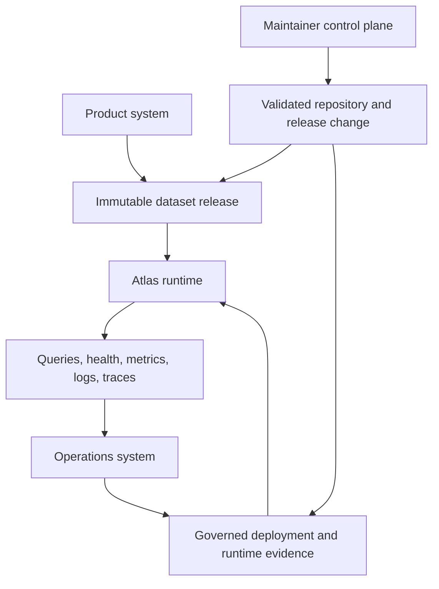
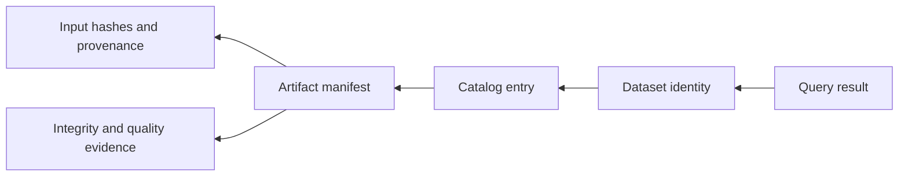

# What Atlas Is

Atlas is an artifact-first genomics delivery system. It validates governed
GFF3 and FASTA sources. It then constructs immutable dataset releases.
Publication moves a complete release into an explicit store and catalog. Rust,
CLI, HTTP, and OpenAPI surfaces serve that published state.

The central rule is simple: a runtime may select and query a release, but it
does not mutate release truth.

## One Result Has Three Identities

An Atlas response is interpretable only when three identities remain distinct:

| Identity | Answers | Anchored by |
| --- | --- | --- |
| scientific source. | Which upstream records and coordinate system contributed to the result? | Input hashes, source metadata, species, assembly, and normalization policy. |
| published release. | Which immutable bytes and catalog selection supplied the result? | Dataset identity, manifest, artifact checksums, and publication state. |
| request execution. | Which software, policy, principal, and path produced this observation? | Runtime release, effective configuration, request ID, route, query plan, and status. |

Scientific source identity cannot be reconstructed from a process version.
Request success cannot prove that the upstream source was biologically correct.
A release comparison needs the published identity; an incident investigation
also needs the request execution identity.

This separation lets the same release be served by several runtime versions
without changing its data identity, and lets one runtime serve several named
releases without inventing an implicit current dataset.

## The Product Boundary

```mermaid
flowchart LR
    Sources[Governed GFF3 and FASTA] --> Admission[Validate identity, format, and policy]
    Admission --> Normalize[Normalize genomic records]
    Normalize --> Build[Build database, sequence, index, and manifest artifacts]
    Build --> Verify[Verify hashes, statistics, and quality evidence]
    Verify --> Publish[Publish immutable release]
    Publish --> Catalog[Expose catalog identity]
    Catalog --> Serve[Serve queries and metadata]
```

Build output and serving state are deliberately separate. Publication
establishes a complete, discoverable release. Serving an intermediate build
root would bypass catalog identity, store integrity, and rollback semantics.

## Durable Objects

| Object | Meaning | Why it is durable |
| --- | --- | --- |
| dataset identity | release, species, and assembly coordinates for one dataset | prevents an implicit “current dataset” from becoming authority |
| artifact manifest | file locations, checksums, statistics, input hashes, and sharding metadata | binds a release to the bytes that implement it |
| catalog entry | published dataset identity and availability | separates discoverability from local build state |
| query contract | normalized selectors, regions, limits, ordering, and cursor rules | makes equivalent requests behave consistently across interfaces |
| structured result | typed data or a stable error envelope | lets clients branch on fields and codes rather than message text |
| operational evidence | profile, conformance, telemetry, load, and release records | ties deployment decisions to named, reviewable inputs |

## Three Interlocking Systems

The product system owns data meaning and runtime behavior. The operations
system owns deployment, observation, stress testing, promotion, and rollback.
The maintainer control plane governs code, contracts, configuration, and
release evidence. These systems meet through explicit artifacts. They do
not share mutable authority.

## What Atlas Optimizes For

- deterministic construction from governed inputs and pinned configuration
- immutable release identity instead of mutable serving truth
- narrow crate and interface ownership instead of a monolithic public surface
- structured compatibility contracts instead of message-text conventions
- observable overload and failure behavior instead of optimistic availability
- promotion and rollback decisions backed by retained evidence

## Appropriate Uses

Atlas fits systems that publish versioned genomic reference data. It can trace
a result to its source, build, release, dataset, and policy. Supported workflows
cover genes, transcripts, sequences, regions, counts, and release comparisons.

Atlas is not a generic transformation framework or mutable transactional
database. Nor is it an authority for the biological correctness of upstream
data. It validates supported boundaries and preserves provenance. It cannot
establish truth that was absent from the source.

## What Atlas Refuses

Several apparent shortcuts would weaken the identity of a result, so Atlas
keeps them outside the product boundary:

- serving an unpublished build directory as though it were a release
- selecting a dataset through an unnamed, mutable notion of "current"
- accepting malformed coordinates or incompatible identities through silent
  coercion
- treating runtime caches, logs, or local database state as release authority
- presenting the existence of an artifact as proof that its contents passed
  the required policy and integrity checks

These refusals are part of the architecture. They keep a query result connected
to a named dataset and keep operational recovery connected to immutable release
artifacts.

## Evaluate a Result

A result is useful evidence only when its identity can be followed back to the
published release that supplied it.

Use the returned dataset identity first. Resolve it through the catalog, then
inspect the manifest for the exact artifact hashes, input provenance, and build
statistics. A result without that chain may still be locally useful, but it is
not sufficient evidence for release comparison, audit, or rollback decisions.

## The Trust Chain Is Directional

Atlas does not infer release truth backward from a running process. A healthy
server, a populated cache, or a successful query demonstrates an observation
about one runtime. Release trust flows in the other direction: governed inputs
produce verified artifacts; publication establishes catalog visibility; the
runtime resolves that published identity; and a response carries the identity
forward to the consumer.

| Observation | What it establishes | What it does not establish |
| --- | --- | --- |
| ingest completed | the producer emitted a candidate artifact set | the set is complete, verified, or published |
| artifact hashes match | the checked bytes match the recorded manifest | the upstream biological source is correct |
| catalog lists a dataset | the release is discoverable through that catalog | every runtime has refreshed to it |
| readiness succeeds | the instance passed its configured readiness checks | the selected dataset is the one a caller intended |
| query succeeds | the runtime answered for the returned dataset identity | a different release would answer identically |

This directionality is why dataset identity belongs in results and operational
evidence. It prevents runtime availability from being mistaken for data
provenance.

## Stability Boundary

Published crate APIs and installed binaries carry explicit compatibility
expectations. So do versioned HTTP and OpenAPI shapes, structured outputs,
runtime configuration, artifact layouts, and named operational contracts.
Internal Rust modules, local debug output, repository fixtures, and maintainer
implementation details are not downstream promises unless a contract names
them.

Continue with [Core Concepts](core-concepts.md) for terminology,
[Dataset Model](dataset-model.md) for release identity, and
[System Overview](../runtime/system-overview.md) for component ownership.
