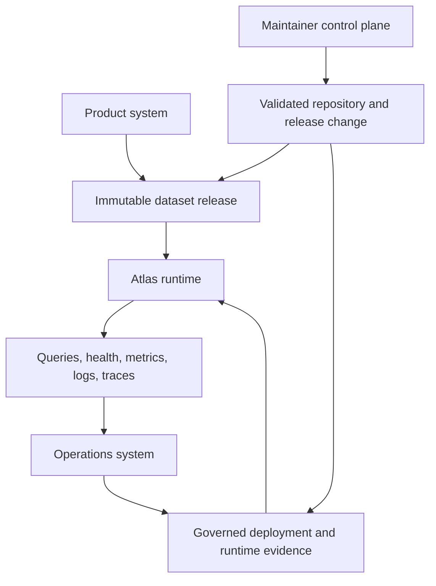

# What Atlas Is

Atlas is an artifact-first genomics delivery system. It validates governed GFF3
and FASTA sources and constructs immutable dataset releases. Publication moves
a complete release into an explicit store and catalog. Rust, CLI, HTTP, and
OpenAPI surfaces serve that published state.

The central rule is simple: a runtime may select and query a release, but it
does not mutate release truth.

## The Product Boundary

```mermaid
flowchart LR
    Sources[Governed GFF3 and FASTA] --> Admission[Validate identity, format, and policy]
    Admission --> Normalize[Normalize genomic records]
    Normalize --> Build[Build database, sequence, index, and manifest artifacts]
    Build --> Verify[Verify hashes, statistics, and quality evidence]
    Verify --> Publish[Publish immutable release]
    Publish --> Catalog[Expose catalog identity]
    Catalog --> Serve[Serve queries and metadata]
```

Build output and serving state are deliberately separate. Publication is the
boundary that establishes a complete, discoverable release. Serving directly
from an intermediate build root would bypass catalog identity, store integrity,
and rollback semantics.

## Durable Objects

| Object | Meaning | Why it is durable |
| --- | --- | --- |
| dataset identity | release, species, and assembly coordinates for one dataset | prevents an implicit “current dataset” from becoming authority |
| artifact manifest | file locations, checksums, statistics, input hashes, and sharding metadata | binds a release to the bytes that implement it |
| catalog entry | published dataset identity and availability | separates discoverability from local build state |
| query contract | normalized selectors, regions, limits, ordering, and cursor rules | makes equivalent requests behave consistently across interfaces |
| structured result | typed data or a stable error envelope | lets clients branch on fields and codes rather than message text |
| operational evidence | profile, conformance, telemetry, load, and release records | ties deployment decisions to named, reviewable inputs |

## Three Interlocking Systems

The product system owns data meaning and runtime behavior. The operations
system owns deployment, observation, stress testing, promotion, and rollback.
The maintainer control plane governs changes to code, contracts, configuration,
and release evidence. These systems meet through explicit artifacts. They do
not share mutable authority.

## What Atlas Optimizes For

- deterministic construction from governed inputs and pinned configuration
- immutable release identity instead of mutable serving truth
- narrow crate and interface ownership instead of a monolithic public surface
- structured compatibility contracts instead of message-text conventions
- observable overload and failure behavior instead of optimistic availability
- promotion and rollback decisions backed by retained evidence

## Appropriate Uses

Atlas fits systems that publish versioned genomic reference data. It can show
which source, build, release, dataset, and policy produced a result. Supported
workflows cover genes, transcripts, sequences, regions, counts, and release
comparisons over explicit dataset identity.

Atlas is not a generic transformation framework, a mutable transactional
database, or an authority for the biological correctness of upstream data. It
validates supported boundaries and preserves provenance; it cannot establish
truth that was absent from the source.

## Stability Boundary

Published crate APIs and installed binaries carry explicit compatibility
expectations. So do versioned HTTP and OpenAPI shapes, structured outputs,
runtime configuration, artifact layouts, and named operational contracts.
Internal Rust modules, local debug output, repository fixtures, and maintainer
implementation details are not downstream promises unless a contract names
them.

Continue with [Core Concepts](core-concepts.md) for terminology,
[Dataset Model](dataset-model.md) for release identity, and
[System Overview](../runtime/system-overview.md) for component ownership.
