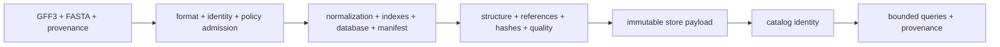
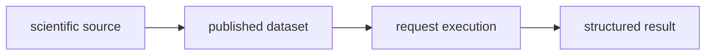
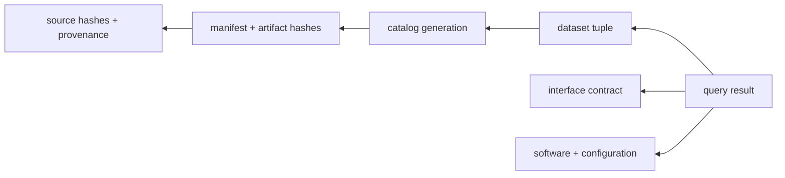

# What Atlas Is

Atlas is a release-oriented system for genomic reference data. It accepts
governed GFF3 and FASTA sources, constructs query artifacts, verifies their
identity and integrity, publishes them immutably, and exposes the published
state through CLI, HTTP, OpenAPI, and Rust interfaces.

The runtime may select and query a release. It may not mutate release truth.

## The Product Boundary

Atlas owns the behavior of this path. It does not certify the biological truth
of the upstream annotation, replace source governance, or turn an arbitrary
local directory into a release.

## Three Identities Explain a Result

| Identity | Answers | Anchored by |
| --- | --- | --- |
| scientific source | which records and coordinate system entered the build | source hashes, metadata, species, assembly, and normalization policy |
| published dataset | which immutable bytes were selected | dataset tuple, catalog generation, manifest, and artifact hashes |
| request execution | which software and policy produced the observation | software, configuration, principal, route, query plan, request, and status |

The same dataset can be served by several compatible software releases without
changing its data identity. One server can expose several named datasets
without inventing an implicit “current” release.

## Dataset, Software, and Target Advance Independently

| Identity | Changes when |
| --- | --- |
| dataset release | source, normalization, schema, or artifact content changes |
| software release | binaries, public contracts, chart, or packaged software changes |
| deployment qualification | target, profile, policy, dependency, selected dataset, or evidence window changes |

A software release does not republish unchanged genomic data. A new dataset
does not prove every software release can serve it. Deployment qualification
joins exact dataset and software identities with evidence observed in one
target.

## Durable Product Objects

| Object | Durable meaning |
| --- | --- |
| dataset tuple | `release/species/assembly` names one logical dataset |
| manifest | binds source identity, layout, statistics, and hashes |
| catalog entry | makes a published tuple discoverable |
| query contract | defines selectors, regions, ordering, limits, and cursors |
| structured result | carries typed data or a stable error envelope |
| operational receipt | binds target evidence to software and dataset identities |

Caches, logs, local SQLite handles, process memory, and mutable aliases are not
release authority.

## Design Commitments

Atlas favors:

- deterministic construction from admitted inputs and explicit configuration;
- immutable published bytes over in-place data mutation;
- narrow crate and interface ownership over a monolithic runtime;
- stable fields and error codes over message-text conventions;
- bounded rejection and observable degradation over optimistic availability;
- explicit promotion and rollback evidence over inferred success.

It refuses to:

- serve an unpublished build root as a released dataset;
- silently coerce incompatible coordinates or dataset identities;
- let a cache entry or alias redefine published identity;
- treat artifact presence as proof of completed verification; or
- infer source provenance backward from a healthy process.

## Evaluate a Result

Start with the returned dataset identity. Follow it through the catalog and
manifest to the source and artifact hashes. Separately confirm the interface
contract and effective runtime identity. A result missing that chain may be
useful interactively, but it is insufficient for audit, release comparison, or
rollback decisions.

Continue with [Core Concepts](core-concepts.md), the
[Dataset Model](dataset-model.md), and the
[System Overview](../runtime/system-overview.md).
