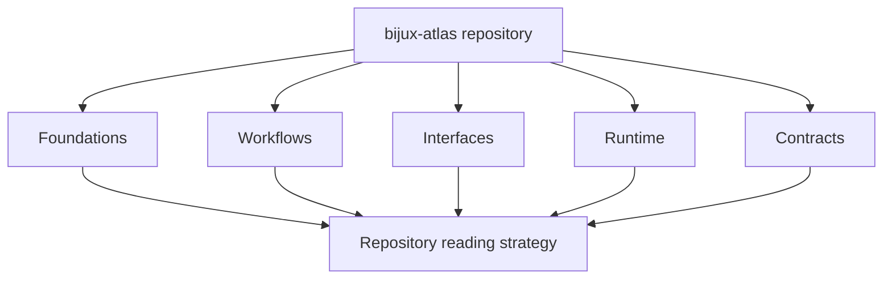

# bijux-atlas

`bijux-atlas` is the product documentation for Atlas itself.

These docs move from the product model to the exact workflow, interface,
runtime, or contract a question needs next.

## What This Documentation Covers

Use these pages for product behavior, data workflows, runtime interfaces,
architecture, and compatibility contracts.

Atlas is the repository-owned product surface for:

- ingesting governed GFF3 and FASTA inputs into immutable dataset artifacts
- publishing those artifacts into a serving store and catalog
- serving dataset identity, gene, transcript, sequence, and diff workflows
- exposing a stable CLI, HTTP, and OpenAPI surface around those artifacts

These docs are intentionally separate from:

- `bijux-atlas-ops`, which explains how Atlas is deployed and operated
- `bijux-atlas-dev`, which explains the repository control plane and maintainer automation

## Where Product Truth Lives

- product and domain meaning live primarily under `crates/bijux-atlas/src/domain/`
- runtime assembly lives under `crates/bijux-atlas/src/runtime/` and
  `crates/bijux-atlas/src/app/`
- HTTP and API surface lives under
  `crates/bijux-atlas/src/adapters/inbound/http/`
- CLI surface and user-facing command handling live under
  `crates/bijux-atlas/src/adapters/inbound/cli/` and `crates/bijux-atlas/src/bin/`
- generated API and runtime references live under `configs/generated/openapi/`
  and `configs/generated/runtime/`
- workflow examples and machine-checked contract shapes live under
  `configs/examples/` and `configs/schemas/contracts/`

## Reading Paths

Choose a path based on the question in front of you:

- start in [Foundations](foundations/index.md) when you need the product model, terminology, or repository scope
- move to [Workflows](workflows/index.md) when you need to install Atlas, build data, start a server, or run queries
- use [Interfaces](interfaces/index.md) when the question is about exact commands, endpoints, flags, outputs, or env vars
- use [Runtime](runtime/index.md) when you need architecture, lifecycle, storage, request flow, or source-layout explanations
- use [Contracts](contracts/index.md) when you need the strongest compatibility promises and review rules

## Product Boundary

Atlas is artifact-first. The runtime is not meant to serve mutable, partially
built local state directly from ad hoc ingest output. The normal path is:

1. validate and build source inputs into release-shaped artifacts
2. publish artifacts into a serving store
3. resolve catalog state from that store
4. expose queries and metadata through the CLI and HTTP surfaces

That boundary is why product, operations, and maintainer docs stay distinct.
The runtime promise should be understandable without walking through Helm, CI,
or repository-governance material first.

## Docs Versus Repository Data

These pages explain meaning, boundaries, and usage. They do not replace the
repository-owned authorities that enforce shape or behavior. When a page
describes a stable surface, readers should be able to confirm that claim in one
of four places:

- implementation code under `crates/bijux-atlas/src/`
- generated references under `configs/generated/`
- machine-checked contract schemas under `configs/schemas/contracts/`
- example or workflow material under `configs/examples/`

## Sections

- [Foundations](foundations/index.md)
- [Workflows](workflows/index.md)
- [Interfaces](interfaces/index.md)
- [Runtime](runtime/index.md)
- [Contracts](contracts/index.md)

## Source Anchors

- `crates/bijux-atlas/`
- `crates/bijux-atlas/src/bin/bijux-atlas.rs`
- `crates/bijux-atlas/src/bin/bijux-atlas-server.rs`
- `crates/bijux-atlas/src/bin/bijux-atlas-openapi.rs`
