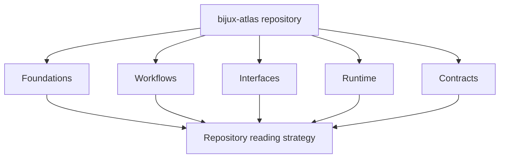

# bijux-atlas

`bijux-atlas` is the product handbook for Atlas itself.

```mermaid
flowchart TD
    Repo[bijux-atlas repository] --> Foundations[Foundations]
    Repo --> Workflows[Workflows]
    Repo --> Interfaces[Interfaces]
    Repo --> Runtime[Runtime]
    Repo --> Contracts[Contracts]
    Foundations --> Truth[Repository reading strategy]
    Workflows --> Truth
    Interfaces --> Truth
    Runtime --> Truth
    Contracts --> Truth
```

These docs are for readers who need to understand what Atlas delivers, how the
runtime behaves, and which contracts define that behavior.

## What This Documentation Covers

Use these pages for product meaning, runtime behavior, user-facing workflows,
interfaces, and compatibility contracts.

Atlas is the repository-owned product surface for:

- ingesting governed GFF3 and FASTA inputs into immutable dataset artifacts
- publishing those artifacts into a serving store and catalog
- serving dataset identity, gene, transcript, sequence, and diff workflows
- exposing a stable CLI, HTTP, and OpenAPI surface around those artifacts

The Atlas product surface is now carried by a split crate set rather than one
monolithic runtime package. `bijux-atlas-runtime` owns orchestration,
`bijux-atlas` preserves the historical import path, `bijux-atlas-cli`,
`bijux-atlas-server`, and `bijux-atlas-api` own the direct binaries, and the
leaf crates own ingest, query, model, core, store, and operations contracts.

These docs are intentionally separate from:

- `bijux-atlas-ops`, which explains how Atlas is deployed and operated
- `bijux-atlas-dev`, which explains the repository control plane and maintainer automation

## Where Product Truth Lives

- dataset identity, gene, transcript, and diff meaning live primarily under
  `crates/bijux-atlas-model/src/`
- ingest-time normalization and artifact construction live under
  `crates/bijux-atlas-ingest/src/engine/`
- query semantics live under `crates/bijux-atlas-query/src/engine/`
- runtime assembly, store ports, policy, and configuration live under
  `crates/bijux-atlas-runtime/src/app/`,
  `crates/bijux-atlas-runtime/src/domain/`, and
  `crates/bijux-atlas-runtime/src/runtime/`
- HTTP and API surface lives under
  `crates/bijux-atlas-server/src/adapters/inbound/http/`
- CLI surface and user-facing command handling live under
  `crates/bijux-atlas-cli/src/bin/`,
  `crates/bijux-atlas-server/src/bin/`, and
  `crates/bijux-atlas-api/src/bin/`
- generated API and runtime references live under `configs/generated/openapi/`
  and `configs/generated/runtime/`
- workflow examples and machine-checked contract shapes live under
  `configs/examples/` and `configs/schemas/contracts/`

## Reading Paths

Choose a path based on the question in front of you:

- start in [Foundations](foundations/index.md) when you need the product model, terminology, or repository scope
- move to [Workflows](workflows/index.md) when you need to install Atlas, build data, start a server, or run queries
- use [Interfaces](interfaces/index.md) when the question is about exact commands, endpoints, flags, outputs, or env vars
- use [Runtime](runtime/index.md) when you need architecture, lifecycle, storage, request flow, or source-layout explanations
- use [Contracts](contracts/index.md) when you need the strongest compatibility promises and review rules

## Product Boundary

Atlas is artifact-first. The runtime is not meant to serve mutable, partially
built local state directly from ad hoc ingest output. The normal path is:

1. validate and build source inputs into release-shaped artifacts
2. publish artifacts into a serving store
3. resolve catalog state from that store
4. expose queries and metadata through the CLI and HTTP surfaces

That boundary is why product, operations, and maintainer docs stay distinct.
The runtime promise should be understandable without walking through Helm, CI,
or repository-governance material first.

## Docs Versus Repository Data

These pages explain meaning, boundaries, and usage. They do not replace the
repository-owned authorities that enforce shape or behavior. When a page
describes a stable surface, readers should be able to confirm that claim in one
of four places:

- implementation code under the owning split crates in `crates/`
- generated references under `configs/generated/`
- machine-checked contract schemas under `configs/schemas/contracts/`
- example or workflow material under `configs/examples/`

## Sections

- [Foundations](foundations/index.md)
- [Workflows](workflows/index.md)
- [Interfaces](interfaces/index.md)
- [Runtime](runtime/index.md)
- [Contracts](contracts/index.md)

## Source Anchors

- `crates/bijux-atlas-runtime/`
- `crates/bijux-atlas/`
- `crates/bijux-atlas-cli/src/bin/bijux-atlas.rs`
- `crates/bijux-atlas-server/src/bin/bijux-atlas-server.rs`
- `crates/bijux-atlas-api/src/bin/bijux-atlas-openapi.rs`
