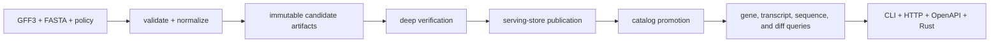
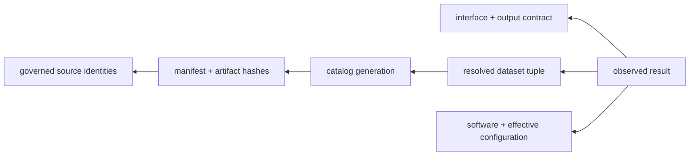
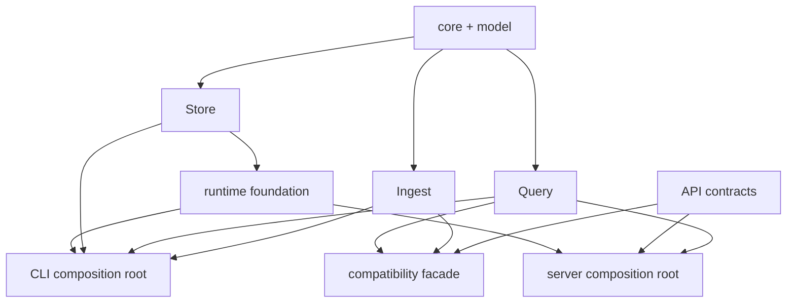

# Atlas Product

Atlas owns the path from governed GFF3 and FASTA inputs to immutable dataset
artifacts and stable query surfaces. It does not serve mutable ingest output as
release truth.

```mermaid
flowchart LR
    Inputs["GFF3 + FASTA + policy"] --> Ingest["validate + normalize"]
    Ingest --> Artifacts["immutable candidate artifacts"]
    Artifacts --> Verify["deep verification"]
    Verify --> Store["serving-store publication"]
    Store --> Catalog["catalog promotion"]
    Catalog --> Query["gene, transcript, sequence, and diff queries"]
    Query --> Surface["CLI + HTTP + OpenAPI + Rust"]
```

## Product Capabilities

| Capability | Product promise |
| --- | --- |
| ingest | accepted source records are normalized into a reviewable candidate |
| verification | structure, references, manifests, and hashes are checked before publication |
| publication | a complete candidate becomes immutable serving-store state |
| promotion | the catalog makes one published dataset tuple discoverable |
| query | bounded query engines operate on verified artifacts |
| delivery | CLI, HTTP, OpenAPI, and Rust surfaces preserve identity and stable errors |
| compatibility | wire, configuration, artifact, output, plugin, and crate changes are governed |

The logical dataset identity is `release/species/assembly`. Artifact hashes
bind that tuple to exact bytes. Aliases such as `latest` are selectors and must
be resolved before a result or comparison is recorded.

## Follow a Result Backward

```mermaid
flowchart RL
    Result["observed result"] --> Contract["interface + output contract"]
    Result --> Dataset["resolved dataset tuple"]
    Dataset --> Catalog["catalog generation"]
    Catalog --> Manifest["manifest + artifact hashes"]
    Manifest --> Inputs["governed source identities"]
    Result --> Runtime["software + effective configuration"]
```

A result is reviewable when both paths are known: its interface contract
explains the shape, while its dataset and runtime identities explain which
published bytes and behavior produced it.

## Crate Ownership

The CLI and server are composition roots. They call the domain crates required
by their executable paths; `bijux-atlas-runtime` is a shared foundation, not a
central orchestrator.

```mermaid
flowchart TB
    Core["core + model"] --> Ingest
    Core --> Query
    Core --> Store
    Store --> Runtime["runtime foundation"]
    Ingest --> CLI["CLI composition root"]
    Query --> CLI
    Store --> CLI
    Runtime --> CLI
    Query --> Server["server composition root"]
    API["API contracts"] --> Server
    Runtime --> Server
    API --> Facade["compatibility facade"]
    Ingest --> Facade
    Query --> Facade
```

| Owner | Responsibility |
| --- | --- |
| core and model | stable shared contracts and genomic identities |
| ingest | validation, normalization, and artifact construction |
| store | immutable publication and catalog operations |
| query | query semantics and bounded execution |
| runtime | configuration, policy, store ports, adapters, and shared domains |
| server | HTTP lifecycle, dataset and response caching, telemetry, and routing |
| API | DTOs, envelopes, parameters, and OpenAPI |
| CLI | operator commands and workflow composition |
| compatibility facade | historical `bijux_atlas` Rust import surface |

## Authority Transfers

| Transition | Completion evidence |
| --- | --- |
| source to candidate | accepted source identities, policy, findings, and candidate manifest |
| candidate to publishable | validation and deep-verification results for the exact bytes |
| publishable to stored | backend publication record, manifest, and checksum lock |
| stored to discoverable | catalog generation naming the exact dataset tuple |
| discoverable to resolvable | server refresh and verified local artifact open |
| resolvable to answered | interface result carrying request, dataset, and artifact provenance where supported |

No transition implies the next. Files in a build directory are not published;
published files are not discoverable until promotion; a catalog entry does not
prove that every server refreshed it.

## Diagnose at the First Disagreement

| Observation | Inspect first | Do not infer |
| --- | --- | --- |
| source record rejected | normalization finding and source location | all inputs are invalid |
| deep verification failed | manifest, references, and payload hashes | publication corrupted the artifact |
| published tuple absent | catalog generation and promotion record | payload publication never happened |
| readiness false | catalog refresh, dataset state, and configured readiness mode | process liveness failed |
| empty query | exact tuple, selector, ordering, and page boundary | dataset absence |
| CLI and HTTP disagree | shared typed result before presentation | query semantics are necessarily wrong |

Preserve the earliest disputed identity. Changing catalog, cache, runtime, and
traffic simultaneously removes the stable comparison needed for diagnosis.

## Choose the Next Guide

| Question | Guide |
| --- | --- |
| What identities and boundaries define Atlas? | [Foundations](foundations/index.md) |
| How do I install, build, publish, serve, and query? | [Workflows](workflows/index.md) |
| Which commands, endpoints, outputs, and settings are public? | [Interfaces](interfaces/index.md) |
| How do requests, storage, caching, and processes fit together? | [Runtime](runtime/index.md) |
| Which promises are compatible and versioned? | [Contracts](contracts/index.md) |

For deployment, security, observability, load, recovery, and release decisions,
continue to [Atlas Operations](../bijux-atlas-ops/index.md). For repository
automation and delivery, continue to the
[Maintainer Control Plane](../bijux-atlas-dev/index.md).
