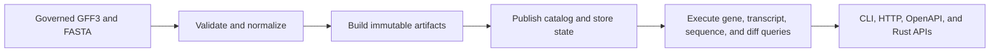
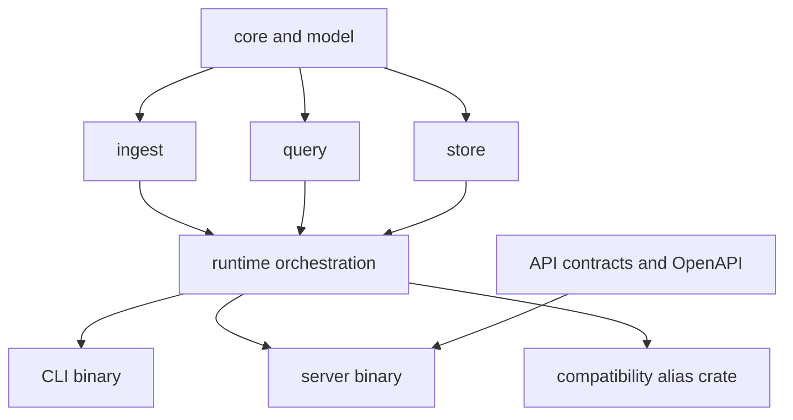
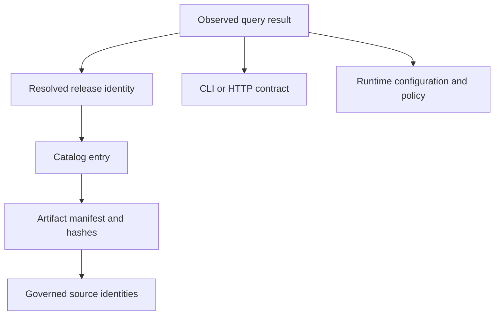

# bijux-atlas

Atlas delivers immutable genomic dataset releases and stable query surfaces
over published catalog state. The product boundary runs from source admission
through artifact construction, publication, serving, and compatibility.

```mermaid
flowchart LR
    Inputs[Governed GFF3 and FASTA] --> Ingest[Validate and normalize]
    Ingest --> Build[Build immutable artifacts]
    Build --> Publish[Publish catalog and store state]
    Publish --> Query[Execute gene, transcript, sequence, and diff queries]
    Query --> Interfaces[CLI, HTTP, OpenAPI, and Rust APIs]
```

## Product Capabilities

Atlas is the repository-owned product surface for:

- ingesting governed GFF3 and FASTA inputs into immutable dataset artifacts
- publishing those artifacts into a serving store and catalog
- serving dataset identity, gene, transcript, sequence, and diff workflows
- exposing a stable CLI, HTTP, and OpenAPI surface around those artifacts

The Atlas product surface is carried by a split crate set.
`bijux-atlas-runtime` owns orchestration. `bijux-atlas` preserves the historical
import path. The CLI, server, and API crates own the direct binaries. Leaf
crates own ingest, query, model, core, store, and operations contracts.

| Capability | Product boundary |
| --- | --- |
| dataset construction | validates and normalizes supported GFF3 and FASTA inputs into release-shaped artifacts |
| publication | moves complete artifacts into explicit store and catalog state |
| discovery | resolves release, species, assembly, dataset, and available endpoint identity |
| query | serves genes, counts, transcripts, sequence regions, and release comparisons |
| delivery | exposes direct binaries, split Rust crates, HTTP routes, and generated OpenAPI |
| compatibility | versions wire shapes, structured output, configuration, plugins, artifacts, and crate ownership |

## Crate Architecture

```mermaid
flowchart TB
    Core[core and model] --> Ingest[ingest]
    Core --> Query[query]
    Core --> Store[store]
    Ingest --> Runtime[runtime orchestration]
    Query --> Runtime
    Store --> Runtime
    Runtime --> CLI[CLI binary]
    Runtime --> Server[server binary]
    API[API contracts and OpenAPI] --> Server
    Runtime --> Compat[compatibility alias crate]
```

Ownership stays split so consumers can depend on the narrowest durable surface:

- dataset identity, gene, transcript, and diff meaning live primarily under
  `crates/bijux-atlas-model/src/`
- ingest-time normalization and artifact construction live under
  `crates/bijux-atlas-ingest/src/engine/`
- query semantics live under `crates/bijux-atlas-query/src/engine/`
- runtime assembly, store ports, policy, and configuration live under
  `crates/bijux-atlas-runtime/src/app/`,
  `crates/bijux-atlas-runtime/src/domain/`, and
  `crates/bijux-atlas-runtime/src/runtime/`
- HTTP and API surface lives under
  `crates/bijux-atlas-server/src/adapters/inbound/http/`
- CLI surface and user-facing command handling live under
  `crates/bijux-atlas-cli/src/bin/`,
  `crates/bijux-atlas-server/src/bin/`, and
  `crates/bijux-atlas-api/src/bin/`
- generated API and runtime references live under `configs/generated/openapi/`
  and `configs/generated/runtime/`
- workflow examples and machine-checked contract shapes live under
  `configs/examples/` and `configs/schemas/contracts/`

## Follow a Result

```mermaid
flowchart TD
    Result[Observed query result] --> Release[Resolved release identity]
    Release --> Catalog[Catalog entry]
    Catalog --> Manifest[Artifact manifest and hashes]
    Manifest --> Inputs[Governed source identities]
    Result --> Surface[CLI or HTTP contract]
    Result --> Runtime[Runtime configuration and policy]
```

A reviewable result has two traceable paths. Its release identity leads through
the catalog and artifact manifest to governed inputs. Its shape leads to the
owning interface contract. Those paths are more useful than a generic statement
that the runtime or dataset is current.

## Choose a Product Surface

Choose a path based on the question in front of you:

- start in [Foundations](foundations/index.md) when you need the product model, terminology, or repository scope
- move to [Workflows](workflows/index.md) when you need to install Atlas, build data, start a server, or run queries
- use [Interfaces](interfaces/index.md) when the question is about exact commands, endpoints, flags, outputs, or env vars
- use [Runtime](runtime/index.md) when you need architecture, lifecycle, storage, request flow, or source-layout explanations
- use [Contracts](contracts/index.md) when you need the strongest compatibility promises and review rules

## Publication Boundary

Atlas is artifact-first. The runtime is not meant to serve mutable, partially
built local state directly from ad hoc ingest output. The normal path is:

1. validate and build source inputs into release-shaped artifacts
2. publish artifacts into a serving store
3. resolve catalog state from that store
4. expose queries and metadata through the CLI and HTTP surfaces

Serving from an ingest build directory bypasses catalog publication, store
identity, and release provenance. A completed build is therefore necessary but
not sufficient for a serveable release.

## Contract Authorities

Stable claims are backed by four kinds of authority:

- implementation code under the owning split crates in `crates/`
- generated references under `configs/generated/`
- machine-checked contract schemas under `configs/schemas/contracts/`
- example or workflow material under `configs/examples/`

Those authorities have different force. Implementation and schemas define
behavior. Generated references expose the resolved surface. Examples teach a
supported path but do not expand the contract. A release-specific claim also
needs evidence from the owning workflow.

| Reader question | Product authority | Release-specific proof |
| --- | --- | --- |
| Which dataset identity is served? | model, artifact, store, and catalog contracts | published manifest and store/catalog record |
| Which queries are stable? | query implementation, structured-output schemas, and OpenAPI | contract results for the released binaries |
| Which command owns an operation? | CLI command tree and generated command reference | help or contract output from the released command |
| Is an ingest directory serveable? | publication and artifact contracts | completed publish record, not build output alone |
| Is a wire change compatible? | API and compatibility policy | compatibility report for the affected release pair |

## Continue by Concern

- [Foundations](foundations/index.md)
- [Workflows](workflows/index.md)
- [Interfaces](interfaces/index.md)
- [Runtime](runtime/index.md)
- [Contracts](contracts/index.md)

For deployment, rollout, security, observability, load, and release decisions,
continue to [Atlas Operations](../bijux-atlas-ops/index.md). For repository
automation and contribution workflows, continue to the
[Maintainer Control Plane](../bijux-atlas-dev/index.md).
