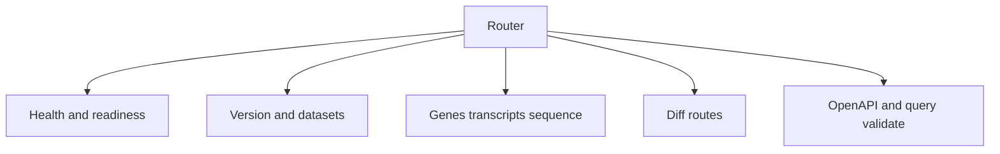
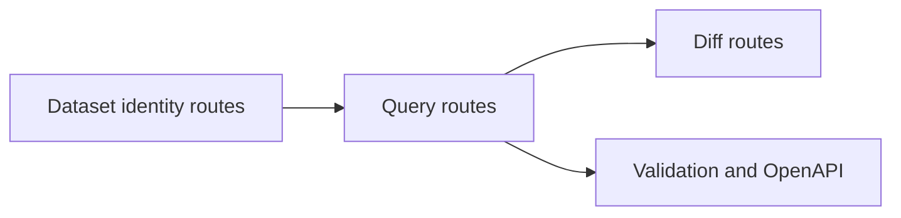
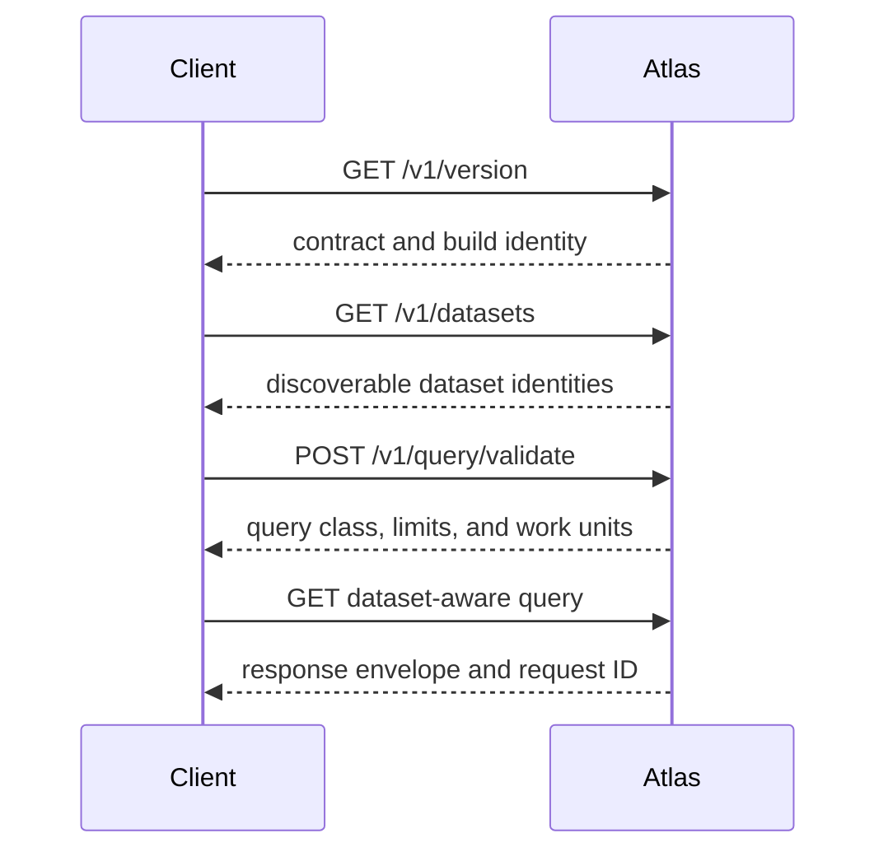

# API Endpoint Index

Atlas exposes a versioned query API alongside separate lifecycle and telemetry
routes. Dataset-aware calls resolve immutable content through the release,
species, and assembly tuple; lifecycle routes describe the process and traffic
state rather than biological data.

## Endpoint Families

## Lifecycle and Telemetry Routes

| Method | Route | Contract |
| --- | --- | --- |
| `GET` | `/` | Human-readable dataset browser for the current catalog. |
| `GET` | `/health`, `/healthz` | Basic process response; no dependency or admission guarantee. |
| `GET` | `/live` | Process is accepting requests rather than draining. |
| `GET` | `/ready`, `/readyz` | Instance is eligible for traffic under its catalog and runtime policy. |
| `GET` | `/healthz/overload` | Live, ready, drain, and shedding state. |
| `GET` | `/metrics` | Prometheus surface when the metrics endpoint is enabled. |

Use readiness for traffic admission, liveness for process replacement, and the
overload route for deliberate shedding. Their semantics are detailed in
[Health, Readiness, and Drain](../../bijux-atlas-ops/observability/health-readiness-and-drain.md).

## Versioned API Routes

| Method | Route | Purpose |
| --- | --- | --- |
| `GET` | `/v1/version` | Runtime, plugin, contract, schema, build, and policy identity. |
| `GET` | `/v1/openapi.json` | OpenAPI contract exposed by the running build. |
| `GET` | `/v1/datasets` | Discover catalog entries, with filtering and pagination. |
| `GET` | `/v1/datasets/{release}/{species}/{assembly}` | Inspect one canonical dataset identity and its available surfaces. |
| `GET` | `/v1/releases/{release}/species/{species}/assemblies/{assembly}` | Compatibility route that redirects to the canonical dataset path. |
| `GET` | `/v1/genes` | Query genes using an explicit dataset tuple and filters. |
| `GET` | `/v1/genes/count` | Count genes for an explicit dataset tuple and filters. |
| `POST` | `/v1/query/validate` | Validate query shape, cost, limits, and dataset selection without executing the query. |
| `GET` | `/v1/diff/genes`, `/v1/diff/region` | Compare named source and target releases. |
| `GET` | `/v1/sequence/region` | Retrieve sequence for a named dataset region. |
| `GET` | `/v1/genes/{gene_id}/sequence` | Retrieve sequence resolved from a gene in a named dataset. |
| `GET` | `/v1/genes/{gene_id}/transcripts` | List transcripts belonging to a gene in a named dataset. |
| `GET` | `/v1/transcripts/{tx_id}` | Retrieve a transcript from a named dataset. |

This relationship view shows how the route families build on dataset identity.
Most useful Atlas query work starts by naming the dataset explicitly and then
choosing the query or diff path.

## Client Request Sequence

Discovery prevents a client from guessing release identity. Validation lets a
client inspect an expensive or policy-sensitive request before execution.
Record the response request ID for correlation, including on errors.

## Debug Routes

Additional `/debug/...` routes may be enabled depending on runtime settings. Treat them as operationally sensitive and configuration-dependent rather than universal public surface.

## Contract Authority

The running router decides which routes are reachable. The generated OpenAPI
contract defines versioned request and response shape. Endpoint observability
contracts define request class and required signals. If this summary disagrees
with the running OpenAPI document or tested router, treat the mismatch as API
drift and do not infer compatibility from this list alone.
