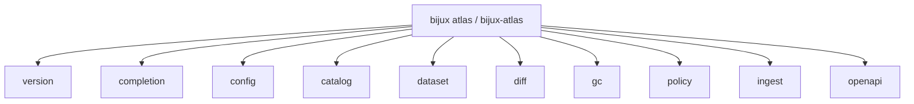
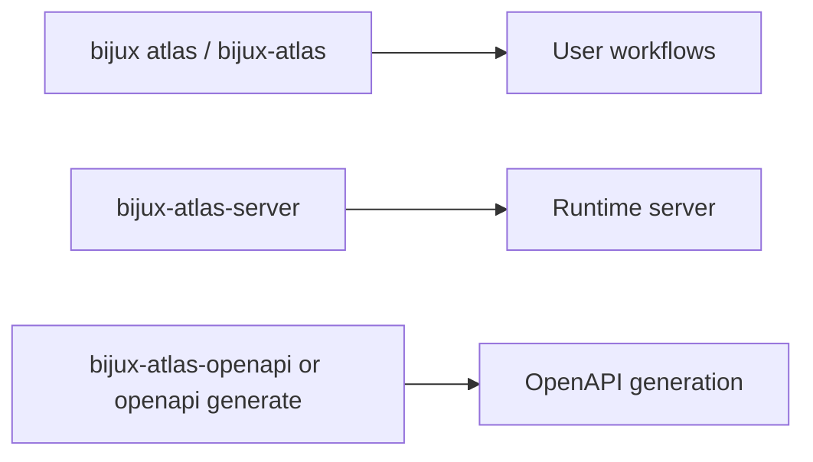

# Command Surface

This page summarizes the user-facing Atlas command families. It does not
document the maintainer control plane; that lives in [Automation Command
Surface](../../bijux-atlas-dev/automation/automation-command-surface.md).

The installed runtime namespace is `bijux atlas ...`.
The direct runtime binaries remain `bijux-atlas`, `bijux-atlas-server`, and `bijux-atlas-openapi`.

## Top-Level Command Map

This command map is the quickest way to orient yourself in the runtime CLI. It groups the public
families readers are expected to discover from the product-facing command surface.

## Runtime Companions

This companion view matters because Atlas exposes more than one runtime binary. It keeps users from
treating server startup, CLI workflows, and OpenAPI generation as one indistinct surface.

Use this page when you are asking, "Which runtime-facing binary or subcommand family should I use?"

Use the automation reference when you are asking, "Which maintainer command checks the repository, docs, or release state?"

## Top-Level Families

- `version`: print CLI version information
- `completion`: generate shell completions
- `config`: inspect config behavior
- `catalog`: validate and mutate catalog state
- `dataset`: validate, verify, publish, and pack dataset state
- `diff`: build dataset diff artifacts
- `gc`: plan and apply garbage collection
- `policy`: validate and explain active policy
- `ingest`: build validated dataset state from source inputs
- `openapi`: generate the OpenAPI description

## Code Authority

- command tree and argument structure:
  `crates/bijux-atlas/src/adapters/inbound/cli/args.rs`
- runtime binaries:
  `crates/bijux-atlas/src/bin/bijux-atlas.rs`,
  `crates/bijux-atlas/src/bin/bijux-atlas-server.rs`, and
  `crates/bijux-atlas/src/bin/bijux-atlas-openapi.rs`
- generated command references: `configs/generated/docs/command-index.json` and
  `configs/generated/docs/configs-command-list.txt`

## Main Takeaway

This page should be read as the public command map for the product runtime.
When the command tree changes, this page, the Clap structures, and the generated
command references should all continue to agree.

## Stability Reading

- `bijux atlas ...`, `bijux-atlas`, `bijux-atlas-server`, and documented command families are user-facing surfaces
- structured output, error behavior, and OpenAPI are only as stable as the documented contracts behind them
- debug-only or maintainer-only commands should not be inferred from this page

## Stability

This page documents the checked-in runtime-facing command namespace. Update it
when the public CLI surface changes, and keep maintainer-only automation out of
scope.

## Related Binaries

- `bijux-atlas`
- `bijux-atlas-server`
- `bijux-atlas-openapi`

## Purpose

This page is the lookup reference for command surface. Use it when you need the current checked-in surface quickly and without extra narrative.
