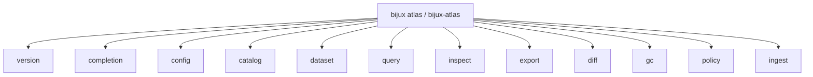
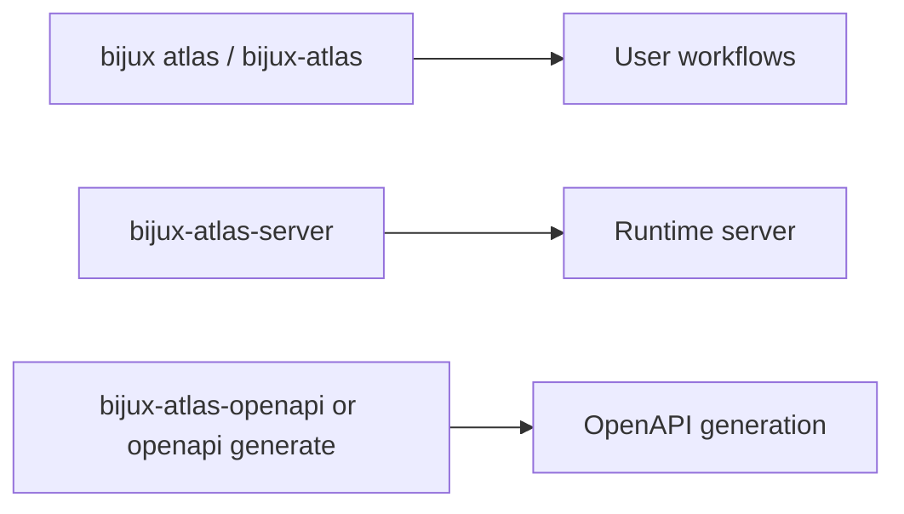

# Command Surface

This page summarizes the user-facing Atlas command families. It does not
document the repository control plane; that lives in [Automation Command
Surface](../../bijux-atlas-dev/automation/automation-command-surface.md).

The installed runtime namespace is `bijux atlas ...`.
The direct runtime binaries remain `bijux-atlas`, `bijux-atlas-server`, and `bijux-atlas-openapi`.

## Top-Level Command Map

This command map is the quickest way to orient yourself in the runtime CLI. It
groups the public families exposed by the product surface.

## Runtime Companions

Atlas exposes more than one runtime binary. This view keeps server startup, CLI
workflows, and OpenAPI generation from collapsing into one indistinct surface.

Use this page when you are asking, "Which runtime-facing binary or subcommand
family should I use?"

Use the automation reference when you are asking, "Which repository command checks docs, release state, or governance rules?"

## Top-Level Families

- `version`: print CLI version information
- `completion`: generate shell completions
- `config`: inspect config behavior
- `catalog`: validate and mutate catalog state
- `dataset`: validate, verify, publish, and pack dataset state
- `query`: run and explain bounded gene queries
- `inspect`: inspect dataset artifacts and SQLite layout
- `export`: export OpenAPI specs and query result rows
- `diff`: build dataset diff artifacts
- `gc`: plan and apply garbage collection
- `policy`: validate and explain active policy
- `ingest`: build validated dataset state from source inputs

## Code Authority

- command tree and argument structure:
  `crates/bijux-atlas/src/adapters/inbound/cli/args.rs`
- runtime binaries:
  `crates/bijux-atlas/src/bin/bijux-atlas.rs`,
  `crates/bijux-atlas/src/bin/bijux-atlas-server.rs`, and
  `crates/bijux-atlas/src/bin/bijux-atlas-openapi.rs`
- generated command references: `configs/generated/docs/command-index.json` and
  `configs/generated/docs/configs-command-list.txt`

## Main Takeaway

This page should be read as the public command map for the product runtime.
When the command tree changes, this page, the Clap structures, and the generated
command references should all continue to agree.

## Stability Rule

- `bijux atlas ...`, `bijux-atlas`, `bijux-atlas-server`, and documented command families are user-facing surfaces
- structured output, error behavior, and OpenAPI are only as stable as the documented contracts behind them
- debug-only or repository-only commands should not be inferred from this page

## Related Binaries

- `bijux-atlas`
- `bijux-atlas-server`
- `bijux-atlas-openapi`

## Reading Rule

Use this page when the hard part is not the exact flag or argument, but which
runtime binary or command family owns the task.
