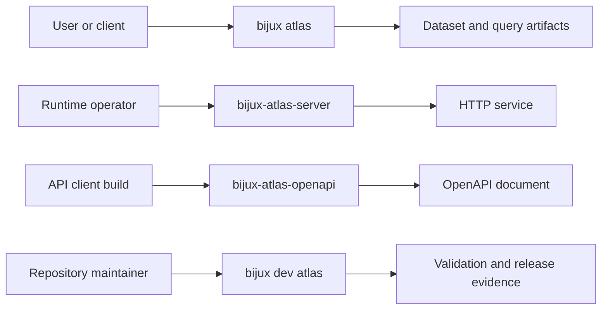
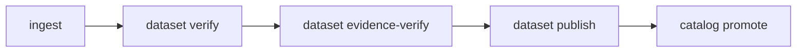
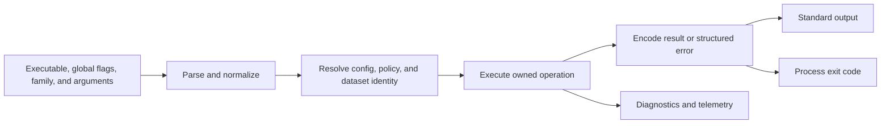

# Command Surface

Atlas separates product commands from repository maintenance. Use
`bijux atlas ...` through the Bijux umbrella, or invoke the product binary as
`bijux-atlas ...`. Repository checks and release automation belong to
`bijux dev atlas ...` and are not product subcommands.

## Choose the Executable

| Executable | Owns | Does not own |
| --- | --- | --- |
| `bijux atlas` / `bijux-atlas` | dataset construction, publication, inspection, querying, export, and policy | server lifecycle and repository governance. |
| `bijux-atlas-server` | serving published datasets over HTTP | dataset construction and repository checks. |
| `bijux-atlas-openapi` | generation of the HTTP API contract | starting a server or querying a dataset. |
| `bijux dev atlas` / `bijux-atlas-dev` | maintainer validation, reports, evidence, and release automation | the installed product interface. |


```mermaid
flowchart LR
    User[User or client] --> Product[bijux atlas]
    Operator[Runtime operator] --> Server[bijux-atlas-server]
    ClientBuild[API client build] --> OpenAPI[bijux-atlas-openapi]
    Maintainer[Repository maintainer] --> Dev[bijux dev atlas]
    Product --> Artifacts[Dataset and query artifacts]
    Server --> HTTP[HTTP service]
    OpenAPI --> Contract[OpenAPI document]
    Dev --> Evidence[Validation and release evidence]
```

## Public Product Families

The governed product registry exposes twelve top-level families:

| Family | Use it to |
| --- | --- |
| `catalog` | validate catalog state and manage dataset discoverability. |
| `completion` | generate shell completion definitions. |
| `config` | print resolved Bijux config paths, cache location, and selected environment values. |
| `dataset` | verify, package, publish, and inspect dataset release state. |
| `diff` | create a structured comparison between dataset releases. |
| `export` | export OpenAPI or bounded query rows. |
| `gc` | plan or apply garbage collection against managed artifacts. |
| `ingest` | validate GFF3, FASTA, and FAI inputs and build dataset artifacts. |
| `inspect` | inspect dataset, provenance, and database structure. |
| `policy` | validate or explain the active data policy. |
| `query` | run or explain bounded dataset queries. |
| `version` | report product version identity. |

Use `bijux-atlas <family> --help` for the arguments provided by the installed
release. Treat hidden compatibility and diagnostic commands as internal even
when they are visible in source or a binary string table.

## Common Workflows

### Build and publish a dataset


```mermaid
flowchart LR
    Ingest[ingest] --> Verify[dataset verify]
    Verify --> Evidence[dataset evidence-verify]
    Evidence --> Publish[dataset publish]
    Publish --> Promote[catalog promote]
```

Run dry-run or explain modes before mutating release or catalog state when the
subcommand provides them. Publication and catalog promotion are distinct: a
release can be built and verified without becoming the selected catalog entry.

### Inspect before querying

```bash
bijux-atlas inspect dataset --help
bijux-atlas inspect provenance --help
bijux-atlas query explain --help
bijux-atlas query run --help
```

Inspection establishes dataset and provenance identity. Query explanation
shows the bounded execution plan. Query execution produces the result.

### Export a contract or result set

```bash
bijux-atlas export openapi --help
bijux-atlas export query --help
```

Use the dedicated OpenAPI binary when a build process needs only the API
contract. Use the product export family when the export belongs to a wider
Atlas workflow.

## Global Output Controls

The product CLI accepts these global controls before or after a command family:

| Flag | Behavior |
| --- | --- |
| `--json` | emit canonical compact JSON for normal command results and structured errors. |
| `--quiet` | suppress normal success output where the invoked command honors quiet mode. |
| `--verbose` | increase diagnostic verbosity; the flag may be repeated. |
| `--trace` | request trace-level diagnostics for supported execution paths. |
| `--print-config-paths` | print resolved workspace config, user config, and cache paths. |

Machine consumers must combine structured output with the process exit code.
See [Structured Output Contracts](../contracts/structured-output-contracts.md)
before binding automation to fields.

## Invocation Contract


```mermaid
flowchart LR
    Args[Executable, global flags, family, and arguments] --> Parse[Parse and normalize]
    Parse --> Resolve[Resolve config, policy, and dataset identity]
    Resolve --> Execute[Execute owned operation]
    Execute --> Encode[Encode result or structured error]
    Encode --> Stdout[Standard output]
    Execute --> Diagnostics[Diagnostics and telemetry]
    Encode --> Exit[Process exit code]
```

Automation should retain the executable identity, complete argument vector with
secrets redacted, producer version, structured standard output, diagnostics,
and exit code. A JSON document with an unexpected exit status is not a
successful command result. Conversely, an empty success stream is valid only
when the invoked command explicitly defines silence as success.

Global flags belong to the invocation, not the domain result. Repeated
`--verbose`, `--trace`, or presentation changes must not be treated as domain
schema fields.

## Surface Authority

The public family list is governed by
`configs/sources/governance/governance/cli-user-command-surface.json`. The Clap
command tree implements the executable surface. Generated command references
record the observed build. All three must agree before a newly exposed family
is treated as public.

When they disagree, the installed command tree determines what can execute,
the registry determines intended public governance, and the generated
reference records what its build observed. Report the mismatch instead of
silently selecting the broadest surface.

For maintainer commands, continue with [Automation Command
Surface](../../bijux-atlas-dev/automation/automation-command-surface.md). For
runtime startup, see [Configuration and Output](configuration-and-output.md).
