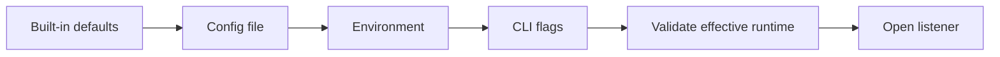
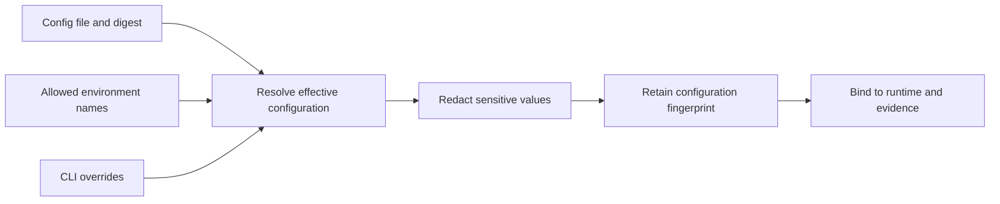
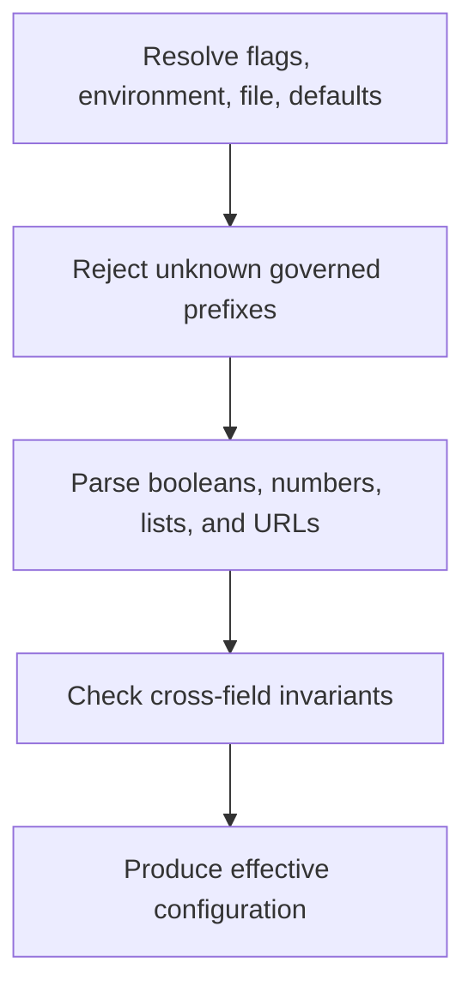

# Configuration and Output

Atlas has two configuration contexts. Product CLI path discovery follows Bijux
workspace and user conventions. Server startup resolves an explicit runtime
configuration, then validates the complete environment contract before it
opens a listener.

## Product CLI Paths

Print the paths resolved by the product CLI:

```bash
bijux-atlas --print-config-paths --json
```

The result contains `workspace_config`, `user_config`, and `cache_dir`.
Workspace configuration resolves to `.bijux/config.toml`. User configuration
uses `$XDG_CONFIG_HOME/bijux/config.toml`, then `$HOME/.config/bijux/config.toml`,
with `.bijux/config.toml` as the final fallback.

Cache resolution uses the first non-empty value in this order:

1. `BIJUX_CACHE_DIR`;
2. `$XDG_CACHE_HOME/bijux`;
3. `$HOME/.cache/bijux`;
4. `.bijux/cache`.

`bijux-atlas config --json` reports these paths and selected environment values.
It does not print the effective `bijux-atlas-server` configuration.

## Server Startup Precedence

The server accepts `--config` in JSON, YAML, or TOML. Three startup fields can
also be set by flags or environment variables.



The value on the right overrides the value on its left.

| Field | CLI | Environment | File key | Default |
| --- | --- | --- | --- | --- |
| bind address | `--bind` | `ATLAS_BIND` | `bind_addr` | `0.0.0.0:8080`. |
| published store | `--store-root` | `ATLAS_STORE_ROOT` | `store_root` | `artifacts/server-store`. |
| runtime cache | `--cache-root` | `ATLAS_CACHE_ROOT` | `cache_root` | `artifacts/server-cache`. |

All resolved values must be non-empty. Relative store and cache paths are
resolved by the runtime path policy; production deployments should provide
explicit absolute or mounted paths so process working directory cannot alter
ownership.

Validate without starting the service:

```bash
bijux-atlas-server \
  --config deploy/atlas-runtime.toml \
  --validate-config
```

Inspect the effective configuration before rollout:

```bash
bijux-atlas-server \
  --config deploy/atlas-runtime.toml \
  --print-effective-config
```

Treat that output as sensitive. Runtime configuration can describe endpoints,
authentication modes, and secret-bearing settings. Apply the redaction policy
before retaining it as operational evidence.

## Configuration Identity

A deployment record should preserve the config-file digest, selected
environment variable names, CLI overrides, redacted effective configuration,
runtime version, and resolution timestamp. Store secret references or versions,
never secret values. This identity makes it possible to distinguish a binary
regression from an unrecorded override.



## Configuration Is Validated as a Whole

Startup-field precedence does not bypass runtime invariants. After resolution,
the server validates the environment allowlist, value types, ranges, and
cross-field rules. Examples include production restrictions on loopback binds,
required Redis configuration, authentication prerequisites, and incompatible
cache/readiness modes.



Do not validate a file in isolation and assume the deployment is valid. The
environment and CLI flags may change the effective runtime.

## Output Channels

The product CLI emits indented JSON by default and canonical compact JSON with
`--json`. Help text and diagnostics are human-facing. The server emits runtime
logs and traces according to its observability configuration; those streams are
not product command results.

Use the following rules in automation:

- request `--json` explicitly;
- capture standard output separately from diagnostics;
- require the expected process exit code;
- validate against the command- or report-specific schema;
- retain producer version and dataset or release identity;
- never parse help text, log messages, or indentation.

Standard output carries the requested command result. Standard error carries
human diagnostics unless the specific command contract states otherwise. Logs,
metrics, and traces are operational signals, not alternate command-result
channels. Keep them correlated but validate them against their own contracts.

Configuration identity and output identity belong together. A comparison is
credible only when both runs record the relevant effective configuration and
the exact Atlas, dataset, and contract versions.

See [Environment Variables](environment-variables.md) for the runtime
allowlist and secret-handling boundaries, and [Structured Output
Contracts](../contracts/structured-output-contracts.md) for machine parsing.
