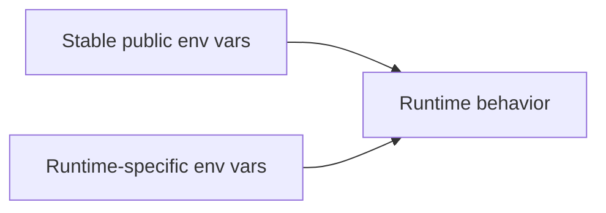
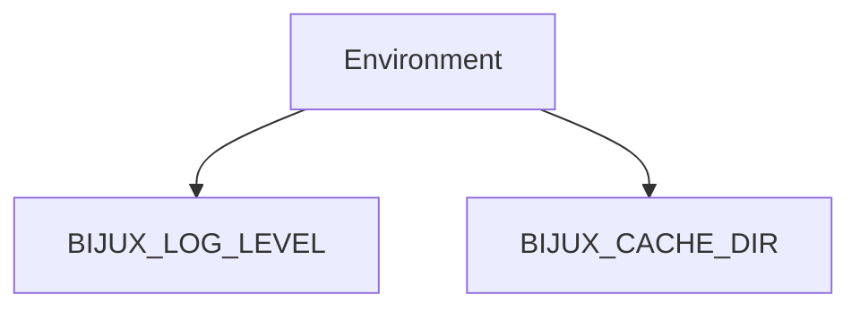

# Environment Variables

Atlas supports a mix of stable public environment variables and lower-level
runtime variables used by server configuration.

## Environment Variable Layers

This environment-variable split matters because not every variable carries the
same compatibility weight. Some are stable public knobs, while others are
closer to runtime-specific deployment inputs.

## Main Stable Variables

This small stable-variable map highlights the public environment knobs that can
be depended on most confidently without searching through implementation
details.

## Public Variables

- `BIJUX_LOG_LEVEL`: log verbosity override
- `BIJUX_CACHE_DIR`: shared cache directory override

## Runtime-Oriented Variables Seen in the Current Codebase

- `ATLAS_BIND`
- `ATLAS_STORE_ROOT`
- `ATLAS_CACHE_ROOT`
- `ATLAS_POLICY_MODE`
- `ATLAS_REDIS_URL`
- `ATLAS_LOG_LEVEL`
- `ATLAS_TRACE_EXPORTER`
- `ATLAS_CLUSTER_CONFIG_PATH`

## Reference Guidance

Use environment variables when:

- the runtime specifically supports them
- you need deployment-time overrides

Prefer explicit documented configuration when:

- the value is operationally important
- you need repeatable reviewable deployment behavior

## Reading Rule

Use this page when you need to know whether an environment variable is a stable
public knob or just a runtime-oriented deployment input.
