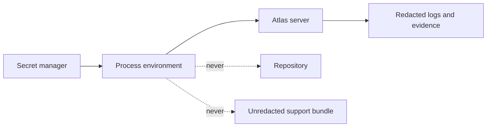

# Environment Variables

Atlas treats its runtime environment as an allowlisted contract. The server
rejects unknown `ATLAS_` and `BIJUX_` variables so misspellings and obsolete
settings cannot silently become no-ops. The complete allowlist is governed by
`configs/schemas/contracts/env.schema.json`.

## Configuration Layers

| Prefix or convention | Scope | Contract |
| --- | --- | --- |
| `BIJUX_*` | shared product paths and CLI conventions | the product CLI and shared runtime path resolver. |
| `ATLAS_*` | server startup, storage, security, load control, and telemetry | the runtime environment schema and runtime config validation. |
| `XDG_*` and `HOME` | fallback discovery for user config and cache paths | used only when the explicit Bijux path variable is absent. |

Do not infer that every process reads every allowed variable. The schema says a
name is permitted in the server environment. The owning runtime component says
whether and how that value affects behavior.

## Shared Product Variables

| Variable | Behavior |
| --- | --- |
| `BIJUX_CACHE_DIR` | first-priority override for the shared Bijux cache root. |
| `BIJUX_LOG_LEVEL` | advertised and reported by the product CLI; the server's enforced log-level setting is `ATLAS_LOG_LEVEL`. |

The current product CLI exposes `BIJUX_LOG_LEVEL` in help and config output, but
its command execution path does not apply it as the server logging setting. Do
not use it as a substitute for `ATLAS_LOG_LEVEL` in deployments.

## Server Variable Families

The runtime contract contains the exact names and accepted parsing rules. These
families explain ownership without duplicating the full generated allowlist:

| Family | Representative variables | Operational effect |
| --- | --- | --- |
| startup and identity | `ATLAS_BIND`, `ATLAS_STORE_ROOT`, `ATLAS_CACHE_ROOT`, `ATLAS_ENV`, `ATLAS_RELEASE_ID` | select listener, storage paths, deployment class, and evidence identity. |
| dataset lifecycle | `ATLAS_PINNED_DATASETS`, `ATLAS_STARTUP_WARMUP`, `ATLAS_MAX_DATASET_COUNT`, `ATLAS_MAX_DISK_BYTES` | bound cache occupancy and startup materialization. |
| storage and registry | `ATLAS_REGISTRY_SOURCES`, `ATLAS_STORE_S3_ENABLED`, `ATLAS_STORE_S3_BASE_URL`, `ATLAS_STORE_RETRY_ATTEMPTS` | select backends, discovery, and dependency retry behavior. |
| request protection | `ATLAS_MAX_BODY_BYTES`, `ATLAS_REQUEST_TIMEOUT_MS`, `ATLAS_RESPONSE_MAX_BYTES`, `ATLAS_MAX_REQUEST_QUEUE_DEPTH` | bound request cost, time, response size, and queueing. |
| overload control | `ATLAS_SHED_LOAD_ENABLED`, `ATLAS_MEMORY_PRESSURE_SHED_ENABLED`, `ATLAS_EMERGENCY_GLOBAL_BREAKER`, `ATLAS_DISABLE_HEAVY_ENDPOINTS` | activate normal or emergency load shedding. |
| authentication | `ATLAS_AUTH_MODE`, `ATLAS_ALLOWED_API_KEYS`, `ATLAS_TOKEN_REQUIRED_ISSUER`, `ATLAS_HMAC_REQUIRED` | select and constrain request authentication. |
| telemetry and audit | `ATLAS_LOG_LEVEL`, `ATLAS_LOG_REDACTION_ENABLED`, `ATLAS_TRACE_EXPORTER`, `ATLAS_AUDIT_SINK` | control diagnostic detail, export, redaction, and audit retention. |
| Redis coordination | `ATLAS_REDIS_URL`, `ATLAS_ENABLE_REDIS_RATE_LIMIT`, `ATLAS_ENABLE_REDIS_RESPONSE_CACHE`, `ATLAS_WARM_COORDINATION_ENABLED` | enable shared limiting, caching, and warmup coordination. |

Representative names are navigation aids, not a substitute for the environment
schema or the generated runtime configuration reference.

## Secrets

Secret-bearing variables include API keys, HMAC material, token signing
material, storage credentials, and bearer tokens. Supply them through the
deployment platform's secret mechanism. Do not put them in committed config
files, shell history, rendered manifests, support bundles, or retained
effective-config output.


```mermaid
flowchart LR
    SecretStore[Secret manager] --> RuntimeEnv[Process environment]
    RuntimeEnv --> Atlas[Atlas server]
    Atlas --> Redaction[Redacted logs and evidence]
    RuntimeEnv -. never .-> Git[Repository]
    RuntimeEnv -. never .-> Bundle[Unredacted support bundle]
```

Changing secret material is an operational rotation. Coordinate the overlap or
revocation window required by the selected authentication mode; a process
restart alone is not a rotation plan.

## Validation and Failure

The server validates the environment before serving traffic. Invalid booleans,
numbers, ranges, URLs, enum values, required relationships, and unknown governed
names fail startup. In production mode, additional invariants apply.

`ATLAS_DEV_ALLOW_UNKNOWN_ENV` is a development escape hatch for unknown
`ATLAS_` or `BIJUX_` names. It weakens typo detection and must not appear in a
production deployment.

Validate the effective environment with the candidate binary:

```bash
bijux-atlas-server \
  --config deploy/atlas-runtime.toml \
  --validate-config
```

A successful validation applies only to the exact binary, file, flags, and
environment used in that invocation. Retain those identities with deployment
evidence.

For precedence and effective-config inspection, see [Configuration and
Output](configuration-and-output.md). For deployment-oriented setting groups,
see [Runtime Configuration](../../bijux-atlas-ops/kubernetes/runtime-configuration.md).
