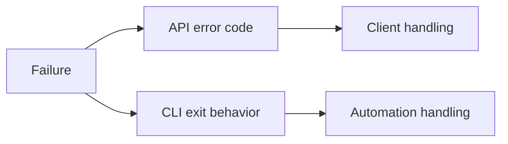
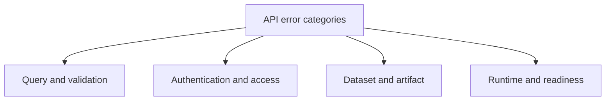

# Error Codes and Exit Codes

Atlas uses structured error reporting to keep failures classifiable and
automatable.

## Error Reporting Model

This error-reporting model separates two important consumers: HTTP clients and
CLI automation. Both need structured signals, but they consume them through
different surfaces.

## Main API Error Categories

This category map helps interpret error codes by failure area instead of
memorizing each one in isolation.

## Common API Error Classes

- authentication and access errors
- invalid query or missing dataset dimension errors
- dataset or gene not found errors
- policy rejection and cost rejection errors
- readiness, timeout, and upstream availability errors
- artifact corruption or quarantine errors

## Important Point

Use the structured error code, not only the human message text, when building client or automation behavior.

## Reading Rule

Use this page when Atlas failed clearly enough to produce an error surface and
the next step is to classify the failure correctly.
