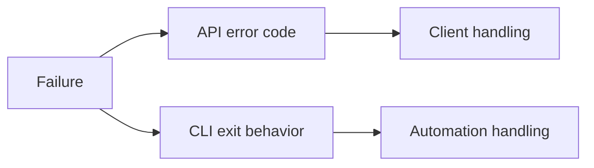
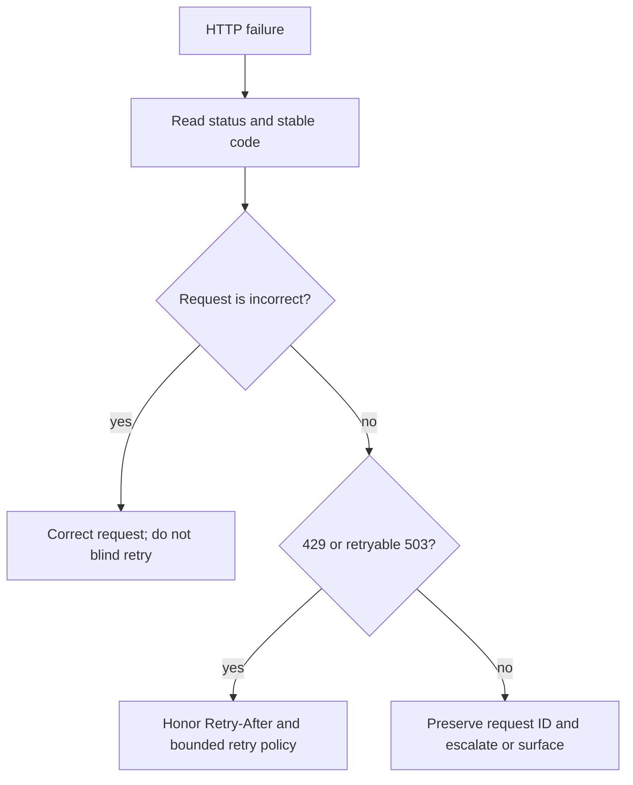

# Error Codes and Exit Codes

Atlas uses structured error reporting to keep failures classifiable and
automatable.

## Error Reporting Model


```mermaid
flowchart LR
    Failure[Failure] --> ApiError[API error code]
    Failure --> ExitCode[CLI exit behavior]
    ApiError --> Client[Client handling]
    ExitCode --> Automation[Automation handling]
```

This error-reporting model separates two important consumers: HTTP clients and
CLI automation. Both need structured signals, but they consume them through
different surfaces.

## HTTP Error Envelope

```json
{
  "error": {
    "code": "DatasetNotFound",
    "message": "dataset not found",
    "details": {},
    "request_id": "req-..."
  }
}
```

`code` is the stable branch key. `message` and `details` explain the specific
failure. `request_id` joins the response to logs and traces. Clients must not
infer a code by matching message text.

## HTTP Status and Code Families

| Status | Stable codes | Client interpretation |
| ---: | --- | --- |
| `400` | `InvalidQueryParameter`, `InvalidCursor`, `MissingDatasetDimension`, `RangeTooLarge`, `ValidationFailed` | Correct request shape, cursor, or dataset identity before retrying. |
| `401` | `AuthenticationRequired` | Supply valid authentication under the deployment policy. |
| `403` | `AccessForbidden` | The authenticated principal is not authorized for the action. |
| `404` | `DatasetNotFound`, `GeneNotFound` | Confirm dataset discovery and requested identifier. |
| `413` | `PayloadTooLarge`, `ResponseTooLarge` | Reduce request or response scope. |
| `422` | `QueryRejectedByPolicy`, `QueryTooExpensive` | Change the request or governing policy; an identical retry is not corrective. |
| `429` | `RateLimited` | Respect `Retry-After` and retry only when the operation is safe to repeat. |
| `503` | `NotReady`, `UpstreamStoreUnavailable`, `Timeout` | Respect `Retry-After`, then re-evaluate readiness and dependency state. |
| `500` | `Internal`, integrity and quarantine codes, or an unmapped internal failure | Preserve the request ID and escalate; do not hide it with unlimited retries. |

The shared code registry also contains ingest validation codes. Their presence
in the type and OpenAPI enum does not mean every runtime endpoint can emit each
one. The generated registry and endpoint response contracts remain the exact
authority.

## Retry Decision


```mermaid
flowchart TD
    Failure[HTTP failure] --> Code[Read status and stable code]
    Code --> Correctable{Request is incorrect?}
    Correctable -->|yes| Change[Correct request; do not blind retry]
    Correctable -->|no| Transient{429 or retryable 503?}
    Transient -->|yes| Bound[Honor Retry-After and bounded retry policy]
    Transient -->|no| Preserve[Preserve request ID and escalate or surface]
```

Atlas currently attaches `Retry-After: 3` to `429` and `503` error responses.
That header is a lower-bound hint, not proof that the cause will clear or that
an arbitrary mutation is idempotent. Cap attempts, add jitter in shared client
fleets, and retain the terminal response.

## CLI Exit Codes

| Exit | Name | Meaning |
| ---: | --- | --- |
| `0` | `success` | Command completed successfully. |
| `2` | `usage` | Command syntax, argument, or namespace is invalid. |
| `3` | `validation` | Input, policy, evidence, immutability, or contract validation failed. |
| `4` | `dependency_failure` | A required file, database, network path, or external dependency failed. |
| `10` | `internal` | The command could not classify or complete an internal operation. |

In JSON mode, the CLI emits a machine error with `code`, `message`, and a
string map of `details`. Shell automation should branch on the numeric exit
class, refine handling with the machine code, and retain stderr or JSON detail
for diagnosis. An internal exit must remain visible; converting it to success
because a report file exists destroys the failure contract.
