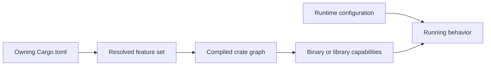
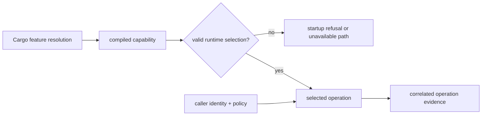

# Feature Flags

Cargo features are crate-specific build-time choices. The `bijux-atlas`
compatibility crate declares no features; runtime, store, server, core, and
maintainer capabilities are owned by their direct crates.

## Feature Flag Groups

Runtime configuration can select only behavior compiled into the artifact. It
cannot enable a missing Cargo feature, and changing an environment variable
does not reveal which features were used to build a binary.

## Feature Ownership

| Crate | Default features | Optional features | Effect |
| --- | --- | --- | --- |
| `bijux-atlas` | none declared | none | compatibility re-exports only |
| `bijux-atlas-runtime` | `serde`, `backend-local` | `backend-s3`, `bench-ingest-throughput`, `jemalloc` | serialization helpers and store backend graph; the benchmark marker has no current source consumer, and `jemalloc` adds a dependency without installing a global allocator |
| `bijux-atlas-store` | `backend-local` | `backend-s3` | local publication by default; S3-like and read-only HTTP support add `reqwest` and retain local support |
| `bijux-atlas-server` | none | `jemalloc` | optional process allocator |
| `bijux-atlas-core` | none | `serde` | cursor/JSON support and feature-gated contracts or benchmarks |
| `bijux-atlas-dev` | none | `kind_integration` | repository-only Kind integration code |

Other crates currently declare no Cargo feature section. Always inspect the
manifest of the crate being built rather than assuming the runtime's feature
names are workspace-global.

## Dependency Effects

- `bijux-atlas-runtime/backend-local` enables its own `serde` feature and
  `bijux-atlas-store/backend-local`.
- `bijux-atlas-runtime/backend-s3` includes `backend-local` and enables
  `bijux-atlas-store/backend-s3`.
- `bijux-atlas-store/backend-s3` includes local support and adds the optional
  HTTP client dependency.
- `jemalloc` is declared separately by the runtime and server. The server
  feature installs the allocator in its binary; the runtime feature only adds
  the optional dependency.
- `bench-ingest-throughput` currently has no runtime source consumer, and
  `kind_integration` is repository integration code. Neither is a production
  runtime configuration switch.

## Capability selection is not runtime policy

A Cargo feature changes the compiled graph for a crate target. It does not
authorize a caller, select a backend for a running process, or prove that an
optional path was exercised. Those are separate decisions with separate
evidence.

| Question | Authority | Evidence |
| --- | --- | --- |
| could this binary contain the capability? | resolved Cargo features | package, target, feature arguments, lockfile, and toolchain |
| did startup select the capability? | runtime configuration and validation | redacted effective config and startup outcome |
| did a request use the capability? | runtime routing and operation result | correlated request, backend, and outcome telemetry |
| may this principal use it? | authentication and authorization policy | identity, decision, and audit record |

Do not use feature presence as a security boundary. Conversely, when a
deployment requires an optional backend or allocator, verify the candidate
artifact's feature provenance before rollout; a valid environment value cannot
repair a binary built without the required capability.

## Reproducible Builds

Record the package, target, Cargo feature arguments, default-feature decision,
lockfile, toolchain, and source revision. A version alone is insufficient when
two builds can select different features.

Authorities:

- [`bijux-atlas-runtime/Cargo.toml`](../../../crates/bijux-atlas-runtime/Cargo.toml)
- [`bijux-atlas-store/Cargo.toml`](../../../crates/bijux-atlas-store/Cargo.toml)
- [`bijux-atlas-server/Cargo.toml`](../../../crates/bijux-atlas-server/Cargo.toml)
- [`bijux-atlas-core/Cargo.toml`](../../../crates/bijux-atlas-core/Cargo.toml)
- [`bijux-atlas-dev/Cargo.toml`](../../../crates/bijux-atlas-dev/Cargo.toml)
