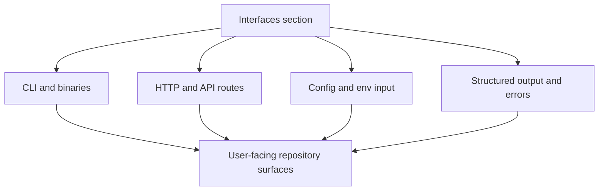

# Interfaces

`bijux-atlas/interfaces` is where Atlas becomes a visible product surface.

This section shows the exact surfaces users, operators, and automation
consumers touch, and it points back to the code and generated references that
define them.

Use this section when the question is exact rather than conceptual.

## Questions This Section Answers

- which CLI binaries and command families are public
- which HTTP endpoints exist and what kind of question each route answers
- which config inputs, env vars, and flags shape runtime behavior
- which outputs, errors, and feature flags are part of the visible runtime surface

## User-Facing Surfaces In This Repository

- CLI surface: `crates/bijux-atlas/src/adapters/inbound/cli/` and
  `crates/bijux-atlas/src/bin/`
- HTTP and API surface:
  `crates/bijux-atlas/src/adapters/inbound/http/`
- runtime configuration surface: `crates/bijux-atlas/src/runtime/config/` and
  `configs/generated/runtime/`
- generated interface references: `configs/generated/openapi/` and
  `configs/generated/docs/`

## Fast Navigation

- CLI and command discovery: [Command Surface](command-surface.md)
- HTTP route inventory: [API Endpoint Index](api-endpoint-index.md)
- startup and request flow from the server boundary: [Server Workflows](server-workflows.md)
- runtime configuration inputs: [Configuration and Output](configuration-and-output.md) and [Runtime Config Reference](runtime-config-reference.md)
- compatibility-sensitive runtime switches: [Feature Flags](feature-flags.md) and [Environment Variables](environment-variables.md)
- machine-facing descriptions: [OpenAPI and API Usage](openapi-and-api-usage.md)

If you already know the interface family, use that page directly. This section
mainly helps decide which surface owns the question in front of you.

## Reading Rule

Stay in this section when you need the visible surface exactly as a user,
integrator, or operator would consume it. Move elsewhere when the question
changes shape:

- move to [Workflows](../workflows/index.md) for step-by-step product usage
- move to [Runtime](../runtime/index.md) for internal architecture and lifecycle
- move to [Contracts](../contracts/index.md) for the strongest compatibility promises

## Pages

- [API Endpoint Index](api-endpoint-index.md)
- [Command Surface](command-surface.md)
- [Configuration and Output](configuration-and-output.md)
- [Environment Variables](environment-variables.md)
- [Error Codes and Exit Codes](error-codes-and-exit-codes.md)
- [Feature Flags](feature-flags.md)
- [OpenAPI and API Usage](openapi-and-api-usage.md)
- [Policy Workflows](policy-workflows.md)
- [Runtime Config Reference](runtime-config-reference.md)
- [Server Workflows](server-workflows.md)

## Source Anchors

- `crates/bijux-atlas/src/bin/`
- `crates/bijux-atlas/src/interfaces/`
- `configs/generated/openapi/`
