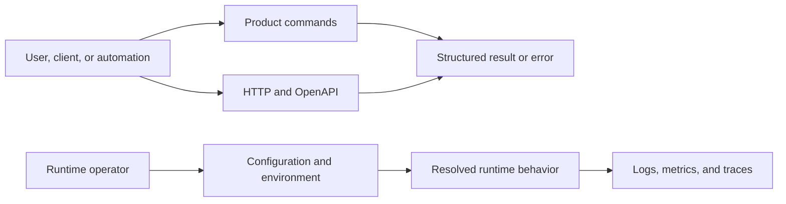
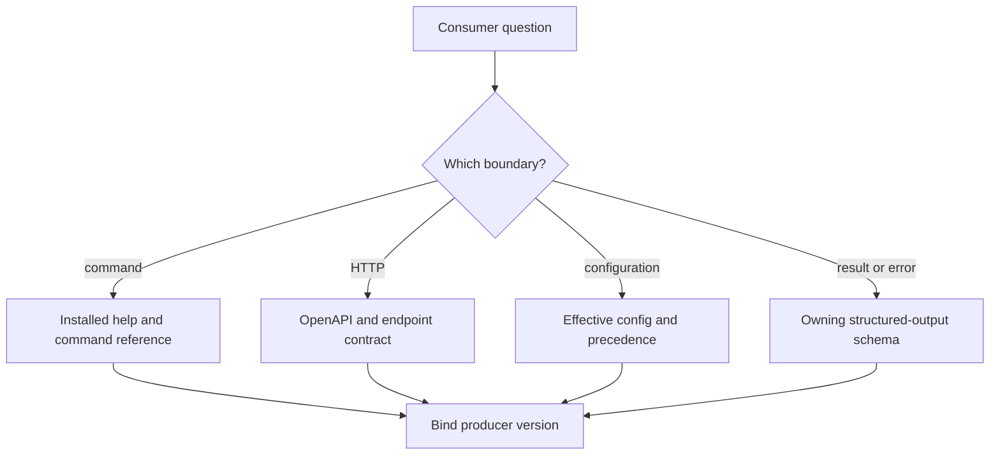

# Interfaces

Atlas exposes four consumer boundaries: commands, HTTP/OpenAPI, runtime
configuration, and structured results. Each has a distinct owner and
compatibility policy. Source paths and generated references help locate those
owners; they do not expand the supported surface by themselves.

```mermaid
flowchart LR
    Consumer[User, client, or automation] --> CLI[Product commands]
    Consumer --> HTTP[HTTP and OpenAPI]
    Operator[Runtime operator] --> Config[Configuration and environment]
    CLI --> Result[Structured result or error]
    HTTP --> Result
    Config --> Runtime[Resolved runtime behavior]
    Runtime --> Signals[Logs, metrics, and traces]
```

## Surface Directory

| Consumer need | Primary reference | Authority |
| --- | --- | --- |
| discover commands and installed binaries | [Command Surface](command-surface.md) | CLI registry, executable command tree, and generated reference |
| identify an HTTP route | [API Endpoint Index](api-endpoint-index.md) | router and generated OpenAPI |
| integrate an API client | [OpenAPI and API Usage](openapi-and-api-usage.md) | API DTOs, errors, and OpenAPI contract |
| start and inspect the server | [Server Workflows](server-workflows.md) | server executable and runtime composition |
| understand configuration precedence and output | [Configuration and Output](configuration-and-output.md) | runtime configuration model |
| find runtime settings | [Runtime Config Reference](runtime-config-reference.md) | configuration registry |
| find environment names | [Environment Variables](environment-variables.md) | environment allowlist |
| interpret structured failures | [Error Codes and Exit Codes](error-codes-and-exit-codes.md) | owning error and output contracts |
| review guarded runtime behavior | [Feature Flags](feature-flags.md) and [Policy Workflows](policy-workflows.md) | feature and policy contracts |

## Interface Resolution

```mermaid
flowchart TD
    Question[Consumer question] --> Surface{Which boundary?}
    Surface -->|command| Help[Installed help and command reference]
    Surface -->|HTTP| OpenAPI[OpenAPI and endpoint contract]
    Surface -->|configuration| Effective[Effective config and precedence]
    Surface -->|result or error| Schema[Owning structured-output schema]
    Help --> Version[Bind producer version]
    OpenAPI --> Version
    Effective --> Version
    Schema --> Version
```

Resolve the exact installed or deployed version before assuming a field,
route, flag, or default. Documentation describes the governed release surface;
the producer version and generated contract identify the concrete instance a
consumer is using.

## Preserve Consumer Identity

Every interface result needs the identities relevant to its boundary:

| Boundary | Identity to retain | Why |
| --- | --- | --- |
| command | binary version, command path, effective flags, and exit code | distinguishes command behavior from shell or installation drift |
| HTTP | server version, request ID, route, status, error code, and dataset tuple | correlates a wire result with server and data identity |
| OpenAPI | generated document digest and producer version | prevents current documentation from standing in for an older deployment |
| configuration | source set, precedence, redacted effective value, and configuration digest | distinguishes authored input from resolved behavior |
| structured data | schema or contract version, dataset identity, and artifact provenance | makes results comparable without parsing prose |

Human-readable messages provide context but do not replace these fields.
Likewise, an HTTP success cannot identify the command contract, and installed
help cannot prove which configuration a running server resolved.

## Boundary Rules

- Human help text and logs are not machine-output contracts.
- Default pretty JSON and explicit compact `--json` differ in encoding, not
  semantic authority.
- Environment and CLI overrides can change effective configuration after a
  file has been validated in isolation.
- Authentication-exempt health routes remain subject to network exposure and
  resilience controls.
- Generated OpenAPI or command references describe their recorded build; they
  need source and version identity for release-specific claims.
- Internal modules, hidden commands, and source-visible switches are not public
  merely because a repository reader can find them.

Product task sequences are under [Workflows](../workflows/index.md). Internal
execution is under [Runtime](../runtime/index.md). Compatibility strength and
change rules are under [Contracts](../contracts/index.md).
