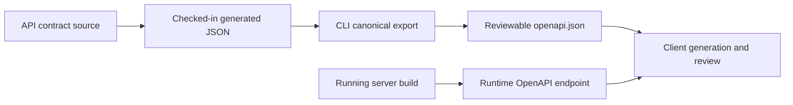
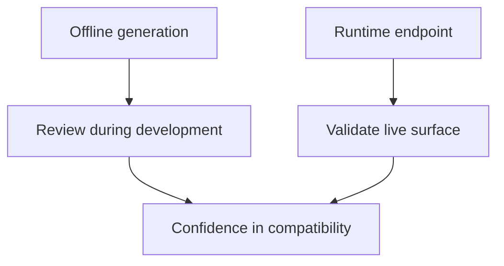
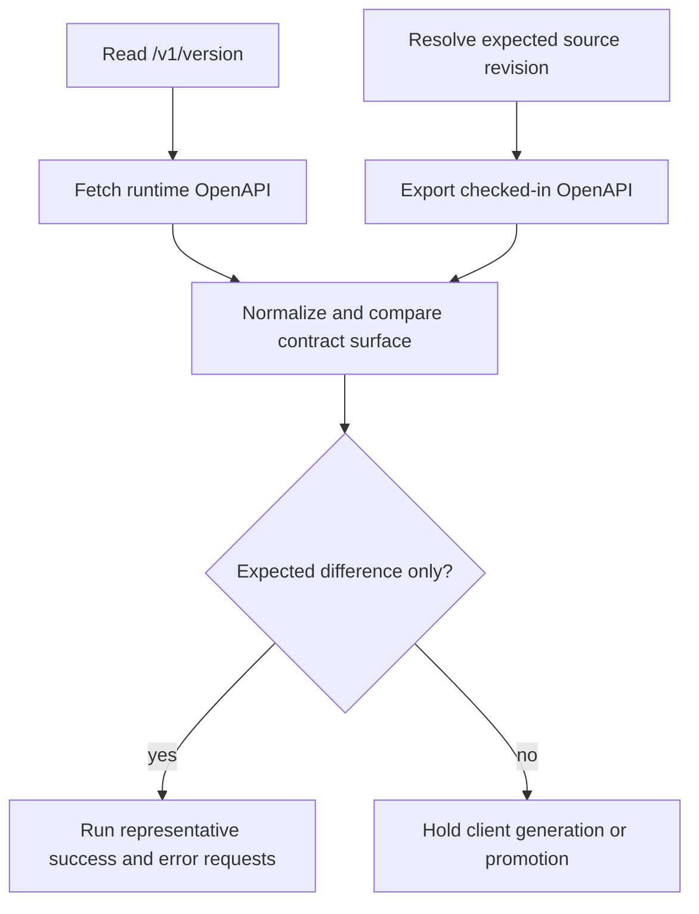

# OpenAPI and API Usage

Atlas exposes its HTTP contract as a checked-in generated document and from a
running server. The two views answer different identity questions and should
agree on the versioned API surface.

## OpenAPI Relationship



The CLI `openapi generate` command reads
`configs/generated/openapi/v1/openapi.json`, canonicalizes it, and writes the
requested output. It exports the checked-in generated contract; it does not
inspect a live router or independently reconstruct the API from source.

The runtime endpoint builds the API document from the `bijux-atlas-api`
contract implementation and adds `info.x-build-id`. Compare the contractual
surface after accounting for that runtime identity field.

## Two Ways to Access the API Description

- offline generation through the CLI
- runtime retrieval through `/v1/openapi.json`

## Generate OpenAPI Offline

```bash
cargo run -p bijux-atlas-cli --bin bijux-atlas -- openapi generate \
  --out configs/generated/openapi/v1/openapi.json
```

Offline generation is best for review, diffing, and contract validation before a server is even running.

## Read OpenAPI from a Running Server

```bash
curl -s http://127.0.0.1:8080/v1/openapi.json
```

Runtime retrieval is best for answering, “What is this environment exposing right now?”

## Why Both Matter



This split matters because OpenAPI serves two distinct jobs: review-time contract inspection and
runtime surface verification. Readers should use the one that matches the question they are asking.

The generated file is useful during code review, CI, and contract validation. The runtime endpoint is useful for confirming what a live server is exposing.

If the two disagree, treat that as a real problem. Either the environment is not running what you think it is, or the contract-generation path has drifted.

## Verification Sequence



Bind the comparison to `/v1/version`, including build, API contract, runtime
policy, and artifact schema identity. A byte difference alone is not the final
verdict because the runtime adds its build identifier; an unexplained route,
schema, response, or error-code difference is contract drift.

For generated clients, preserve the generator name and version, input contract
digest, generation options, and target language runtime. Client code inherits
the limits of both its generator and the contract snapshot used to create it.

## API Usage Guidance

- treat OpenAPI as a description of the contract-owned surface, not as a substitute for operational understanding
- pair endpoint usage with explicit dataset identity fields
- use the generated contract during integration work and the runtime endpoint during environment verification
- do not assume a documented route guarantees the requested dataset is actually published in your current store

## Response and Error Discipline

Successful dataset-aware responses carry API and contract identity together
with the resolved dataset and provenance fields owned by that endpoint. Error
responses use a structured envelope with a stable code, diagnostic message,
details, and request ID. Clients should branch on the HTTP status and stable
code, retain the request ID, and avoid parsing message text.

Before a costly query, `/v1/query/validate` can expose the selected dataset,
query class, work units, limits, and rejection reasons. Validation is advisory
for a particular request and policy state; it does not reserve capacity or
guarantee that dependencies remain available until execution.

## What OpenAPI Does Not Replace

- real query tests against published dataset state
- operational checks such as readiness, metrics, and policy behavior
- compatibility review for changes that affect more than surface shape
- authorization, rate-limit, overload, and dependency behavior under the
  target deployment policy
- provenance verification for the dataset bytes behind a successful response

## Where to Read More

- [API Endpoint Index](api-endpoint-index.md)
- [API Compatibility](../contracts/api-compatibility.md)
