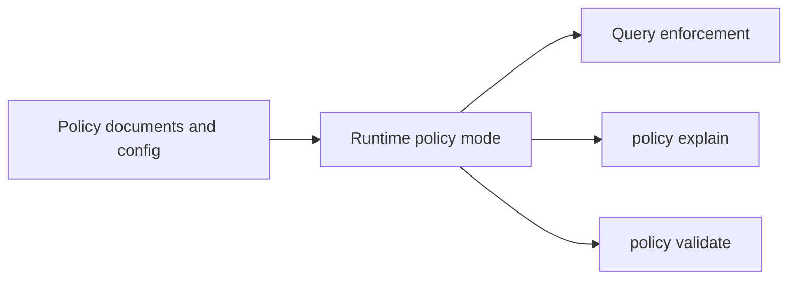
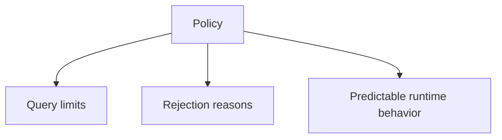

# Policy Workflows

Policy workflows explain how Atlas exposes and enforces runtime- and
query-related rules.

## Policy Surface



This policy surface map shows how Atlas turns policy from a hidden runtime
influence into something you can inspect and explain. That matters when clients
need to understand why a request was accepted or rejected.

## Main Policy Commands

- `policy validate`
- `policy explain`

## Why Users Should Care About Policy



This user-facing view explains why policy belongs in the user guide at all. It
is not just an operator or maintainer concern when policy changes the requests
users can make successfully.

Policy is what turns “the server happened to reject my request” into “the server enforced a known rule for a known reason.”

## Practical Commands

Validate the active policy surface:

```bash
cargo run -p bijux-atlas --bin bijux-atlas -- policy validate --json
```

Explain active policy deltas:

```bash
cargo run -p bijux-atlas --bin bijux-atlas -- policy explain --json
```

## How to Read Policy Effects

If a query fails because it is too broad or too expensive, that is usually a policy decision, not a random implementation quirk.

Common policy-sensitive areas:

- full-scan restrictions
- page size limits
- region span limits
- serialization budget limits

## Workflow Advice

- use policy output to explain runtime behavior to clients
- do not treat policy rejection as a server bug by default
- change policy intentionally, not by relying on hidden defaults

## When to Reach for Policy Commands

- a query is rejected and you need the reason to be explicit
- you are comparing expected versus active runtime policy behavior
- you need to explain enforcement behavior to another team or client

## Reading Rule

Use this page when a request is rejected for a reason that feels intentional
and you need Atlas to explain the rule rather than just repeat the failure.
