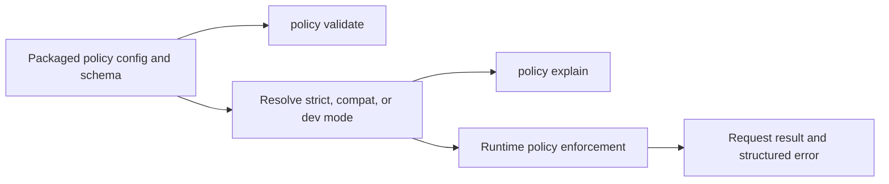

# Policy Workflows

Atlas policy commands inspect the policy set packaged with the installed CLI.
They validate its schema and show selected mode-level limits. They do not
connect to a running server or explain one rejected request after the fact.

## Policy Surface


```mermaid
flowchart LR
    Source[Packaged policy config and schema] --> Validate[policy validate]
    Source --> Resolve[Resolve strict, compat, or dev mode]
    Resolve --> Explain[policy explain]
    Resolve --> Runtime[Runtime policy enforcement]
    Runtime --> Result[Request result and structured error]
```

The inspection command and the server can share policy semantics while
observing different state. `policy explain` describes a selected packaged mode;
the running server may have a different binary, policy mode, or release
identity. Compare those identities before using CLI output to diagnose runtime
behavior.

## Command Semantics

| Command | Output | Safe conclusion | Not established |
| --- | --- | --- | --- |
| `policy validate` | canonical packaged policy plus schema version | the CLI can load, validate, and canonicalize its packaged policy set | a server is running that policy or accepted a request |
| `policy explain` | selected mode and deltas from strict for page size, region span, and response bytes | those three resolved limits for `strict`, `compat`, or `dev` | every policy field, a request-specific decision trace, or live server state |

Omitting `--mode` from `policy explain` uses the mode declared by the packaged
policy. Pass a mode explicitly when comparing profiles.

## Practical Commands

Validate the active policy surface:

```bash
cargo run -p bijux-atlas-cli --bin bijux-atlas -- policy validate --json
```

Explain packaged policy deltas for an explicit mode:

```bash
cargo run -p bijux-atlas-cli --bin bijux-atlas -- policy explain --mode strict --json
```

## Diagnose a Rejected Request

1. Preserve the structured response, error code, request ID, route, selectors,
   and resolved dataset identity.
2. Record the server software release, effective policy mode, and governance
   version from the running environment.
3. Use `policy validate` to confirm the candidate CLI's packaged policy is
   internally valid.
4. Use `policy explain --mode <mode>` only for its reported limit deltas.
5. Compare the request with the owning query, response-budget, rate-limit, or
   authorization contract. Do not infer an unreported rule from the three
   displayed deltas.

Common policy-sensitive boundaries include full scans, page size, region span,
response size, concurrency, rate limiting, and degraded-mode behavior. A
policy rejection is expected behavior when the request violates a governed
rule; a mismatched policy identity or incorrect error contract is a separate
defect.

Implementation authority:
[`crates/bijux-atlas-cli/src/adapters/inbound/cli/policy.rs`](../../../crates/bijux-atlas-cli/src/adapters/inbound/cli/policy.rs).
Continue with [Query Model](../foundations/query-model.md) for request admission
and [Error Codes and Exit Codes](error-codes-and-exit-codes.md) for failure
interpretation.
