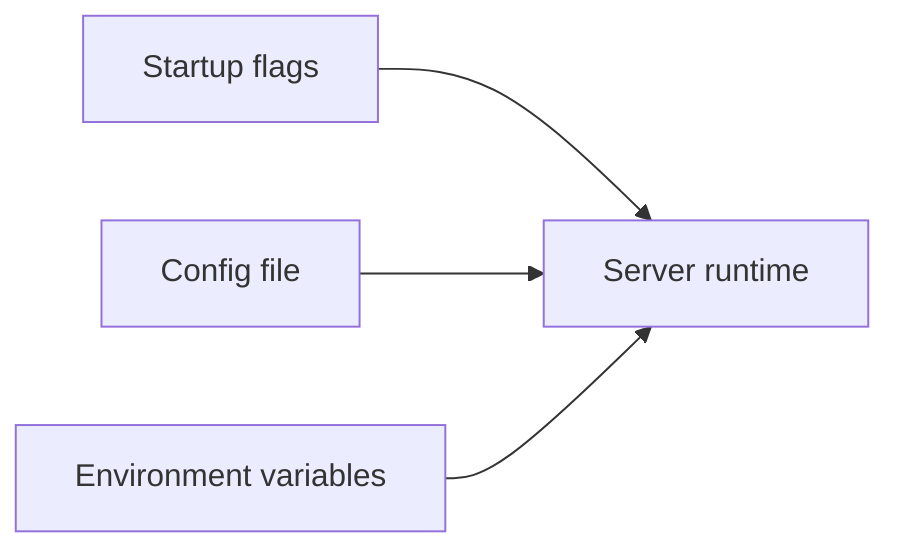
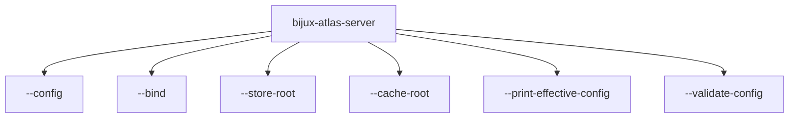

# Runtime Config Reference

This page summarizes the most visible runtime configuration entrypoints for the server binary.

## Runtime Config Inputs

This input diagram shows the three main ways runtime configuration reaches the server. It is meant
to support fast lookup, not to replace the deeper operational guidance in the operations section.

## Visible Server Flags

This flag map calls out the highest-signal server startup options so readers can identify the exact
entrypoint they need without reading full help output first.

## Key Flags

- `--config`: explicit config file input
- `--bind`: network bind address
- `--store-root`: serving store root
- `--cache-root`: runtime cache root
- `--print-effective-config`: inspect resolved runtime config
- `--validate-config`: validate runtime config without normal startup

## Key Rule

`--store-root` should point at a serving store with published artifacts and catalog state, not at an ingest build root.

## Precedence Model

When Atlas resolves runtime configuration, the practical precedence is:

1. explicit startup flags
2. values loaded from the selected config file
3. environment-provided values where the runtime supports them
4. built-in defaults

That order matters because debugging configuration drift is usually a
precedence problem rather than a syntax problem. If a value looks wrong, first
ask which layer supplied it.

## High-Signal Startup Patterns

Use these patterns as quick lookup recipes:

- local explicit startup:
  `bijux-atlas-server --bind 127.0.0.1:8080 --store-root <store> --cache-root <cache>`
- config-file driven startup:
  `bijux-atlas-server --config configs/runtime/local.toml`
- dry validation without serving:
  `bijux-atlas-server --config configs/runtime/local.toml --validate-config`
- inspect the resolved result before serving:
  `bijux-atlas-server --config configs/runtime/local.toml --print-effective-config`

## Common Failure Modes

- `--store-root` points at an ingest workspace instead of a published serving store
- the bind address is correct for local use but wrong for the deployment boundary
- the config file exists but is not the file the process is actually loading
- effective config was never inspected, so a default is mistaken for an explicit setting

## What To Check First

When startup behaves differently than expected:

1. print the effective config
2. confirm the selected config file path
3. confirm `--store-root` and `--cache-root` point at the intended directories
4. confirm the bind address matches the environment you are actually testing

## Related Pages

- [Configuration and Output](configuration-and-output.md)
- [Environment Variables](environment-variables.md)
- [Server Workflows](server-workflows.md)
- [Runtime Config Contracts](../contracts/runtime-config-contracts.md)

## Purpose

This page is the lookup reference for runtime config reference. Use it when you need the current checked-in surface quickly and without extra narrative.

## Stability

This page is a checked-in reference surface. Keep it synchronized with the repository state and generated evidence it summarizes.
