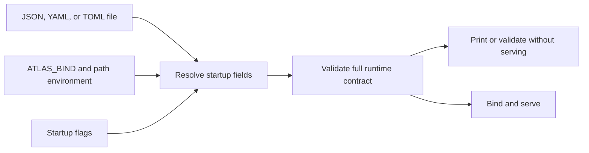

# Runtime Config Reference

`bijux-atlas-server` resolves startup location and path settings from CLI,
environment, an optional config file, and built-in defaults. It then resolves
the wider runtime environment contract and validates the combined result before
normal serving.

## Runtime Config Inputs

```mermaid
flowchart LR
    File[JSON, YAML, or TOML file] --> Resolve[Resolve startup fields]
    Env[ATLAS_BIND and path environment] --> Resolve
    Flags[Startup flags] --> Resolve
    Resolve --> Validate[Validate full runtime contract]
    Validate --> Inspect[Print or validate without serving]
    Validate --> Serve[Bind and serve]
```

## Key Flags

- `--config`: explicit config file input
- `--bind`: network bind address
- `--store-root`: serving store root
- `--cache-root`: runtime cache root
- `--print-effective-config`: inspect resolved runtime config
- `--validate-config`: validate runtime config without normal startup

## Key Rule

`--store-root` must point at a serving store with published artifacts and
catalog state, not at an ingest candidate directory. Relative store and cache
paths resolve from the repository root compiled into the runtime crate, not
from the process working directory.

## Precedence Model

For `bind_addr`, `store_root`, and `cache_root`, the implemented precedence is:

1. explicit startup flags
2. `ATLAS_BIND`, `ATLAS_STORE_ROOT`, or `ATLAS_CACHE_ROOT`
3. values loaded from the selected config file
4. built-in defaults

The earlier documentation placed config files above environment variables; the
runtime does the opposite. Always use the effective-config output as the
resolved observation.

| Field | CLI | Environment | Config key | Default |
| --- | --- | --- | --- | --- |
| bind address | `--bind` | `ATLAS_BIND` | `bind_addr` | `0.0.0.0:8080` |
| serving store | `--store-root` | `ATLAS_STORE_ROOT` | `store_root` | `artifacts/server-store` |
| cache root | `--cache-root` | `ATLAS_CACHE_ROOT` | `cache_root` | `artifacts/server-cache` |

The config file extension must be `.json`, `.yaml`, `.yml`, or `.toml`. Unknown
extensions and empty resolved fields fail validation.

## High-Signal Startup Patterns

Use these patterns as quick lookup recipes:

- local explicit startup:
  `bijux-atlas-server --bind 127.0.0.1:8080 --store-root <store> --cache-root <cache>`
- config-file driven startup:
  `bijux-atlas-server --config configs/runtime/local.toml`
- dry validation without serving:
  `bijux-atlas-server --config configs/runtime/local.toml --validate-config`
- inspect the resolved result before serving:
  `bijux-atlas-server --config configs/runtime/local.toml --print-effective-config`

## Common Failure Modes

- `--store-root` points at an ingest workspace instead of a published serving store
- the bind address is correct for local use but wrong for the deployment boundary
- the config file exists but is not the file the process is actually loading
- effective config was never inspected, so a default is mistaken for an explicit setting
- an environment variable overrides a config-file value unexpectedly
- a relative path is assumed to resolve from the shell's current directory

## What To Check First

When startup behaves differently than expected:

1. print the effective config
2. confirm the selected config file path
3. confirm `--store-root` and `--cache-root` point at the intended directories
4. confirm the bind address matches the environment you are actually testing

`--validate-config` resolves and validates configuration without entering the
normal server loop. `--print-effective-config` emits the resolved payload and
returns before binding. These are stronger startup diagnostics than reading one
input layer, but neither proves store reachability, catalog freshness, or
request readiness.

## Related Pages

- [Configuration and Output](configuration-and-output.md)
- [Environment Variables](environment-variables.md)
- [Server Workflows](server-workflows.md)
- [Runtime Config Contracts](../contracts/runtime-config-contracts.md)

Implementation authority:
[`crates/bijux-atlas-runtime/src/runtime/config/settings.rs`](../../../crates/bijux-atlas-runtime/src/runtime/config/settings.rs).
Generated startup reference:
[`configs/generated/runtime/runtime-startup-config.md`](../../../configs/generated/runtime/runtime-startup-config.md).
