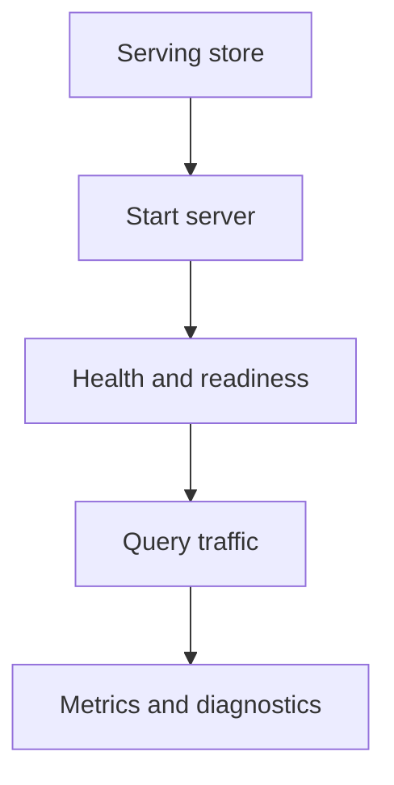
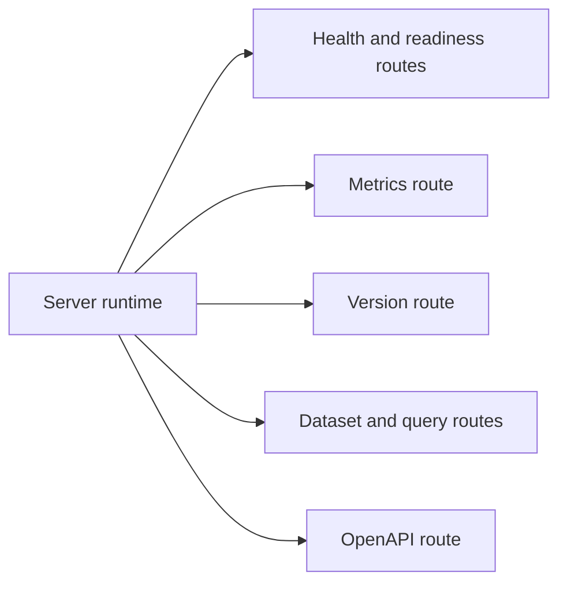

# Server Workflows

Server workflows cover the product-facing runtime surface: starting the
server, checking health, and using the main HTTP routes as intended.

This guide is about normal runtime usage after a valid serving store exists. It
is not the operator runbook for deployment, scaling, or incident response.

## Server Workflow Model



This server workflow model keeps the runtime path simple: start from a serving
store, establish health, serve traffic, and then observe the process. Startup
and successful traffic are not the same proof.

## Main Server Surfaces



This surface map clarifies that the running server exposes more than one kind
of endpoint. Health, metrics, product queries, and contract endpoints do not
answer the same question.

Not every surface has the same audience:

- `/healthz`, `/readyz`, and `/metrics` are primarily operational surfaces
- `/v1/version`, `/v1/datasets`, and query routes are product-facing runtime surfaces
- `/v1/openapi.json` is a contract and integration surface

## Common Day-to-Day Actions

- validate config before startup
- bind to a local or service address
- check health and readiness before sending traffic
- verify dataset discovery through `/v1/datasets`
- confirm API identity through `/v1/version`
- use metrics and OpenAPI deliberately rather than as substitutes for actual query validation

## Practical Startup

```bash
cargo run -p bijux-atlas --bin bijux-atlas-server -- \
  --bind 127.0.0.1:8080 \
  --store-root artifacts/getting-started/tiny-store \
  --cache-root artifacts/getting-started/server-cache
```

## Important Everyday Checks

```bash
curl -s http://127.0.0.1:8080/healthz
curl -s http://127.0.0.1:8080/readyz
curl -s http://127.0.0.1:8080/metrics
curl -s http://127.0.0.1:8080/v1/openapi.json
```

Those checks answer different questions. A healthy metrics endpoint does not prove that the expected
dataset is published. A reachable OpenAPI document does not prove that an environment is
production-ready.

## Everyday Interpretation Rule

- health answers “is the process alive enough to answer?”
- readiness answers “does the process consider itself ready?”
- product endpoints answer “can the server resolve and serve dataset state?”

## Operational Boundary

This guide explains normal usage of the runtime surface. For deployment,
rollback, resource tuning, and incident handling, move to
[bijux-atlas-ops](../../bijux-atlas-ops/index.md).

## Reading Rule

Use this page when the serving store already exists and the question is how to
use the running server surface in the intended order.
