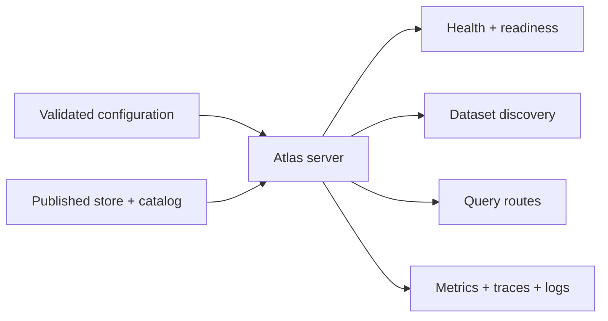

# Server workflows

The Atlas server exposes immutable dataset releases over HTTP. Start it only
after a serving store exists, then distinguish process health, traffic
eligibility, dataset discovery, and successful query behavior. These are
separate observations.

## Runtime path


```mermaid
flowchart LR
    Config[Validated configuration] --> Server[Atlas server]
    Store[Published store + catalog] --> Server
    Server --> Health[Health + readiness]
    Server --> Discovery[Dataset discovery]
    Server --> Queries[Query routes]
    Server --> Signals[Metrics + traces + logs]
```

| Surface | Question answered |
| --- | --- |
| `/healthz` | Is the process alive enough to answer? |
| `/readyz` | Does this replica currently consider itself traffic-eligible? |
| `/v1/version` | Which server release answered? |
| `/v1/datasets` | Which dataset identities are discoverable? |
| query routes | Can an explicit dataset answer the requested operation? |
| `/metrics` | What governed measurements does this process expose? |
| `/v1/openapi.json` | Which HTTP contract does this release publish? |

Readiness does not establish release-wide capacity or query correctness. A
reachable OpenAPI document does not establish dataset availability.

## Start from a checkout

```bash
cargo run --locked -p bijux-atlas-server --bin bijux-atlas-server -- \
  --bind 127.0.0.1:8080 \
  --store-root artifacts/getting-started/tiny-store \
  --cache-root artifacts/getting-started/server-cache
```

For a configured deployment, validate and inspect effective configuration
before binding a listener:

```bash
bijux-atlas-server --config ./atlas.toml --validate-config
bijux-atlas-server --config ./atlas.toml --print-effective-config
bijux-atlas-server --config ./atlas.toml
```

Keep secrets out of command history. Replicas intended to be equivalent should
resolve the same release, backend mode, policy, and dataset configuration.

## Establish serving behavior in order

```bash
curl --fail --silent http://127.0.0.1:8080/healthz
curl --fail --silent http://127.0.0.1:8080/readyz
curl --fail --silent http://127.0.0.1:8080/v1/version
curl --fail --silent http://127.0.0.1:8080/v1/datasets
```

1. Confirm process health.
2. Confirm the replica is ready for traffic.
3. Record server release identity.
4. Confirm the intended release, species, and assembly are discoverable.
5. Execute a representative query against that explicit identity.
6. Preserve request ID, response provenance, status, latency, and relevant
   runtime signals.

A discovery success proves catalog visibility, not artifact correctness for
every query. A representative query adds request-path evidence but does not
replace capacity, security, rollout, or recovery qualification.

## Interpret failures by boundary

| Observation | Likely boundary |
| --- | --- |
| health fails | Process bootstrap or fatal runtime state |
| health passes, readiness fails | Store, catalog, warmup, dependency, drain, or overload policy |
| readiness passes, dataset absent | Catalog selection or expected identity |
| dataset exists, query fails | Artifact integrity, store access, query policy, or execution |
| request succeeds without expected signals | Telemetry instrumentation or delivery path |

Administrative and debug routes are separate privileged surfaces. Keep them
disabled unless deployment policy explicitly isolates and qualifies their
complete route set.

For deployment, scaling, incident response, and release promotion, continue to
the [Atlas operations handbook](../../bijux-atlas-ops/index.md). For request and
error contracts, use [OpenAPI and API Usage](openapi-and-api-usage.md) and
[Error Codes and Exit Codes](error-codes-and-exit-codes.md).
