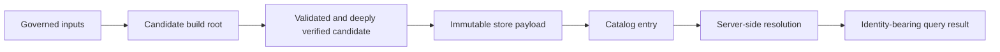
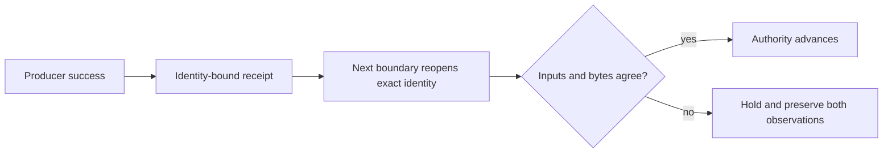

# Artifact Lifecycle

An Atlas artifact becomes serving authority through distinct, observable
boundaries. Ingest creates a candidate. Verification checks its structure and
content. Publication transfers immutable bytes into a store. Catalog promotion
makes the dataset discoverable. Runtime resolution proves that a particular
instance can read the published identity.

## Lifecycle and Evidence

| Boundary | Durable evidence | Authority gained |
| --- | --- | --- |
| build | manifest, derived data, input identity, and build result | candidate exists |
| verify | validation and integrity results for the exact candidate | candidate is eligible for publication |
| publish | store payload, checksum lock, and backend-specific publication record | immutable bytes exist in the selected store |
| promote | catalog entry for the exact dataset tuple | dataset is discoverable through that catalog |
| resolve | server observation with store, catalog, and dataset identity | one server process can select the published dataset |

No row implies the next one. Files on disk do not imply successful deep
verification. A published payload does not imply catalog promotion. A catalog
entry does not imply every runtime has refreshed it.

## Publication Is Backend-Specific

The local filesystem backend acquires a per-dataset publication lock, verifies
the expected manifest and SQLite hashes, writes synchronized temporary files,
renames them into place, and records immutability and lifecycle metadata. It
rejects an existing marker or payload instead of overwriting a release.

The S3-like backend verifies expected hashes and rejects an already readable
dataset, but it has no local publication lock. It writes temporary objects,
then the checksum lock, then final manifest and SQLite objects. It does not
currently emit the local immutability or lifecycle files. Operators must use
backend controls to prevent concurrent writers and must not infer local
filesystem atomicity from the shared store trait.

Catalog promotion remains a separate operation for both paths. A successful
payload write is not permission to serve it until the intended catalog contains
the exact dataset identity.

## Close Each Authority Transfer

Each transition needs a receipt from the consumer of the preceding boundary,
not only a success message from its producer.

| Transfer | Producer evidence | Consumer-side closure |
| --- | --- | --- |
| build to verify | candidate root and manifest | validator opens the exact root and records input and artifact identities |
| verify to publish | passing validation and deep verification | publisher rechecks expected hashes before transfer |
| publish to promote | immutable payload and checksum lock | catalog operation names the exact dataset tuple and artifact identity |
| promote to resolve | catalog generation containing the tuple | server refresh selects that generation and opens verified local paths |
| resolve to answer | selected dataset and query inputs | response carries request, dataset, artifact, and contract provenance where supported |

This pattern protects against a correct operation applied to the wrong root,
store, catalog generation, or process. It also makes delayed catalog refresh a
distinct resolution state instead of misclassifying it as publication failure.

## Failure Recovery

| Failure | Safe response |
| --- | --- |
| candidate validation fails | retain the candidate and evidence; do not publish |
| expected hash differs | reject the transfer and investigate the producer boundary |
| local publication conflicts | identify the existing immutable release; never overwrite it |
| remote publication is interrupted | inspect final and temporary keys plus hashes before retrying |
| payload exists but catalog entry is absent | validate payload, then perform explicit promotion |
| catalog entry exists but payload is invalid | remove traffic authority and restore catalog coherence |
| runtime serves retained cache during store failure | treat it as degraded continuity, not new-release discovery |

Do not manufacture a new checksum lock around unexplained bytes. Recovery must
either prove the existing artifact identity or republish from the verified
candidate under a new, unambiguous release decision.

Continue with [Serving Store Model](serving-store-model.md) for backend
capabilities, [Storage Architecture](storage-architecture.md) for authority
boundaries, and [Artifact and Store Contracts](../contracts/artifact-and-store-contracts.md)
for governed layout details.
