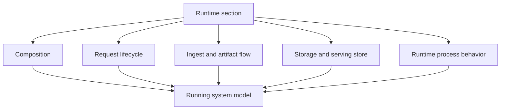

# Runtime

`bijux-atlas/runtime` is the section home for this handbook slice.

Runtime pages explain how Atlas works as a running system once the reader
already understands the product model and the exposed interfaces. This section
should feel architectural rather than operational: it explains why the system
behaves the way it does and where that behavior is assembled in the repo.

Use this section when a product question turns into an internal design or
lifecycle question.

## What This Section Explains

- how Atlas moves from validated input to published artifact to serving lookup
- where request handling, query resolution, storage, and runtime composition live
- how the source tree maps onto architectural boundaries
- which runtime explanations are descriptive architecture versus compatibility contracts

## What Runtime Means In This Repository

In this repo, runtime means the composition of domain logic, adapters, config,
storage assumptions, request handling, and process startup across:

- `crates/bijux-atlas/src/runtime/`
- `crates/bijux-atlas/src/app/`
- `crates/bijux-atlas/src/domain/`
- `crates/bijux-atlas/src/adapters/`

## Suggested Reading Order

1. [System Overview](system-overview.md)
2. [Source Layout and Ownership](source-layout-and-ownership.md)
3. [Request Lifecycle](request-lifecycle.md)
4. [Ingest Architecture](ingest-architecture.md)
5. [Query Architecture](query-architecture.md)

Use the remaining pages as targeted follow-ups when you need storage,
composition, process, or artifact-lifecycle detail.

## Boundary Rule

This section explains how the runtime works internally. It does not replace:

- [Interfaces](../interfaces/index.md) for exact surface lookup
- [Contracts](../contracts/index.md) for formal compatibility promises
- `bijux-atlas-ops` for deployment and operating guidance

## Pages

- [Artifact Lifecycle](artifact-lifecycle.md)
- [Ingest Architecture](ingest-architecture.md)
- [Query Architecture](query-architecture.md)
- [Request Lifecycle](request-lifecycle.md)
- [Runtime Composition](runtime-composition.md)
- [Runtime Process Model](runtime-process-model.md)
- [Serving Store Model](serving-store-model.md)
- [Source Layout and Ownership](source-layout-and-ownership.md)
- [Storage Architecture](storage-architecture.md)
- [System Overview](system-overview.md)

## Source Anchors

- `crates/bijux-atlas/src/domain/`
- `crates/bijux-atlas/src/app/`
- `crates/bijux-atlas/src/adapters/`
- `crates/bijux-atlas/src/runtime/`

## Main Takeaway

The runtime section is where Atlas stops being a list of commands or contracts
and becomes a running system in the reader's head. It should help people trace
from published artifact state to request handling, composition, storage, and
process behavior without drifting into operations or maintainer governance.
