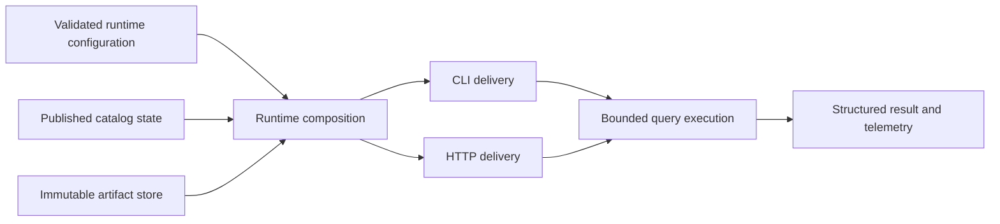
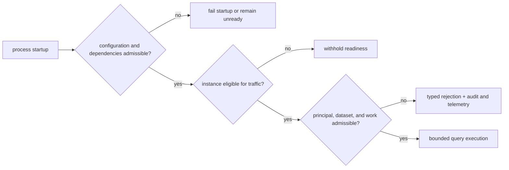

# Runtime

The Atlas runtime resolves immutable dataset releases and executes bounded
queries through CLI and HTTP delivery surfaces. It composes domain policy,
application use cases, store adapters, caches, configuration, security, and
telemetry without moving release authority into a running process.

```mermaid
flowchart LR
    Config[Validated runtime configuration] --> Compose[Runtime composition]
    Catalog[Published catalog state] --> Compose
    Store[Immutable artifact store] --> Compose
    Compose --> CLI[CLI delivery]
    Compose --> HTTP[HTTP delivery]
    CLI --> Query[Bounded query execution]
    HTTP --> Query
    Query --> Evidence[Structured result and telemetry]
```

## Runtime Invariants

- The catalog selects a published dataset identity; a request cannot invent one.
- The serving store supplies immutable artifact state; caches do not become
  release authority.
- Domain and query crates own biological and query semantics; delivery adapters
  do not redefine them.
- Configuration is resolved before it controls runtime behavior and remains
  attributable in diagnostics.
- Security, overload, and concurrency boundaries may reject work before query
  execution.
- Successful output preserves enough release and request context to be
  interpreted against the owning contract.

## Runtime Admission Model

The running process makes three admissions before a scientific result can be
returned. They fail independently and have different recovery owners.

```mermaid
flowchart LR
    Start["process startup"] --> Process{"configuration and dependencies admissible?"}
    Process -->|no| Stop["fail startup or remain unready"]
    Process -->|yes| Traffic{"instance eligible for traffic?"}
    Traffic -->|no| Drain["withhold readiness"]
    Traffic -->|yes| Request{"principal, dataset, and work admissible?"}
    Request -->|no| Reject["typed rejection + audit and telemetry"]
    Request -->|yes| Execute["bounded query execution"]
```

| Admission | Establishes | Does not establish |
| --- | --- | --- |
| process | effective configuration is valid and selected adapters can be composed | catalog freshness, target capacity, or caller authority |
| traffic | the instance meets the configured readiness contract for its current catalog mode | every route is authorized or every query will succeed |
| request | the caller, dataset selection, and work estimate satisfy the applicable policy | biological correctness beyond the selected published artifact |

Treat these as state transitions, not synonyms for “healthy.” A live process
may be intentionally unready. A ready process may correctly reject an
unauthorized or excessive request. A successful request says nothing about an
unexercised failure or capacity boundary.

## Follow the Running System

| Question | Read |
| --- | --- |
| How do crates and control planes fit together? | [System Overview](system-overview.md) |
| Where is behavior owned in source? | [Source Layout and Ownership](source-layout-and-ownership.md) |
| How is the concrete runtime assembled? | [Runtime Composition](runtime-composition.md) |
| What happens from startup to shutdown? | [Runtime Process Model](runtime-process-model.md) |
| How does an HTTP request cross boundaries? | [Request Lifecycle](request-lifecycle.md) |
| How does source data become a release? | [Ingest Architecture](ingest-architecture.md) and [Artifact Lifecycle](artifact-lifecycle.md) |
| How are queries planned and executed? | [Query Architecture](query-architecture.md) |
| Which storage boundary is authoritative? | [Storage Architecture](storage-architecture.md) and [Serving Store Model](serving-store-model.md) |

## Architecture, Interface, and Operations

Runtime architecture explains ownership and execution flow. Exact flags,
environment variables, HTTP paths, output shapes, and error codes belong to
[Interfaces](../interfaces/index.md). Compatibility guarantees belong to
[Contracts](../contracts/index.md). Deployment profiles, observability,
capacity, recovery, and release decisions belong to the
[Operations handbook](../../bijux-atlas-ops/index.md).

The distinction matters during failure analysis. A runtime explanation can
identify the rejecting boundary, but only its interface contract defines the
consumer-visible result. Only captured operational evidence establishes what
happened in a particular environment.
