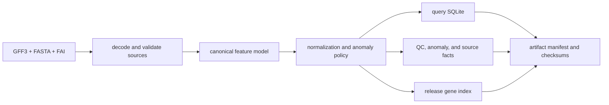
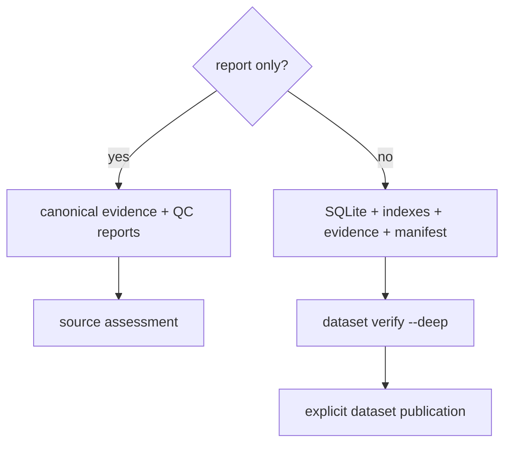
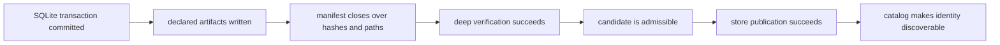

# Ingest Architecture

Ingest is a deterministic compiler from governed biological sources to Atlas
dataset artifacts. The engine keeps source decoding, canonical biological
meaning, artifact construction, and publication separate. This prevents
transport or serving concerns from changing how a feature is interpreted.

## Ownership boundaries

| Boundary | Owns | Rejects |
| --- | --- | --- |
| source decoder | compressed input handling, GFF3 parsing, FAI and reference facts | unreadable or structurally invalid source sets |
| annotation model | genes, transcripts, exons, identifiers, coordinates, and normalization traces | semantic conflicts selected by policy |
| ingest policy | strictness, identifier policy, anomaly thresholds, sharding choice | inputs outside the accepted policy envelope |
| artifact writer | SQLite, source copies, canonical evidence, reports, indexes, manifests | write or internal consistency failures |
| dataset publication | verified candidate transfer into the serving store | mutable or integrity-ambiguous release state |

The ingest crate ends at the candidate build root. It does not update a serving
catalog, choose a runtime backend, or refresh a server cache.

## Canonical meaning precedes storage

The decoder produces a canonical feature model before SQLite is written. Its
summary and hashes are emitted as evidence, alongside source facts and sequence
normalization traces. This makes two important comparisons possible:

- query-semantic equality asks whether two builds should answer supported
  queries the same way;
- lineage-sensitive equality includes source and normalization decisions that
  may differ even when query results are equivalent.

Storage is therefore an encoding of accepted domain state. SQLite layout must
not become the only definition of biological meaning.

## Output contract

A normal ingest copies the accepted source set and emits derived artifacts
under the dataset identity. The result identifies:

- the artifact manifest and checksums;
- the query SQLite database;
- QC and anomaly reports;
- canonical model and source-fact evidence;
- the release gene index;
- an optional shard catalog and shard databases;
- optional normalized debug output outside production mode.

`region_grid` sharding is reserved and currently rejected. Contig sharding is
the implemented partitioning path. Consumers must follow the emitted shard
catalog instead of deriving shard filenames or coverage rules themselves.

## Report-only is an evidence path

Report-only ingest writes canonical evidence and quality reports without
creating the normal SQLite and manifest publication payload. It is useful for
measuring source defects. It is not a build that can pass normal dataset
publication gates.

## A database commit is not a dataset commit

The SQLite writer uses a transaction for the rows and indexes it owns. That
transaction protects database consistency; it cannot make the complete build
root atomic. Reports, source facts, canonical evidence, shard databases, and
the manifest are separate files produced around that database.

Treat completion as a chain of increasingly stronger claims:

No earlier state implies a later one. In particular, a valid SQLite file does
not prove that evidence is complete, and a deeply verified candidate is not
yet a published dataset. Automation should retain the command outcome and
verification result together rather than inferring success from selected
files.

## Failure and replay rules

An output root may contain partial files after a failed process. Its mere
existence is not evidence of a completed build. Accept a candidate only when
the command succeeds and deep verification passes for the exact identity.

Resume may continue a compatible interrupted job. A changed source hash,
dataset identity, or policy requires a distinct build decision. Normalized
replay compares decoded counts when enabled, but it does not replace source
provenance or artifact verification.

See [Ingest workflows](../workflows/ingest-workflows.md) for the user journey
and [Artifact and store contracts](../contracts/artifact-and-store-contracts.md)
for the durable layout.
