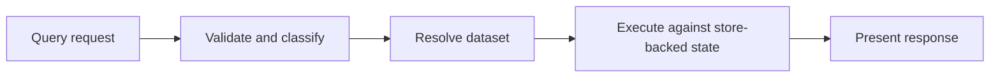
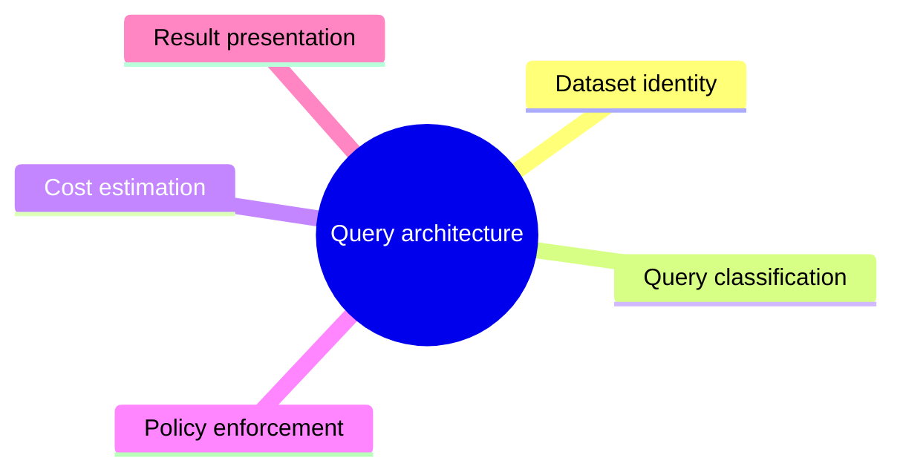

# Query Architecture

Atlas query architecture is built around explicit dataset identity, request
classification, policy checks, and store-backed execution.

## Query Path

This query path highlights the stages Atlas wants to keep visible: request
classification, dataset resolution, execution, and presentation. That
visibility is what makes rejection reasons and result shape easier to explain.

## Query Concerns

This concern map shows the themes that shape most query changes. It helps keep
request transport, cost policy, and result presentation from collapsing into
one indistinct layer.

## Architectural Priorities

- explicit selectors beat implicit scans
- policy should explain rejection clearly
- response structure should remain deterministic
- query logic should not leak transport concerns into domain rules

## Why Query Validation Exists

The dedicated validation route is not just a convenience. It exposes the classification and policy
model directly so clients can understand request shape without needing to infer behavior from full
execution only.

## Healthy Query Architecture Traits

- explicit dataset identity remains part of the request contract
- policy rejection is explainable before expensive execution starts
- presentation does not smuggle transport concerns into core query rules

## Reading Rule

Use this page when the question is not how to call a query endpoint, but how
Atlas keeps query identity, policy, execution, and response shaping separate.
