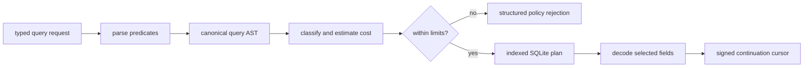
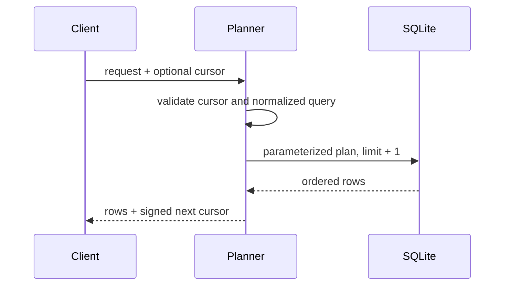

# Query Architecture

Atlas turns every gene query into a normalized, budgeted plan before touching
SQLite. Dataset selection and store verification happen outside the query
engine. The engine owns query meaning, cost policy, indexed execution, stable
ordering, and cursor integrity.

```mermaid
flowchart LR
    Request["typed query request"] --> Parse["parse predicates"]
    Parse --> Normalize["canonical query AST"]
    Normalize --> Plan["classify and estimate cost"]
    Plan --> Budget{"within limits?"}
    Budget -- no --> Reject["structured policy rejection"]
    Budget -- yes --> SQL["indexed SQLite plan"]
    SQL --> Rows["decode selected fields"]
    Rows --> Cursor["signed continuation cursor"]
```

## The frozen query model

Validation can freeze a request into a stable model containing its intent,
query class, plan node, sort key, predicate labels, normalized AST, estimated
work units, and contract hash. That model lets clients and operators inspect a
decision without inferring it from latency or a later database error.

| Query shape | Intent or plan | Default class |
| --- | --- | --- |
| exact gene identifier | point lookup | cheap |
| exact name | name lookup | medium |
| name prefix | prefix search | heavy |
| genomic interval | region scan | heavy |
| other accepted filters | filtered scan | medium |

Classification controls policy and concurrency decisions. It is not a promise
of a fixed response time.

## Limits are enforced before execution

The planner checks requested row limits, region span, prefix length, prefix
cost, and estimated work. An unfiltered scan is rejected unless the caller
explicitly permits a full scan. Exact gene-identifier lookups remain the
contractual cheap path.

Strand-aware filtering is currently rejected by the request validator because
the current dataset schema does not support that contract. Documentation or
transport parameters must not imply support that the query engine rejects.

## Indexed execution is a safety property

The executor builds parameterized SQL from the plan and checks SQLite's explain
result before running it. A plan that requires a forbidden full scan fails as a
policy error. This preserves the same boundary for CLI and HTTP callers.

For a sharded dataset, a region predicate selects shards whose declared
sequence set includes the requested sequence. Other shapes use the primary
`gene_summary.sqlite` path unless a higher layer provides a different governed
selection. Shard selection follows the shard catalog; it does not probe files
by convention.

## Pagination is bound to query identity

Atlas fetches one extra row to decide whether a continuation exists. The next
cursor records the order, last-seen key, dataset identity, query hash, and
depth. Cursor verification rejects reuse with a different query, dataset, or
ordering contract.

```mermaid
sequenceDiagram
    participant Client
    participant Planner
    participant SQLite
    Client->>Planner: request + optional cursor
    Planner->>Planner: validate cursor and normalized query
    Planner->>SQLite: parameterized plan, limit + 1
    SQLite-->>Planner: ordered rows
    Planner-->>Client: rows + signed next cursor
```

Consumers should treat cursors as opaque. They are continuations for an exact
query contract, not durable offsets or dataset-independent bookmarks.

## Error ownership

Parse and limit failures are validation errors. Cursor mismatch is a cursor
error. A forbidden access path is a policy error. SQLite preparation or row
decoding is an execution error. The HTTP layer maps these categories into the
public error envelope; it must not redefine query semantics.

See the [Query model](../foundations/query-model.md) for supported fields and
[Request lifecycle](request-lifecycle.md) for transport and runtime behavior.
