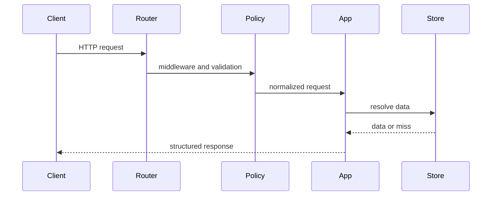
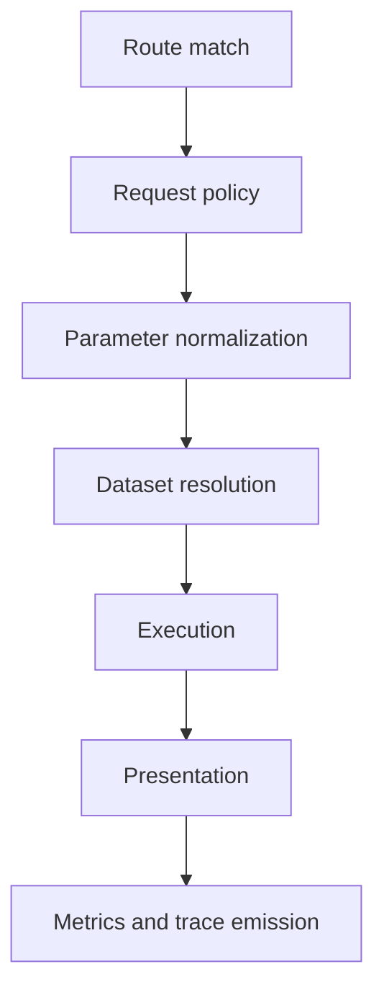

# Request Lifecycle

The request lifecycle explains how Atlas turns an incoming HTTP request into a
validated, executed, and structured response.

## Lifecycle Overview

This lifecycle sequence keeps the request path concrete. Policy, normalization,
dataset resolution, execution, and presentation are separate stages, not one
opaque handler.

## Main Request Stages

This stage map is useful because most request failures belong to one stage. If
you can name the stage, you can usually find the owning code and test surface
much faster.

## Key Architectural Point

The router should remain declarative. Request shaping, policy enforcement, execution, and presentation each have different reasons to change.

## Why Operators and Maintainers Care

- request policy explains many 4xx responses
- dataset resolution explains many serving misses
- presentation explains why structured output looks the way it does
- metrics and tracing explain what happened after the fact

## A Healthy Request Boundary

- routers stay declarative
- policy explains many rejections before execution begins
- presentation shapes the response without redefining domain meaning

## Reading Rule

Use this page when a request reaches the server but the real question is where
it was rejected, normalized, resolved, or reshaped.
