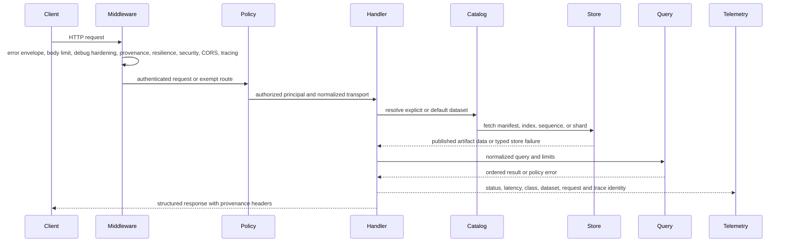
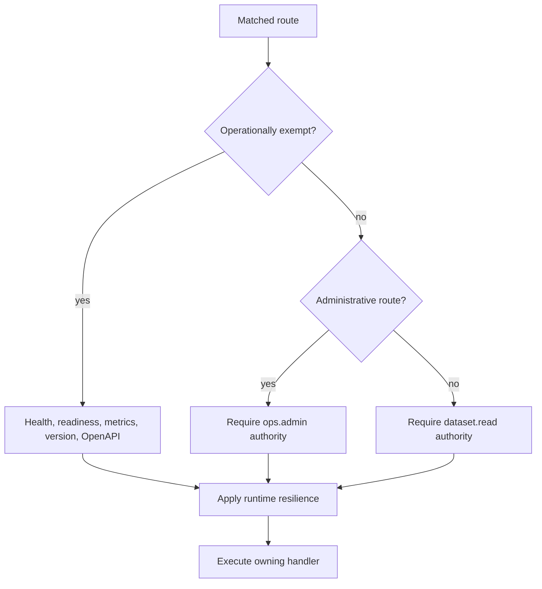
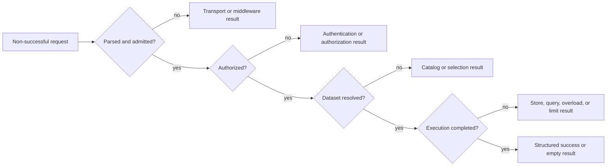

# Request Lifecycle

An Atlas HTTP request crosses several owned boundaries. They cover transport,
security, resilience, normalization, dataset resolution, execution,
presentation, and telemetry. Each boundary owns a distinct rejection class and
retains context about where processing stopped.

## Lifecycle

```mermaid
sequenceDiagram
    participant Client
    participant Middleware
    participant Policy
    participant Handler
    participant Catalog
    participant Store
    participant Query
    participant Telemetry
    Client->>Middleware: HTTP request
    Middleware->>Middleware: error envelope, body limit, debug hardening, provenance, resilience, security, CORS, tracing
    Middleware->>Policy: authenticated request or exempt route
    Policy->>Handler: authorized principal and normalized transport
    Handler->>Catalog: resolve explicit or default dataset
    Catalog->>Store: fetch manifest, index, sequence, or shard
    Store-->>Handler: published artifact data or typed store failure
    Handler->>Query: normalized query and limits
    Query-->>Handler: ordered result or policy error
    Handler-->>Telemetry: status, latency, class, dataset, request and trace identity
    Handler-->>Client: structured response with provenance headers
```

Axum applies middleware around the router. Each handler retains ownership of
domain-specific parsing and execution. Middleware can reject a request. It
cannot make an invalid query valid or redefine dataset identity.

## Boundary Map

| Boundary | Representative checks | Observable outcome |
| --- | --- | --- |
| transport | body size, CORS, request ID, response hardening | HTTP rejection or normalized request context |
| debug hardening | admin endpoint enablement and protected debug routes | unavailable or rejected administrative request |
| security | authentication mode, principal, role, action, resource, route policy | stable authorization decision and audit event |
| resilience | global breaker, overload state, cheap/heavy class, concurrency permit | admitted request or `RateLimited`, `QueryRejectedByPolicy`, or `NotReady` |
| normalization | path, query, region, selector, cursor, limit, and output validation | typed request or stable client error |
| dataset resolution | release, species, assembly, catalog presence, cached-only rules | selected immutable dataset or explicit miss |
| execution | query planning, shard access, SQLite execution, sequence or diff work | ordered result or typed runtime/store error |
| presentation | envelope, status, cache, ETag, provenance, pagination | versioned wire response |
| telemetry | route, status, latency, request class, dataset, trace identity | metrics, structured logs, and trace events |

## Route Classes

Health, readiness, liveness, overload, metrics, version, and OpenAPI routes are
authentication-exempt by contract. Dataset routes require dataset-read
authority. Debug and cluster routes require operator authority and are only
registered when administrative endpoints are enabled.

```mermaid
flowchart TD
    Request[Matched route] --> Exempt{Operationally exempt?}
    Exempt -->|yes| Service[Health, readiness, metrics, version, OpenAPI]
    Exempt -->|no| Admin{Administrative route?}
    Admin -->|yes| AdminPolicy[Require ops.admin authority]
    Admin -->|no| DatasetPolicy[Require dataset.read authority]
    Service --> Resilience[Apply runtime resilience]
    AdminPolicy --> Resilience
    DatasetPolicy --> Resilience
    Resilience --> Handler[Execute owning handler]
```

An exempt route is not an unrestricted data route. Its resource kind remains
the service namespace, and deployment network policy still determines who can
reach it.

## Failure Attribution

```mermaid
flowchart LR
    Rejection[Non-successful request] --> Transport{Parsed and admitted?}
    Transport -->|no| Edge[Transport or middleware result]
    Transport -->|yes| Authorized{Authorized?}
    Authorized -->|no| Policy[Authentication or authorization result]
    Authorized -->|yes| Resolved{Dataset resolved?}
    Resolved -->|no| Catalog[Catalog or selection result]
    Resolved -->|yes| Executed{Execution completed?}
    Executed -->|no| Runtime[Store, query, overload, or limit result]
    Executed -->|yes| Presentation[Structured success or empty result]
```

The first rejecting boundary owns the primary outcome. Later middleware may
add correlation, hardening, or presentation fields, but it must not obscure
whether the request failed at transport, policy, catalog, store, query, or
capacity control.

## Dataset Resolution and Caching

The catalog establishes discoverable dataset identity. Artifact caches and the
optional Redis response cache accelerate access. They are not release
authority. A Redis failure can fall back to the serving path. Catalog or
artifact unavailability can fail a request or change readiness, depending on
cached-only and readiness configuration.

## Completion Semantics

A successful response means middleware admitted the request and resolved the
dataset. Execution completed under its limits, and presentation produced the
versioned envelope. Success does not identify a particular cache layer. Policy
rejection, dataset miss, overload refusal, and empty query result are distinct
outcomes. Status, error code, and telemetry preserve that distinction.

For streaming or paginated work, response start is not equivalent to complete
delivery. Completion must account for serialization, body transfer, cursor or
continuation state, and any terminal error exposed by the interface contract.

Continue with [Query Architecture](query-architecture.md),
[Serving Store Model](serving-store-model.md), and
[Error Codes and Exit Codes](../interfaces/error-codes-and-exit-codes.md).
