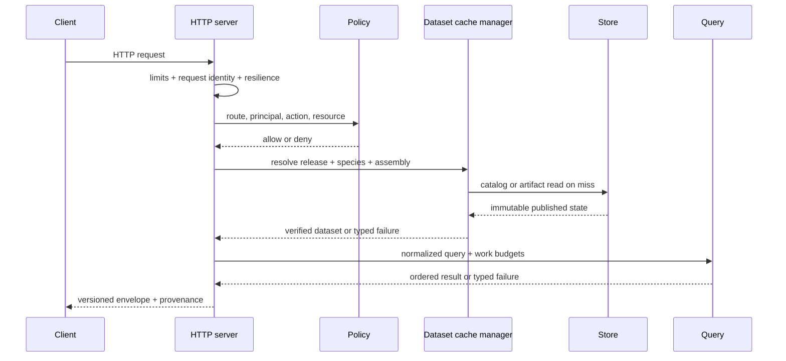

# Request lifecycle

An Atlas HTTP request crosses owned boundaries for transport, security,
resilience, dataset resolution, query execution, presentation, and telemetry.
The first boundary that refuses work owns the primary outcome. Later layers may
add correlation and response structure, but must not obscure why processing
stopped.

## End-to-end path

```mermaid
sequenceDiagram
    participant Client
    participant Server as HTTP server
    participant Policy
    participant Cache as Dataset cache manager
    participant Store
    participant Query
    Client->>Server: HTTP request
    Server->>Server: limits + request identity + resilience
    Server->>Policy: route, principal, action, resource
    Policy-->>Server: allow or deny
    Server->>Cache: resolve release + species + assembly
    Cache->>Store: catalog or artifact read on miss
    Store-->>Cache: immutable published state
    Cache-->>Server: verified dataset or typed failure
    Server->>Query: normalized query + work budgets
    Query-->>Server: ordered result or typed failure
    Server-->>Client: versioned envelope + provenance
```

Axum middleware owns HTTP composition and admission. Handlers own
domain-specific parsing and query invocation. Runtime modules provide shared
configuration, policy, store ports, and domain semantics; they are not a
separate network hop.

## Boundary map

| Boundary | Decides | Representative outcome |
| --- | --- | --- |
| transport | Body, CORS, request identity, and response hardening | Normalized context or HTTP rejection |
| security | Authentication, route class, action, resource, and authorization | Attributable allow or deny |
| resilience | Breaker state, request class, rate, concurrency, and overload | Admission or stable policy rejection |
| normalization | Dataset selector, region, cursor, limit, projection, and output | Typed request or client error |
| dataset | Catalog presence, verified artifacts, and cached-only policy | Exact published identity or explicit miss |
| execution | Query plan, SQLite work, sequence or diff operation, and budgets | Ordered result or typed runtime failure |
| presentation | Envelope, status, ETag, pagination, cache, and provenance | Versioned wire response |
| telemetry | Route, class, status, latency, release, dataset, request, and trace | Correlated metrics, logs, and spans |

## Three identities travel together

| Identity | Origin | Purpose |
| --- | --- | --- |
| request | Accepted `x-request-id` or server-generated value | Correlates one transport attempt |
| principal | Authentication context and route classification | Drives authorization and audit attribution |
| dataset | Resolved release, species, assembly, and manifest | Binds result, cache key, ETag, cursor, and provenance |

A retry may receive a new request ID while retaining principal and dataset
identity. Changing the dataset means a different scientific request, even when
filters and route are unchanged.

## Route classification boundary

Health, readiness, liveness, overload, metrics, version, and OpenAPI routes are
authentication-exempt by contract. Dataset routes require `dataset.read`.
Administrative routes are registered only when enabled and are intended to
require `ops.admin`.

The current implementation does not classify all enabled administrative routes
correctly: only 18 of 26 are recognized as administrative. Four replica routes,
two recovery routes, failure injection, and chaos execution fall through to
ordinary dataset-read treatment. Keep administrative endpoints disabled or
network-isolated unless an exception proves every enabled route end to end.

Authentication exemption is not unrestricted reachability. Network policy and
service exposure remain separate deployment controls.

## Reject expensive work early

```mermaid
flowchart LR
    Edge[Body + header limits] --> Auth[Authentication + authorization]
    Auth --> Rate[Rate + overload policy]
    Rate --> Parse[Parameters + cursor]
    Parse --> Plan[Query class + estimated work]
    Plan --> Permit[Worker or queue permit]
    Permit --> Data[Store + SQLite]
    Data --> Encode[Response size + deadline]
```

A global timeout does not replace SQL, response-size, queue, sequence, or work
budgets. The user-visible deadline includes queue wait, store access, cache
fill, execution, serialization, compression, and delivery.

## Interpret outcomes by owner

| Outcome | First place to investigate |
| --- | --- |
| malformed or oversized input | Transport and normalization |
| missing, invalid, or underprivileged identity | Authentication, authorization, and route classification |
| overload or concurrency refusal | Resilience and request-class policy |
| dataset miss or stale discovery | Catalog selection and cached-only state |
| integrity or backend failure | Serving store and dataset cache manager |
| work-limit or query failure | Query planning and execution |
| incomplete stream or pagination | Presentation, deadline, and continuation state |

The same HTTP status can represent different recovery actions. Group incidents
by the first rejecting boundary before status code.

A successful response means the request was admitted, an exact dataset was
resolved, execution completed within its budgets, and presentation finished.
A `304 Not Modified` is valid only when its ETag represents that same dataset
and normalized request. Response start is not completion for streaming or
paginated work.

Continue with [Query Architecture](query-architecture.md),
[Serving Store Model](serving-store-model.md), and
[Error Codes and Exit Codes](../interfaces/error-codes-and-exit-codes.md).
