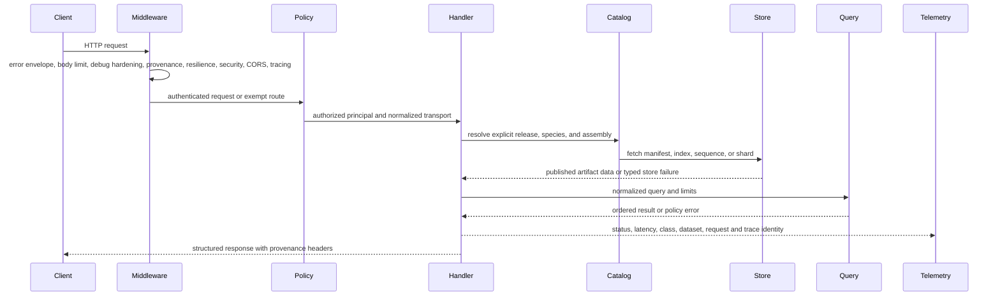
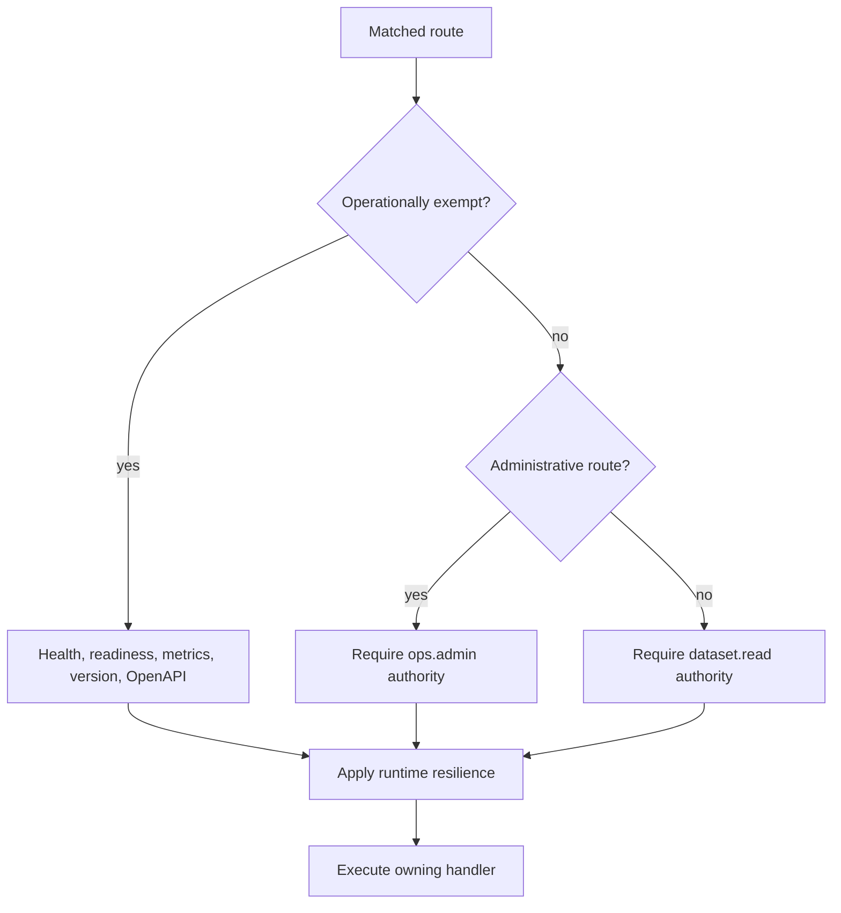
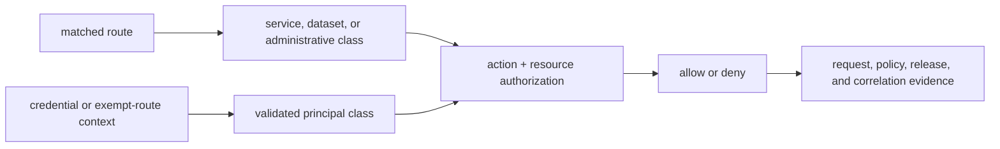
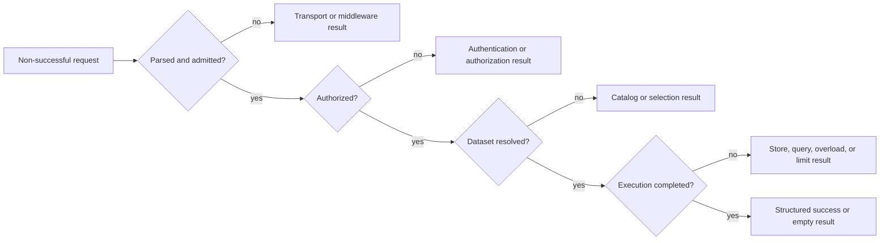

# Request Lifecycle

An Atlas HTTP request crosses several owned boundaries. They cover transport,
security, resilience, normalization, dataset resolution, execution,
presentation, and telemetry. Each boundary owns a distinct rejection class and
retains context about where processing stopped.

## Lifecycle

```mermaid
sequenceDiagram
    participant Client
    participant Middleware
    participant Policy
    participant Handler
    participant Catalog
    participant Store
    participant Query
    participant Telemetry
    Client->>Middleware: HTTP request
    Middleware->>Middleware: error envelope, body limit, debug hardening, provenance, resilience, security, CORS, tracing
    Middleware->>Policy: authenticated request or exempt route
    Policy->>Handler: authorized principal and normalized transport
    Handler->>Catalog: resolve explicit release, species, and assembly
    Catalog->>Store: fetch manifest, index, sequence, or shard
    Store-->>Handler: published artifact data or typed store failure
    Handler->>Query: normalized query and limits
    Query-->>Handler: ordered result or policy error
    Handler-->>Telemetry: status, latency, class, dataset, request and trace identity
    Handler-->>Client: structured response with provenance headers
```

Axum applies middleware around the router. Each handler retains ownership of
domain-specific parsing and execution. Middleware can reject a request. It
cannot make an invalid query valid or redefine dataset identity.

## Boundary Map

| Boundary | Representative checks | Observable outcome |
| --- | --- | --- |
| transport | body size, CORS, request ID, response hardening | HTTP rejection or normalized request context |
| debug hardening | admin endpoint enablement and protected debug routes | unavailable or rejected administrative request |
| security | authentication mode, principal, role, action, resource, route policy | stable authorization decision and audit event |
| resilience | global breaker, overload state, cheap/heavy class, concurrency permit | admitted request or `RateLimited`, `QueryRejectedByPolicy`, or `NotReady` |
| normalization | path, query, region, selector, cursor, limit, and output validation | typed request or stable client error |
| dataset resolution | release, species, assembly, catalog presence, cached-only rules | selected immutable dataset or explicit miss |
| execution | query planning, shard access, SQLite execution, sequence or diff work | ordered result or typed runtime/store error |
| presentation | envelope, status, cache, ETag, provenance, pagination | versioned wire response |
| telemetry | route, status, latency, request class, dataset, trace identity | metrics, structured logs, and trace events |

## Route Classes

Health, readiness, liveness, overload, metrics, version, and OpenAPI routes are
authentication-exempt by contract. Dataset routes require dataset-read
authority. Debug and cluster routes require operator authority and are only
registered when administrative endpoints are enabled.

```mermaid
flowchart TD
    Request[Matched route] --> Exempt{Operationally exempt?}
    Exempt -->|yes| Service[Health, readiness, metrics, version, OpenAPI]
    Exempt -->|no| Admin{Administrative route?}
    Admin -->|yes| AdminPolicy[Require ops.admin authority]
    Admin -->|no| DatasetPolicy[Require dataset.read authority]
    Service --> Resilience[Apply runtime resilience]
    AdminPolicy --> Resilience
    DatasetPolicy --> Resilience
    Resilience --> Handler[Execute owning handler]
```

An exempt route is not an unrestricted data route. Its resource kind remains
the service namespace, and deployment network policy still determines who can
reach it.

## Identity Carried Through the Request

Three identities must not be conflated:

| Identity | Origin | Purpose |
| --- | --- | --- |
| request identity | accepted `x-request-id` or server-generated identifier | correlates one transport attempt across response, log, metric exemplar, and trace |
| principal identity | validated API key or token context | drives authorization and audit attribution |
| dataset identity | explicit release, species, and assembly resolved to a manifest | binds the answer, cache key, ETag, provenance, and query cursor to published data |

A retried HTTP call may have a new request identity while retaining the same
principal and dataset identity. A different dataset identity is not a retry of
the same scientific request, even when the route and filters are identical.

Responses expose `x-request-id` for correlation. Dataset responses also carry
artifact and cache provenance where the route contract supports it. Preserve
these fields in client diagnostics; they are needed to distinguish a repeated
request from a response served from different published bytes.

## Authorization Decision Trace

Authorization evidence must preserve the inputs to the decision without
retaining credentials. A status code alone cannot show whether identity was
missing, invalid, underprivileged, or applied to the wrong resource.

```mermaid
flowchart LR
    Route["matched route"] --> Class["service, dataset, or administrative class"]
    Credential["credential or exempt-route context"] --> Principal["validated principal class"]
    Class --> Decision["action + resource authorization"]
    Principal --> Decision
    Decision --> Outcome["allow or deny"]
    Outcome --> Audit["request, policy, release, and correlation evidence"]
```

| Decision element | Evidence to retain | Never retain as proof |
| --- | --- | --- |
| route classification | normalized route and service, dataset, or administrative class | raw unbounded URL data |
| identity | principal identifier or class, authentication mode, issuer or key version | token, API key, private key, or secret value |
| authorization | action, resource kind, resource identity, policy version, and verdict | a role name with no evaluated action or resource |
| request context | request ID, trace ID, runtime release, effective config identity, and dataset tuple | correlation ID without the decision fields |
| outcome | stable status and error code plus whether domain work began | HTTP status alone |

Negative checks are first-class evidence. Exercise a missing credential, an
invalid credential, a valid but unauthorized principal, and an authorized
principal for each protected route class required by the deployment claim.
Network isolation remains separate: an application-level denial does not prove
that an administrative route is unreachable from an untrusted network.

## Admission and Work Budgets

Admission is layered so expensive work is rejected before consuming the most
constrained resource:

```mermaid
flowchart LR
    Edge[body and header limits] --> Auth[authentication and authorization]
    Auth --> Rate[rate and global overload policy]
    Rate --> Parse[parameter and cursor validation]
    Parse --> Plan[query class and estimated work]
    Plan --> Permit[heavy-worker or queue permit]
    Permit --> Data[store and SQLite work]
    Data --> Encode[response-size and deadline checks]
```

Each layer has its own budget and error code. A global request timeout does not
replace SQL, sequence-size, response-size, queue, or query-work limits. Reject
at the earliest boundary that can prove the request is inadmissible. This
preserves capacity for cheap traffic and produces a more accurate client error.

The request deadline covers more than SQL execution. Queue wait, store access,
cache fill, serialization, compression, and body delivery all consume the
user-visible latency budget. Telemetry should separate those stages when a
timeout diagnosis depends on ownership.

## Failure Attribution

```mermaid
flowchart LR
    Rejection[Non-successful request] --> Transport{Parsed and admitted?}
    Transport -->|no| Edge[Transport or middleware result]
    Transport -->|yes| Authorized{Authorized?}
    Authorized -->|no| Policy[Authentication or authorization result]
    Authorized -->|yes| Resolved{Dataset resolved?}
    Resolved -->|no| Catalog[Catalog or selection result]
    Resolved -->|yes| Executed{Execution completed?}
    Executed -->|no| Runtime[Store, query, overload, or limit result]
    Executed -->|yes| Presentation[Structured success or empty result]
```

The first rejecting boundary owns the primary outcome. Later middleware may
add correlation, hardening, or presentation fields, but it must not obscure
whether the request failed at transport, policy, catalog, store, query, or
capacity control.

For incident analysis, group failures by the first rejecting boundary before
grouping by HTTP status. The same status can represent different recovery
actions: a policy rejection is not repaired by adding query capacity, and a
store-integrity error is not repaired by relaxing an overload threshold.

## Dataset Resolution and Caching

The catalog establishes discoverable dataset identity. Artifact caches and the
optional Redis response cache accelerate access. They are not release
authority. A Redis failure can fall back to the serving path. Catalog or
artifact unavailability can fail a request or change readiness, depending on
cached-only and readiness configuration.

## Completion Semantics

A successful response means middleware admitted the request and resolved the
dataset. Execution completed under its limits, and presentation produced the
versioned envelope. Success does not identify a particular cache layer. Policy
rejection, dataset miss, overload refusal, and empty query result are distinct
outcomes. Status, error code, and telemetry preserve that distinction.

Conditional success has the same identity requirements. A `304 Not Modified`
is valid only when the request's ETag represents the selected artifact and
normalized request. It is not permission to reuse a response from another
release, species, assembly, projection, or query order.

For streaming or paginated work, response start is not equivalent to complete
delivery. Completion must account for serialization, body transfer, cursor or
continuation state, and any terminal error exposed by the interface contract.

Continue with [Query Architecture](query-architecture.md),
[Serving Store Model](serving-store-model.md), and
[Error Codes and Exit Codes](../interfaces/error-codes-and-exit-codes.md).
